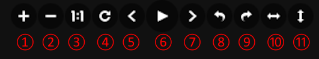

The Viewer component can be used to generate image files, etc., during project execution.
A component for viewing from the browser.
You can view the following files:

- apng (Animated Portable Network Graphics)
- avif (AV1 Image File Format)
- gif (Graphics Interchange Format)
- jpeg (Joint Photographic Expert Group image)
- png (Portable Network Graphics)
- webp (Web Picture format)
- tiff (Tagged Image File Format)
- bmp (BitMaP image)
- svg (Scalable Vector Graphics)

There are no unique properties that you can specify for the Viewer component.
Also, you cannot set the output files property for the Viewer component.

### Viewer Component Behavior
After the Viewer component has finished executing its predecessor,
Receive connected files from input files.

__When "./" is set for input files__  
Setting input files to __./__ places all files passed as input files (For extensions visible in the Viewer component) directly under the viewer component directory.
{: .notice--info}

If these files contain image files that can be viewed in a browser
The dialog appears in the browser only the first time.
Click the __ok__ button to display the viewer screen in a separate tab.

Also, the __open viewer screen__ button at the top of the screen is enabled.
After that, you can click this button to display the viewer screen.

### Viewer screen
The viewer screen tiles the files received from input files.

Click the file you want to view from the tile view to display the slide show.

#### How to operate during a slide show
When the slideshow is displayed, a toolbar is displayed and each button can be used to control the display of the file.

|| Component | Description |
|----------|----------|---------------------------------|
|1| zoomIn button | Zoom in |
|2| zoomOut button | Zoom out |
|3| oneToOne button | Show full image |
|4| reset button | Resets the display state |
|5| prev button | Displays the previous file |
|6| play button | Displays full screen |
|7| next button | Displays the next file |
|8| rotateLeft button | Rotates 90 degrees to the left |
|9| rotateRight button | Rotates 90 degrees to the right |
|10| flipHorizontal button | Flip horizontally |
|11| flipVertical button | Flip vertically |

#### How to exit the slide show view
To exit the slideshow display, click the __×__ button in the upper right corner or anywhere other than the file, or press the __Esc__ key.

--------
[Return to Component Details]({{site.baseurl}}/reference/4_component/)
