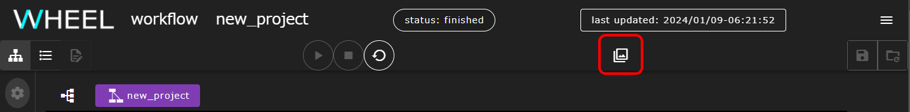
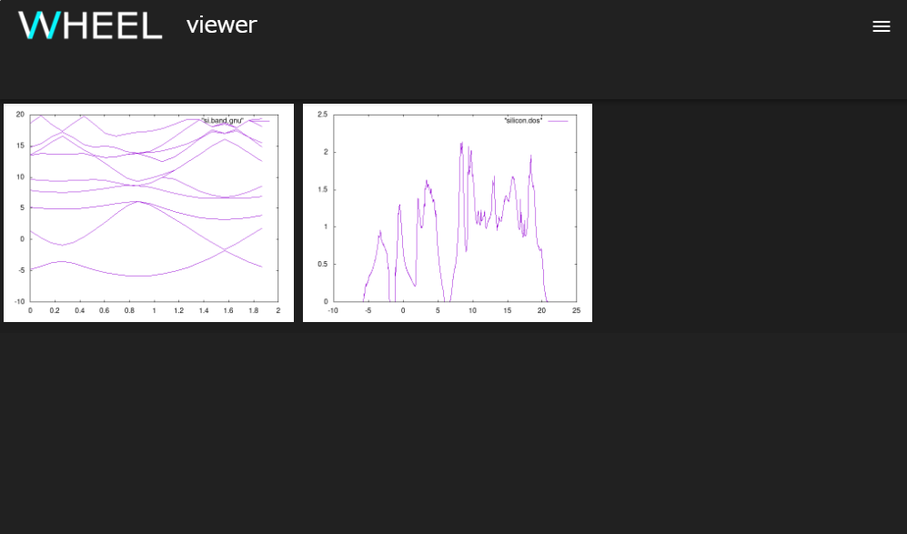
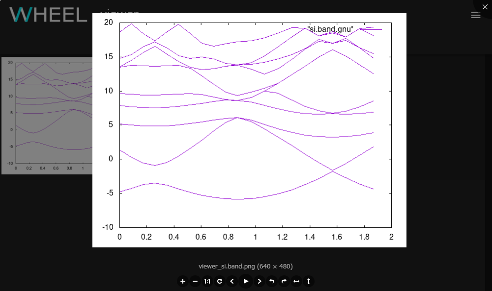

Viewerコンポーネントはプロジェクト実行中に生成される画像ファイルなどを
ブラウザから確認するためのコンポーネントです。
表示可能なファイルは次のとおりです。

- apng (Animated Portable Network Graphics)
- avif (AV1 Image File Format)
- gif (Graphics Interchange Format)
- jpeg (Joint Photographic Expert Group image)
- png (Portable Network Graphics)
- webp (Web Picture format)
- tiff (Tagged Image File Format)
- bmp (BitMaP image)
- svg (Scalable Vector Graphics)

Viewerコンポーネントに指定できる固有のプロパティはありません。
また、Viewerコンポーネントにはoutput filesプロパティを設定することはできません。

### Viewerコンポーネントの挙動
Viewerコンポーネントは先行するコンポーネントの実行終了後に
input filesから接続されたファイルを受け取ります。

__input filesに "./" と設定した場合について__  
input filesに __./__ と設定することで、input filesとして渡されるファイル（Viewerコンポーネントで表示可能な拡張子が対象）はすべてViewerコンポーネントディレクトリ直下に置かれます。
{: .notice--info}

これらのファイルに、ブラウザで表示可能な画像ファイルが含まれているときは
初回のみブラウザ上にダイアログが表示されます。
__ok__ ボタンをクリックすると別のタブでビューワー画面が表示されます。

また、画面上部の __open viewer screen__ <!--ビューワー画面表示-->ボタンが有効になり
以降はこのボタンをクリックすることでビューワー画面を表示することができます。

### ビューワー画面
ビューワー画面には、input filesから受け取ったファイルが一覧表示されます。

一覧から表示したいファイルをクリックすると、前面表示されます。

#### 前面表示時の操作方法
前面表示時はツールバーが表示され、各ボタンにてファイルの表示を操作することができます。

||構成要素|説明|
|----------|----------|---------------------------------|
|1| zoomIn ボタン | 拡大表示します |
|2| zoomOut ボタン | 縮小表示します |
|3| oneToOne ボタン | 原寸表示します |
|4| reset ボタン | 表示状態をリセットします |
|5| prev ボタン | 前のファイルを表示します |
|6| play ボタン | 全画面表示します |
|7| next ボタン | 次のファイルを表示します |
|8| rotateLeft ボタン | 左に90°回転します |
|9| rotateRight ボタン | 右に90°回転します |
|10| flipHorizontal ボタン | 左右反転します |
|11| flipVertical ボタン | 上下反転します |

#### 前面表示の終了方法
前面表示を終了する場合は、右上の __×__ ボタンもしくはファイル以外の任意の場所をクリック、または __Esc__ キーを押下します。

--------
[コンポーネントの詳細に戻る]({{ site.baseurl }}/reference/4_component/)
