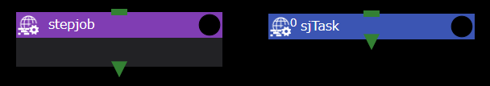

The Stepjob/StepjobTask component is based on the Step Job feature of the HPC Middleware "FUJITSU Software Technical Computing Suite (TCS)."
It can be used only when a remote host that can use step jobs is set.

This feature combines the StepJob component with the StepjobTask component, which is available only within the StepJob component.

The StepJob component acts as a special workflow component, and only the StepjobTask component can be placed inside.

The StepjobTask component can specify execution order and dependency expressions.
Based on these settings, it is submitted as a subjob using the step job function of TCS.

For more information about the Step Job feature, see the HPC Middleware "FUJITSU Software Technical Computing Suite (TCS)" documentation.

You can set the following properties for the Stepjob/StepjobTask component:

## Stepjob
###  host
Like the Task component, but you must select a remote host that can take advantage of the StepJob functionality.

### use job scheduler
It is enabled by default, and if disabled, the project will not run properly.

### queue
Like the Task component, it sets the queue to which the job is submitted.

### submit command
Displays the name of the command used to submit the job to the batch system specified in [Remote host settings]({{site.baseurl}}/for_admins/how_to_boot/#remote-host-settings).
Therefore, it cannot be changed here.

### submit option
Sets additional options to be specified when the job is submitted.

## StepjobTask
Only available within the StepJob component.
You can place a StepjobTask by double-clicking the Stepjob component to display it.

### script
Sets the job script to be submitted to the batch system.

### step number
Sets the number that determines the order in which StepjobTask is executed.
This value is automatically calculated and set by WHEEL based on the connectivity between components.
It cannot be changed.

### use dependency
When enabled, the following dependencyForm can be set and the step job will run according to the dependency expression set there.

### dependencyForm
You can set dependency expressions for job execution.

A dependency expression is an expression that determines whether execution can be performed based on the exit status (ec) of the job script of the executed StepjobTask component or the exit code (pc) of the job.

Dependency expressions are defined as follows:

```
sd=form[:[deletetype][:stepno[:stepno[...]]]]
```

| Expression Element | Required | Description |
| ---- | ---- |---- |
| sd= | O | Prefix |
| form |  |  An expression that indicates a condition that determines whether to execute the subjob to be submitted. <br/> See [form](#form) for more information |
| deletetype |  |  Detailed behavior when no subjobs are executed. See [deletetype](#deletetype) for more information |
| stepno |  |  Step number indicating which subjob execution result to apply |

#### form

form is specified by the following elements:

param
: ec: Return code of the job script of the dependent subjob
: pc: Job exit code of the dependent subjob

operator
: ==, !=, <, > , <=, >=

Value
: operator == or! If you specify =, you can specify multiple values separated by commas (,).

The following is an example of specifying a Form:
```
ec==0
```

#### deletetype
You can specify the following three types of deletetype:

| deletetype | Description |
| ---- | ---- |
| one | Deletes only this subjob. Subsequent subjobs that depend on the results of this subjob are not deleted |
| after | Removes only this subjob and any subsequent subjobs that depend on it |
| all | Deletes this subjob and all subsequent subjobs |  


<br />
The following is an example of a dependency expression for the dependencyForm property:
The following is an example of a dependency expression that indicates that if the return code of the job script for the subjob with step number 0 is non-zero, the subjob will not be executed.

```
sd=ec!=0:all:0
```

--------
[Return to Component Details]({{site.baseurl}}/reference/4_component/)
