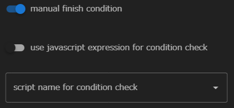

The BulkjobTask component is based on the Bulk Jobs feature of the HPC Middleware "FUJITSU Software Technical Computing Suite (TCS)."
It can be used only when remote hosts that can use bulk jobs are set up.

You can specify a bulk number and an input file for the BuildjobTask component.
Multiple jobs are submitted as subjobs based on these settings.

For more information about bulk job functionality, see the HPC Middleware "FUJITSU Software Technical Computing Suite (TCS)" documentation.

The following properties can be set for the BulkjobTask component:

### use parameter setting file for bulk number
Sets whether the bulk number is specified from the parameter configuration file.

When enabled, you can specify a parameter configuration file.

When disabled, start and end values can be specified and are treated as the start and end bulk numbers, respectively.

### manual finish condition
Specifies whether to specify the judgment of the end status of the component.  
When enabled, you can set additional criteria for determining the end status of components.

#### use javascript expression for condition check
To determine the success or failure of a component
Specifies whether to use a javascript expression or a shell script.

 - When invalid  
  
When disabled, a drop-down list appears to select a shell script.  
The shell script specified here is executed after component execution has finished.
A return value of 0 indicates success, and a non-zero value indicates failure.   
If none is specified, the return code of the script specified in __script__ performs the same judgment.

 - When enabled  
 
When enabled, you can write javascript expressions.  
The expression entered here is evaluated after the component has finished executing.
If it returns a Truthy value, it succeeds.
A falsy value is considered a failure.

--------
[Return to Component Details]({{site.baseurl}}/reference/4_component/)
