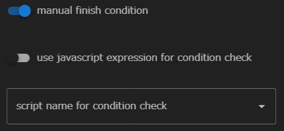

BulkjobTaskコンポーネントは、HPCミドルウェア「FUJITSU Software Technical Computing Suite（TCS）」のバルクジョブ機能に基づいた機能です。
バルクジョブを利用できるリモートホストが設定されている場合のみ使用することができます。

BuildjobTaskコンポーネントには、バルク番号、インプットファイルを指定することができ
これらの設定に基づいてサブジョブとして複数のジョブが投入されます。

バルクジョブ機能の詳細に関しては、HPCミドルウェア「FUJITSU Software Technical Computing Suite（TCS）」のドキュメントをご確認ください。

BulkjobTaskコンポーネントに設定できるプロパティは以下のとおりです。

### use parameter setting file for bulk number
バルク番号をパラメータ設定ファイルから指定するかどうかを設定します。

有効のときは、パラメータ設定ファイルを指定することができます。

無効のときは、startおよびendの値を指定することができ、それぞれ開始バルク番号、終了バルク番号として扱われます。

### manual finish condition
コンポーネントの終了状態の判定を独自に指定するかどうかを設定します。  
有効にした場合は、さらにコンポーネントの終了状態の判定基準を設定することができます。

#### use javascript expression for condition check
コンポーネントの成功 / 失敗を判定するのに
javascript式を用いるか、シェルスクリプトを用いるかを指定します。

 - 無効のとき  
  
無効のときは、シェルスクリプトを選択するドロップダウンリストが表示されます。  
ここで指定されたシェルスクリプトが、コンポーネント実行終了後に実行され、
戻り値が0であれば成功、0以外であれば失敗と判定されます。  
なお、無指定のときは __script__ に指定したスクリプトの戻り値で同様の判定が行われます。

 - 有効のとき  
 
有効のときは、javascript式を記述することができます。  
ここで入力した式が、コンポーネントの実行終了後に評価され、
Truthyな値を返せば成功、
Falsyな値を返せば失敗と判定されます。

--------
[コンポーネントの詳細に戻る]({{ site.baseurl }}/reference/4_component/)
