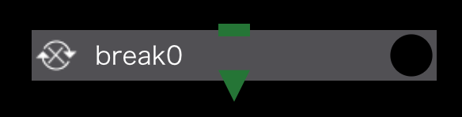
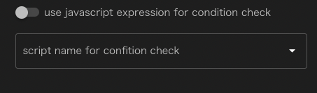
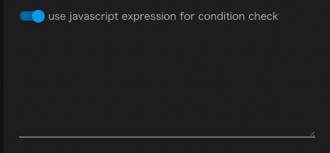

The Break component can only be created directly under a for, while, or foreach component, and can have a condition expression set, similar to the If component.

When the condition set on this component is met, it interrupts the parent component's loop and continues executing the project as if all loops had finished.

When the result of the condition check is false, this component does nothing.

Among the components at the same level as the Break component, the execution order (before or after the condition check) of components that have no dependency on the Break component cannot be specified.
If you want to control whether a component runs when Break is triggered, set a dependency with the Break component.
Even if there is no direct dependency, it is fine if they are connected through other components.

The properties you can set for the Break component are as follows.

### condition setting
Configure the settings for condition evaluation.

#### use javascript expression for condition check
Similar to the retry decision of the Task component, specifies whether to use a JavaScript expression or a shell script as the condition expression for evaluating true / false.

 - When disabled
  
When disabled, a dropdown list for selecting a shell script is displayed.
The specified shell script is used as the condition expression to determine true / false.

 - When enabled
 
When enabled, a JavaScript expression can be entered.
The entered expression is used as the condition expression to determine true / false.

--------
[Return to Component Details]({{site.baseurl}}/reference/4_component/)
