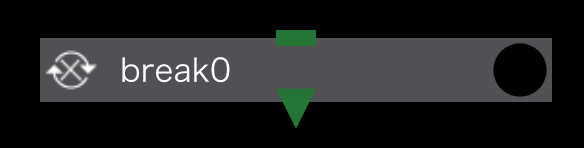

Breakコンポーネントは、for, whileおよびforeachコンポーネントの直下のみに作成することができ
Ifコンポーネントと同様に条件判定式を設定することができます。

コンポーネントに設定した条件を満たした時は、本コンポーネントの親コンポーネントのループを中断し
全ループが終了したものとしてプロジェクトの実行を続けます。

条件判定の結果が偽の時は本コンポーネントは何も行ないません。

Breakコンポーネントと同一レベルにあるコンポーネントのうち、Breakコンポーネントと依存関係が無いコンポーネントが、条件判定の前後どちらで実行されるかは指定できません。
Breakした時に実行されるかどうかを制御したい場合は、Breakコンポーネントとの依存関係を設定してください。
直接依存関係が無くても他のコンポーネントを介して接続されていれば大丈夫です。

Breakコンポーネントに設定できるプロパティは以下のとおりです。

### condition setting
条件判定を行うための設定を行います。

#### use javascript expression for condtion check
Taskコンポーネントのretry判定と同じく、真 / 偽を判定する条件式としてjavascript式を用いるか、シェルスクリプトを用いるかを指定します。

 - 無効のとき
  
無効のときは、シェルスクリプトを選択するドロップダウンリストが表示されます。
ここで指定されたシェルスクリプトを条件式として、真 / 偽が判定されます。

 - 有効のとき
 
有効のときは、javascript式を記述することができます。
ここで入力した式を条件式として、真 / 偽が判定されます。

--------
[コンポーネントの詳細に戻る]({{ site.baseurl }}/reference/4_component/)
