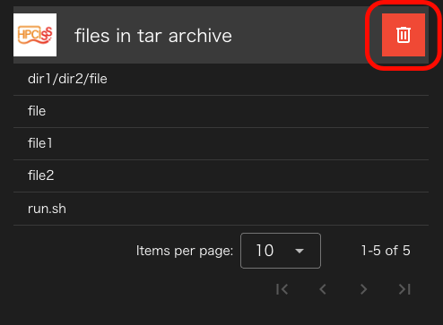

HPCI-SS-tarコンポーネントもHPCI-SSコンポーネントと同じくHPCI共用ストレージにファイルを保存するためのStorageコンポーネントの亜種です。

HPCI-SS-tarコンポーネントは、HPCI-SSコンポーネントと違い、ファイル保存時にgfptarコマンドを使って、tar形式(gzip圧縮)でファイルを保存します。

このため、HPCI-SSコンポーネントのように保存先のHPCI共用ストレージ内で、ファイル/ディレクトリを削除したりリネームすることはできません

HPCI-SS-tarコンポーネントに設定できるプロパティは以下のとおりです。

### host
hostには実際にファイルを保存するホストを設定できます。
ただし、hostとして設定できるのはremotehost設定で `use gfarm` にチェックをつけたもの
だけです。

また、gfptarコマンドを用いてHPCI共用ストレージにファイルの転送を行うことができるホストのみが利用できます。

### directory path

storageコンポーネントと同じく、実際にファイルを保存するパスですが
host上のパスではなくHPCI共用ストレージのパスを指定する必要があります。

### 制約事項
HPCI-SS-tarコンポーネントは、`directory path`に指定されたパス名でtarアーカイブを作成します。
このため、directory pathに既にファイルやディレクトリが存在するとエラーになるため
本コンポーネントを含むプロジェクトを複数回実行する場合は、directory pathを書き換えるか、
コンポーネントプロパティ画面の `remove storage directory`  ボタンをクリックして、アーカイブディレクトリを削除してから
実行してください。

--------
[コンポーネントの詳細に戻る]({{ site.baseurl }}/reference/4_component/)
