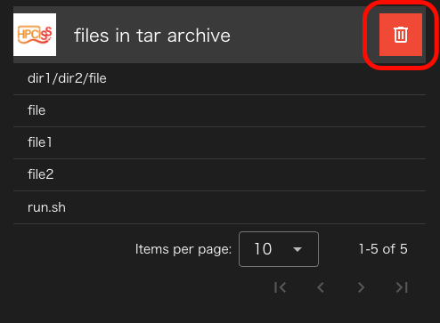

HPCI-SS-tarコンポーネントもHPCI-SSコンポーネントと同じくHPCI共用ストレージにファイルを保存するためのStorageコンポーネントの亜種です。

HPCI-SS-tarコンポーネントは、HPCI-SSコンポーネントと違い、ファイル保存時にgfptarコマンドを使って、tar形式(gzip圧縮)でファイルを保存します。

このため、HPCI-SSコンポーネントのように保存先のHPCI共用ストレージ内で、ファイル/ディレクトリを削除したりリネームすることはできません

HPCI-SS-tarコンポーネントに設定できるプロパティは以下のとおりです。

### host
hostには、gfptarコマンドを実行してHPCI共用ストレージへファイルの転送を行うホストを設定します。
ファイルの実体が保存されるのはHPCI共用ストレージであり、host自体にファイルが保存されるわけではありません。

ただし、hostとして設定できるのはremotehost設定で `use gfarm` にチェックをつけたもの
だけです。

HPCI-SS-tarコンポーネントは常にHPCI共用ストレージへファイルを転送する必要があるため、
hostの設定は必須です。storageコンポーネントと異なり、localhost（ローカルパス）を
指定することはできません。hostが未設定、またはlocalhostが設定されている場合、
プロジェクト実行時にバリデーションエラーとなります。

### directory path

storageコンポーネントと同じく、実際にファイルを保存するパスですが
host上のパスではなくHPCI共用ストレージのパスを指定する必要があります。

directory pathの設定も必須です。空欄のままプロジェクトを実行しようとすると
バリデーションエラーとなります。

### memo
自由記述のメモを入力できます。ここに入力した内容は、ファイル転送時にHPCI共用ストレージ上の
アーカイブに付与されるGFarm拡張属性のメタデータ（`wheel.workflow`）に `<memo>` として
そのまま出力されます。保存したファイルの由来や用途などを記録しておく用途に利用できます。

### 制約事項
HPCI-SS-tarコンポーネントは、`directory path`に指定されたパス名でtarアーカイブを作成します。
このため、directory pathに既にファイルやディレクトリが存在するとエラーになるため
本コンポーネントを含むプロジェクトを複数回実行する場合は、directory pathを書き換えるか、
コンポーネントプロパティ画面の `remove storage directory`  ボタンをクリックして、アーカイブディレクトリを削除してから
実行してください。

--------
[コンポーネントの詳細に戻る]({{ site.baseurl }}/reference/4_component/)
