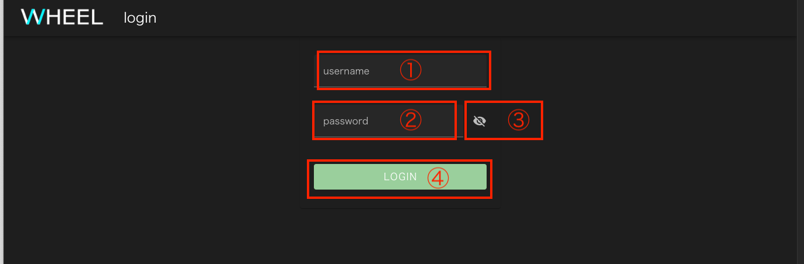

WHEEL起動時に認証機構が有効になっている場合、WHEELの各画面にアクセスする前にログイン操作を行なう必要があります。

ログイン画面の構成は以下のとおりです。

| |構成要素              |説明                                   |
|-|----------------------|---------------------------------------|
|1| ユーザ名入力欄       | ユーザ名を入力します                  |
|2| パスワード入力欄     | パスワードを入力します                |
|3| パスワード表示ボタン | パスワードの表示/非表示を切り替えます |
|4| ログインボタン       | ログイン処理を開始します              |

## 操作方法
(1)にユーザ名、(2)にパスワードを入力すると、(4)ログインボタンが有効になるので
このボタンをクリックしてください。

ユーザ名またはパスワードに誤りがあった場合は本画面に戻ります。

(3)のアイコンをクリックすると、パスワード入力欄の内容を表示するか非表示にするかを切り替えることができます。

--------
[リファレンスマニュアルのトップページに戻る]({{ site.baseurl }}/reference/)
