In this tutorial, you will learn how to use WHEEL by creating and executing workflows using only basic WHEEL functionality.

The following three steps will guide you through the process.

|| Item | Description |
|-----|-----|-----|
|1| [Create and run a workflow with one component](#1-create-and-run-a-workflow-with-one-component) | Creates a minimally configured workflow and runs it on the local host. Learn the basic use of WHEEL |
|2| [Running workflows in various execution environments](#2-running-workflows-in-various-execution-environments) | Step 1. Learn how to run a workflow created in through a remote host or batch system |
|3| [Creating and Running a Multi-Component Workflow](#3-creating-and-running-a-multi-component-workflow) | Learn about controlling when there are multiple components in a workflow |


## 1. Create and run a workflow with one component
In this example, we will create a minimally configured workflow with standard output of "Hello WHEEL."
Through this step, you learn how to create a workflow with one component and how to run it on the local host.

<!-- The following is a summary of what you learned in this step.

|| Item | Description |
|-----|-----|-----|
|1| Prepare to Create Workflow (#1-1- Prepare to Create Workflow) | Creates a new project and prepares to create a workflow |
|2| Create Workflow (#1-2- Create Workflow) | Adds a component to the project and creates a workflow |
|3| Run Workflow (#1-3- Run Workflow) | Run the created workflow |-->

### Preparing to Create a Workflow
Before you begin, you will learn how to create and open a new project in preparation for creating a workflow.

__"Project" means__  
In WHEEL, the administrative unit of a workflow is called a __project__.  
A __project__ contains a workflow and a set of files used to perform operations such as saving, deleting, and executing in the __project__.  
Although the terms __project__ and __workflow__ are used in this manual to fit the context, it is safe to assume that __project__ and __workflow__ are synonymous operationally.
{: .notice--info}

Now let's actually create a new empty project.

#### Creating a New Project
You create projects on the Home Screen. From the Home screen, you can create a new project or edit an existing project.

When you start the browser and connect to the WHEEL server, the home screen is displayed.
Click the __NEW__ button in the upper left corner of the screen.

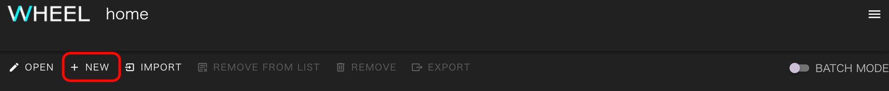


In the directory tree that appears, select the directory (1) where you want to create the new project, if necessary.
Enter the project name (2) and click the __create__ button (3).


__About project names__  
Because the project name is used as part of the directory name, only letters, numbers, and some symbols are allowed.
{: .notice--info}

#### Open Project
Opens the created project and transitions to the graph view screen. On the graph view screen, you can create and execute workflows.

The newly created project is listed on the Home screen. Check the check box (1) to the left of the project name and click the __OPEN__ button (2).


The screen changes to display the Graph View screen.

You are ready to create the workflow.

### Creating Workflows
You then add components to the project and actually create the workflow.
The workflow you create here is a simple workflow with standard output of "Hello WHEEL."

#### Adding Components
On the graph view screen, you can use the palette on the left side of the screen to view the __Components__ workflow parts.
Add workflow components by dragging and dropping.

Let's add a __Task component__ to the project that runs the configured program.

First, drag the Task component (1) and drop it on the black area (2) in the center of the screen.


You have now added one component to the workflow.

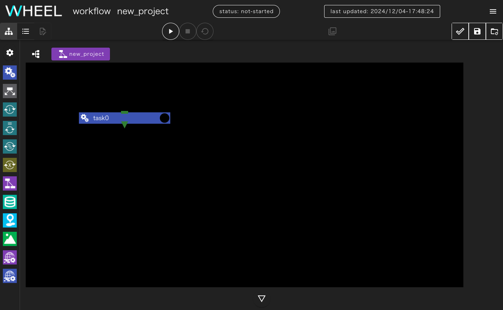


You then define what you want to do in this Task component.

#### Configuring Component Behavior
All components, including the Task component, become part of the workflow only when you set the __properties__ that govern their behavior.
The Task component does not directly specify the program you want to run.
You must create a shell script that calls the program and specify the script you want to run.

As an example, we will create a simple shell script that simply calls the echo command.
Then set the properties as the component behavior to run the shell script you created.

##### Creating Shell Scripts
First, create an empty file that becomes a shell script.

When you click the __task0__ component (1) that you just created, the property screen (2) for setting properties appears on the right side of the screen.


If you scroll down on the property screen, there is a line (1) at the bottom that says __Files__.

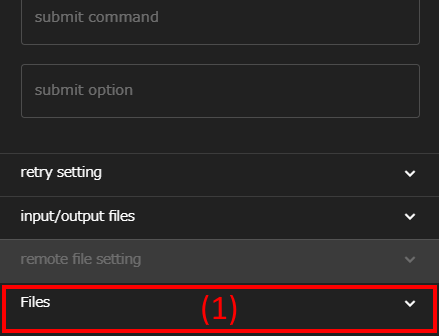

Click this line to expand the file operations area to the bottom.
Click the __new file__ button (1) to create an empty file that will be a shell script.

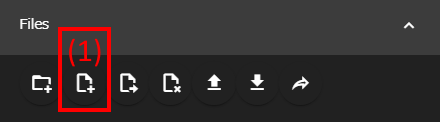


Enter the name of the shell script you want to create (1).
Click the __ok__ button (2).

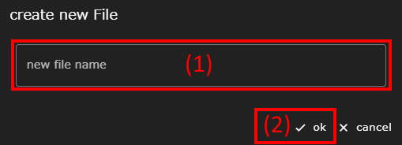

An empty file is created for the shell script.

##### Editing Shell Scripts
Then, edit the shell script you created to describe the process.

The file name (1) appears below the file operation area. Click to select it.
Click the __text editor__ button (2) at the top left of the graph view screen to open the selected file in the text editor screen. In the text editor screen, you can edit or review the file.


Instead of running a numeric program, you create a shell script that outputs a string using the echo command.
Type `echo Hello WHEEL` in the text editor part (1). Click the __save all files__ button (2) at the top right of the screen to save your edits.
Finally, click the __graph view__ button (3) in the upper left of the screen to return to the previous screen.


__About task component execution results__  
The success or failure of the Task component is determined by the return value of the specified script. (0: Normal end, other than 0: Abnormal end)  
Therefore, when executing multiple commands in a script, specify the return value accordingly.
{: .notice--info}

##### Specifying an execution script
The behavior of the Task component is to specify in the component's properties that the shell script you created should be invoked.

Display the properties screen and select a script file from the __script__ drop-down list (1).

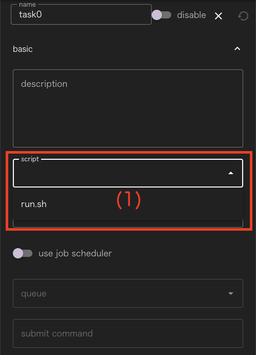

Finally, let's save the project we created by clicking the __save project__ button (1) in the upper right corner of the screen.
<!--__ You can rewind to the last save state by clicking the revert project__ button (2).
Note that you cannot redo (undo). -->


__About save Processing__  
WHEEL uses git to manage project files.  
When you click the __save project__ button, it is committed to the git repository as a save operation.
{: .notice--info}

__About the revert project button__  
Click the __revert project__ button (2) to rewind to the last save state.  
Note, however, that redo cannot be canceled.
{: .notice--info}

### Run Workflow
You will learn how to run the workflow you created.

#### Run Project
Let's run the project we created.
Click the __run project__ button (1) to run the project.


When the project finishes running, the status display at the top of the screen changes to __finished__. If a program executed in the project does not terminate normally, it will __failed__.


#### Checking the logs
You can view the log output of WHEEL and the standard output and standard error output of commands executed in the workflow from the log screen.

Click the ▽ button (1) at the bottom of the screen to display the log screen.
In this project, we are using the `echo` command, so the characters appear in the standard output.

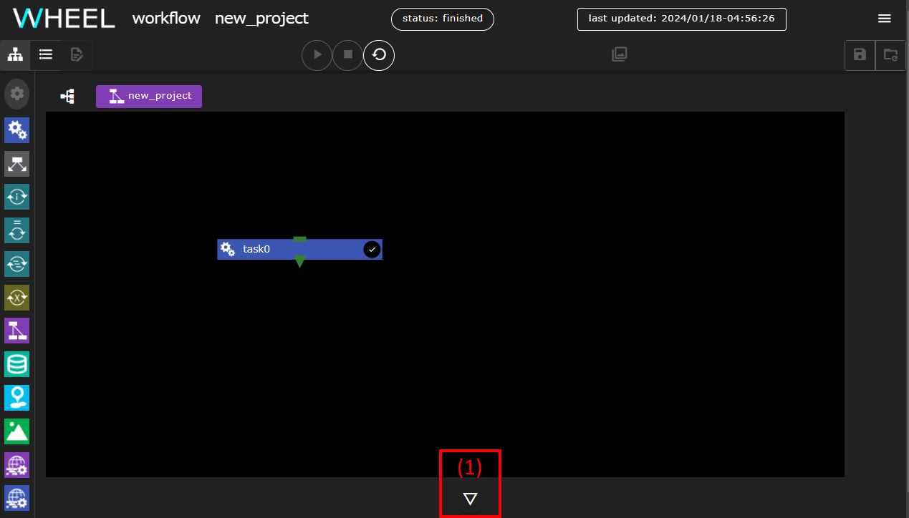

Immediately after opening the log window, the __info__ tab is displayed and you can view the WHEEL log output.
The __stdout__ tab (1) is green when there is unread output in the standard output. Click this tab to see the output of the echo command.

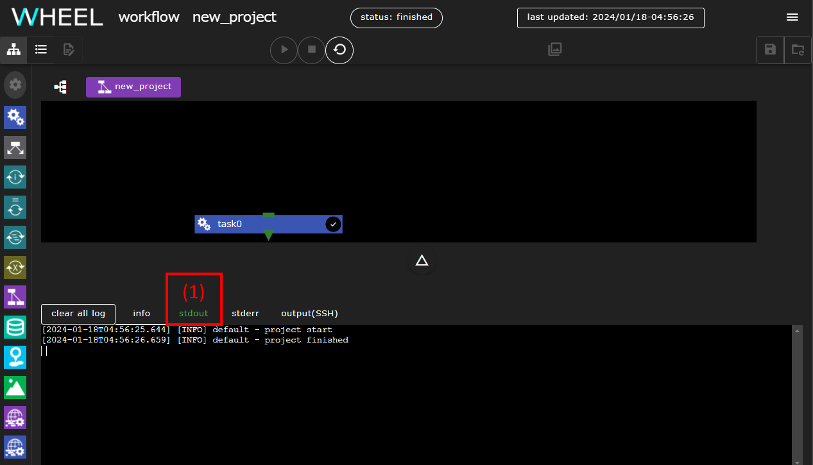


#### Initializing a Project
Depending on the program, files may be output after execution or existing files may be rewritten.
WHEEL also manages the execution state of individual components in a project.
When you modify or re-run a project, you must return it to its original state.

In this tutorial, the project will be rerun several times with modifications, so that the project can be initialized to its original state.

To initialize the project, click the __cleanup project__ button at the top of the screen.


A confirmation dialog will appear, click the __ok__ button.


This completes the learning in this step.


## 2. Running workflows in various execution environments
In the previous section, you ran the Task component of the component on the local host.
In this section, you will modify the workflow settings you created in the previous section to run the task in different execution environments.
Learn how to run tasks on a remote host or through a batch system.

### Running on a remote host
Let's run the workflow tasks in the previous section on a remote host.

The execution environment for the task is specified in the property settings.

Click the task0 component to display the Properties window.
Click the __host__ drop-down list to display the list of remote hosts configured in [Remote Host Settings]({{site.baseurl}}/for_admins/how_to_boot/#remote-host-settings).
Select the label of the remote host you want to use.


Click the __save project__ button (1) and you are ready to go.
Click the __run project__ button (2) to start running the project, just as you would on the local host.


Since the remote host is specified in this case, a dialog box for entering the password to connect to the remote host is displayed.
Password for password-authenticated connections, or Public Key for public-key connections
Enter the passphrase set for the private key and click the __ok__ button.

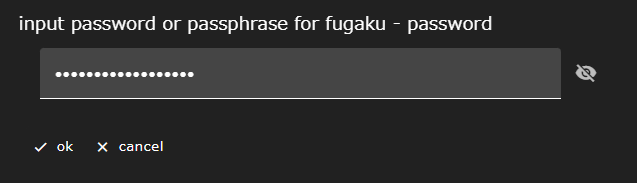

When you open the log screen, the output of the echo command appears in the __output(SSH)__ tab at the end of execution.

")

After reviewing the output, click the __cleanup project__ button to initialize the project for the next lesson.


### Running through a batch system
Next, try running the same workflow through a batch system.

__About preparing to run tasks through a batch system__   
Before you can run tasks through a batch system, the remote host configuration must be in place according to [Additional settings if you have a batch system]({{site.baseurl}}/for_admins/how_to_boot/#additional-settings-if-you-have-a-batch-system).
{: .notice--info}


Display the task0 property screen again.

When you run a job through a batch system, different systems use different methods to obtain the contents of standard output.
So let's modify the script we created in the previous section to print the results of the echo command to a file called `stdout.txt`.

Select the script created in [Creating Shell Scripts](#creating-shell-scripts) from Files at the bottom of the property screen and open it in a text editor screen.

At the end of the echo command line, add `echo Hello WHEEL > stdout.txt `.


In the previous script, you saved the file by clicking the __save all files__ button, but let's save it in a different way.

When you click on the tab that contains the file name, two menus appear: __save__ and __close without save__.

Select __save__ here.

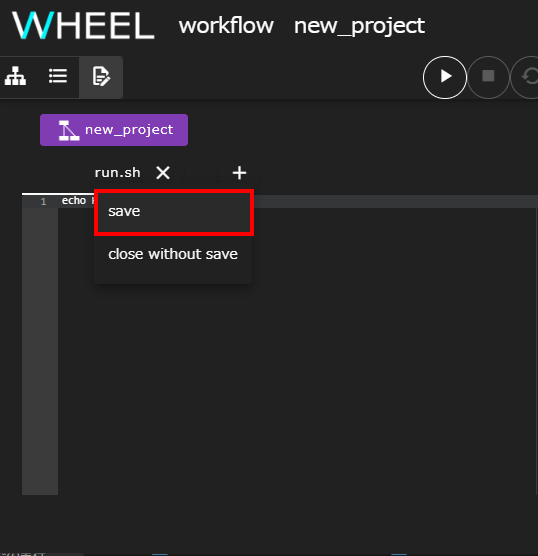

__How to discard file edits__  
Use the __close without save__ button to discard file edits.  
Click the __close without save__ button to discard the edited text and close the tab.
{: .notice--info}


__How to save only some files__  
If you want to open and edit multiple files and save only some of them, use the following procedure.  
1. Click the __close without save__ button to discard unwanted file edits.  
1. Use the __save all files__ button to save in bulk. (Alternatively, use the __save__ button to save the required files individually.)

<div class="notice--info">
  {{ notice-save | markdownify }}
</div>

After you finish editing the script, return to the graph view screen and edit the task0 properties again to set them to run through the batch system.

First, enable the __use job scheduler__ switch (1) so that you can enter settings for the job.
Select the destination queue from the __queue__ (2) field.


Then add a setting to download the __stdout.txt__ output from the script.
Click the up arrow to the right of __basic__ at the top of the properties screen.


The settings in the top row will be collapsed to show all categories, so set __remote file setting__ to
Click to open.


Type __stdout.txt__ in the include field (1) and press Enter.
Click the __+__ button (2) on the right.


Once set, save and run the project.

After execution, select __stdout.txt__ from the properties of the task0 component.
Open a text editor.

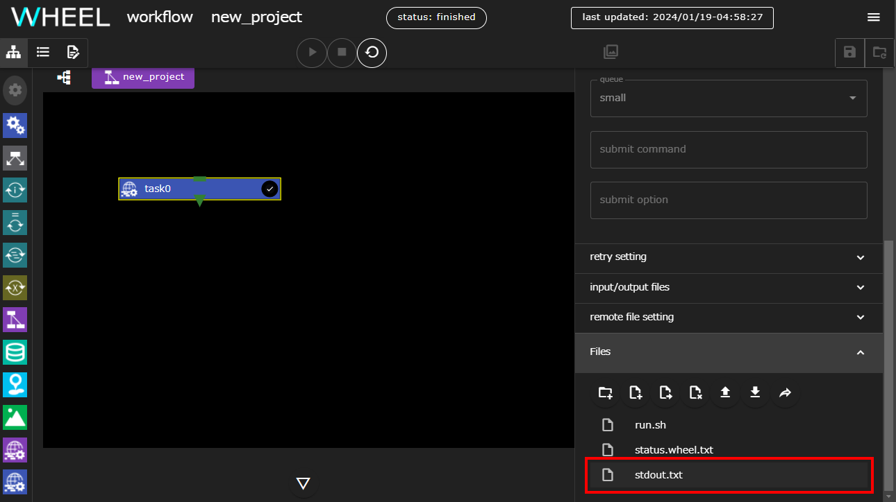

The execution result of the echo command is output to a file.


This completes the task execution via the batch system.  
Click the __cleanup project__ button to initialize the project for the next tutorial.

<!--### 9. I/O File Transfer -->
## 3. Creating and Running a Multi-Component Workflow
Up until the previous section, the component has executed a single workflow.
However, in a real workflow, the output of a preceding program is often passed to another program for processing.
You will learn how to control multiple components in a workflow.

### Passing I/O Files Between Components
First, let's learn how to receive the file output by the preceding component and then execute the subsequent component.

Add a second component to the workflow described above.
If you have not renamed the first component from the default task0, a component named task1 is created.


Next, we configure task0 to output a file called __stdout.txt__ as the execution result.

If you open the task0 properties screen and scroll down, you will see the line __input/output files__.
Click this to display the entry field.
Type __stdout.txt__ in __output files__ and click the __+__ button.


A display named __stdout.txt__ is added to the lower right of the task0 component.


Set the __stdout.txt__ output by task0 to be passed to task1.
If you drag ▶ to the right of __stdout.txt__, the line will grow, so drop it on task1.


You are now set to receive __stdout.txt__ from task0 and run task1.

In task1, the other settings are still unset, so let's create an empty file and create a script just as we did when we created task0.

The contents of the script are:
```
ls -l stdout.txt
```
to see if the file came from task0.
In addition, specify the script file created in the script property.

When you save and run the project, the log screen displays standard output similar to the following:


As this result shows, the file specified in output files is passed as a symbolic link to subsequent components.

In practice, there are several possible uses:
* Solve on the preceding task and pass the result file to subsequent postprocessing components
* Perform pre-processing on preceding tasks and pass input files to subsequent solver components


At this time, WHEEL will automatically download and transfer the data even if the previous and next components run on different hosts.
Therefore, if you run each process on a separate system for licensing or computer architecture reasons,
You can run it in a similar workflow.


This concludes the tutorial on how to pass files between components.  
Click the __cleanup project__ button to initialize the project for the next tutorial.


<!--### 10. Controlling Task Execution Order -->
### Controlling the order in which components are executed
In [Passing I/O Files Between Components](#passing-io-files-between-components), the preceding component received the output file and then executed the subsequent component.

In a real workflow, file passing does not occur.
After one program is finished, the next program must be run
situation.

WHEEL has the function of waiting for the preceding component to finish before executing.
Let's use this feature to control the execution order of the two tasks.

#### Changing the contents of a task
Since it is difficult to tell which was executed first in the contents of task0 and task1.
Modify each script as follows:

task0
```
sleep 10
echo task0
```

task1
```
echo task1
```

To avoid waiting for execution on the remote host, set __host__ to
Change to __localhost__ to run on the localhost.

Next, I'll remove the output files setting, because I won't be using stdout.txt this time.

First, open the properties screen of __task0__ and select the __input/output files__
Display the configuration field and click the trash can icon to the right of __stdout.txt__.


__stdout.txt__ is removed from __output files__, and the line connected to __stdout.txt__ in task1 is also removed.


The input files for task1 still contain the __stdout.txt__ specification, which can be removed by a similar operation.  
Note that specifying input/output files that are not connected by a line does not affect workflow behavior.
If you want to change it temporarily, you can leave the settings you don't want to use.

Now let's save and run the workflow.
Since we are not controlling the order of execution now, task0 and task1 are executed in random order.
If you look at the __stdout__ tab on the log screen, task1 appears just after execution starts.
For task0, sleep10 is included, so it should appear after 10 seconds.


Now let's initialize the project once so that task0 runs first.


#### Setting the order of component execution
Sets the order in which components run.

Drag ▼ (1) at the bottom of the task0 component and drop it on ■ (2) at the top of the task1 component.
A green line connects both tasks.


Now task1 runs after task0 has finished running.

Now let's save and run the project.

If you look at the log output, you should now see task0 and then task1.


This concludes the basic tutorial.

If you want to know about advanced features of WHEEL that were not covered in this tutorial,
Go to [Application Tutorials]({{site.baseurl}}/tutorial/2_advanced_tutorial/) .
For detailed information about each function, refer to the [Reference Manual]({{site.baseurl}}/reference/).


--------
[Return to home page]({{site.baseurl}}/tutorial/)
