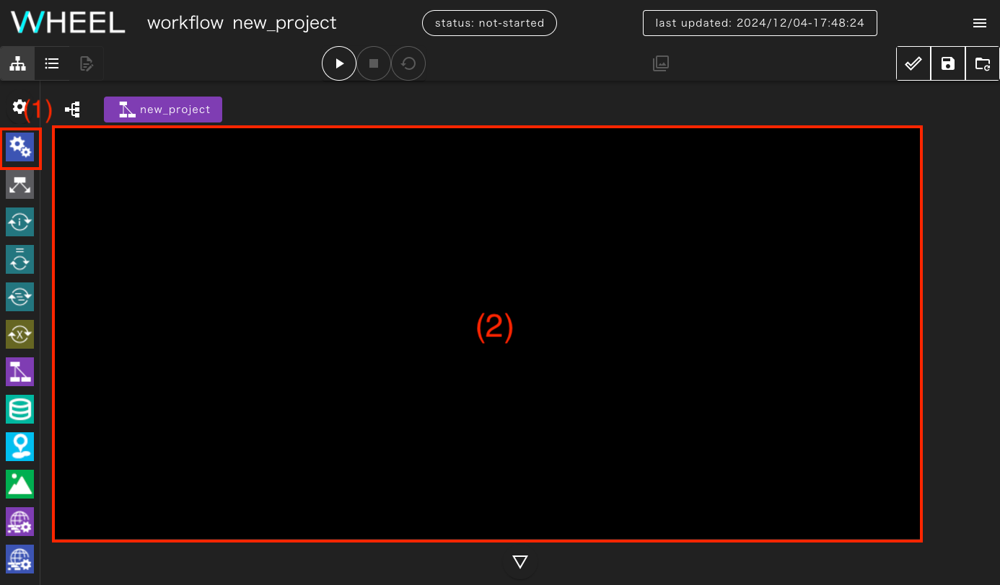
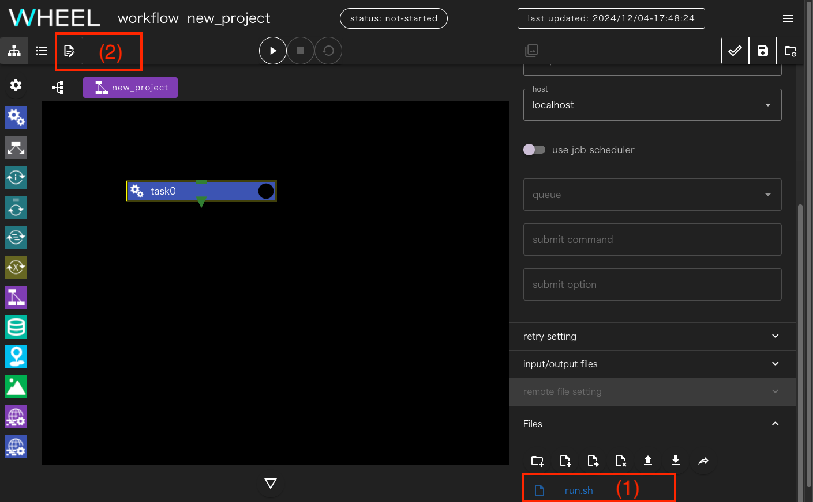
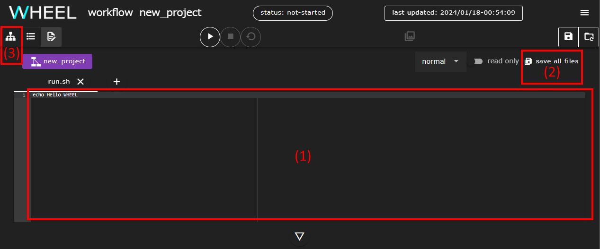
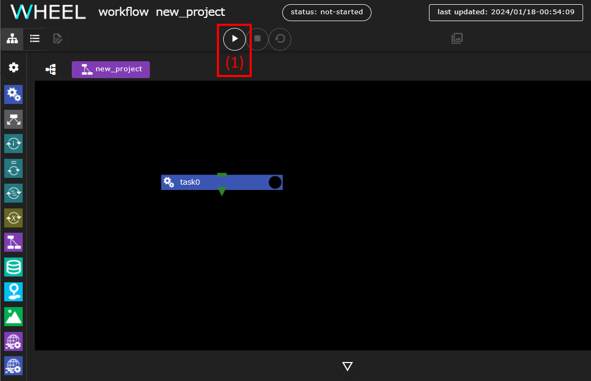
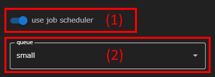
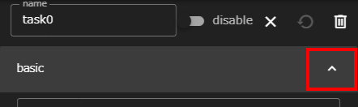
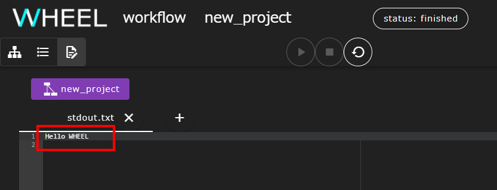
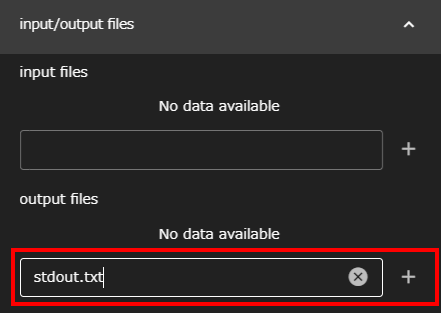
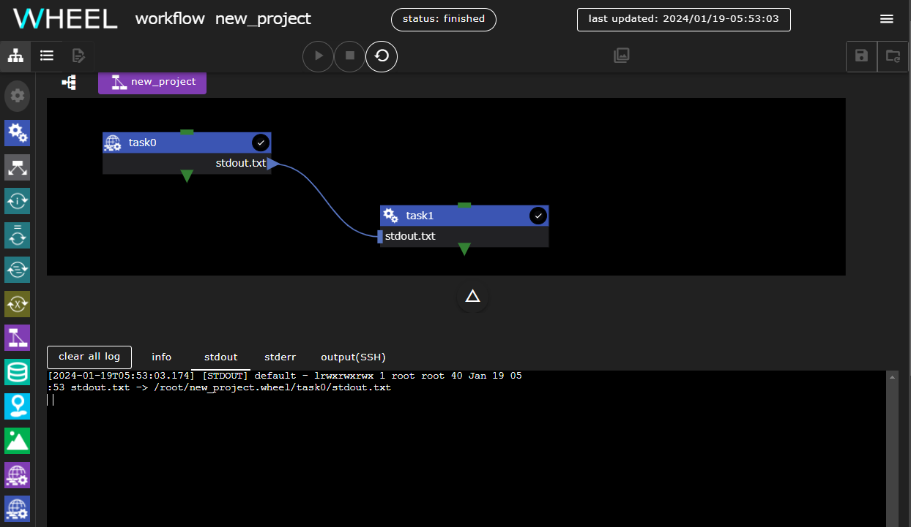
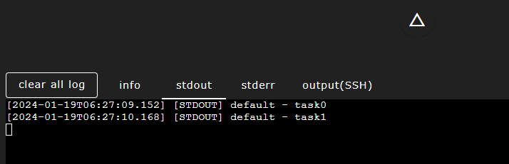

In this tutorial, you will learn how to use WHEEL by creating and executing workflows using only basic WHEEL functionality.

### 1. Creating a New Project
In WHEEL, the execution unit of a workflow is called a __project__.
In a project, you create one or more __task components__ that actually run the program.
You can configure a workflow by exchanging I/O files between them and controlling the execution order.

First, let's create an empty project.

#### Launching the browser to access the home screen
When you start the browser and connect to the WHEEL server, the home screen appears.
Click the __NEW__ button in the upper left corner of the screen.


In the directory tree that appears, select the directory (1) where you want to create the new project, if necessary.
Enter a project name (2) and click the __CREATE__ button (3).


Because the project name is used as part of the directory name, only letters, numbers, and some symbols are allowed.

#### Open Project
The newly created project appears in the list. Check the check box (1) to the left of the project name and click the __OPEN__ button (2).


The screen transitions to display the workflow screen.


### 2. Add First Component
On the workflow screen, you can use the palette on the left side of the screen to insert the __component__ that is a part of the workflow.
Create a workflow by dragging and dropping.

Let's add a __Task component__ to the project that runs the configured program.

#### Adding Task Components
First, drag the Task component (1) and drop it on the black area (2) in the center of the screen.



You have now added the first component to your project.


You then define what to do in this Task component.

### 3. Task Component Property Settings
All components, including the Task component, become part of the workflow only when you set the __properties__ that define their behavior.
The Task component does not directly specify the program you want to run.
You must create a bash script that calls the program and specify the script you want to run.

As an example, we will create and run a simple shell script that simply calls the echo command.

#### Creating Shell Scripts
When you click the __task0__ component (1) that you just created, a subscreen (2) for setting properties appears on the right side of the screen.


If you scroll down on the property screen, there is a line (1) at the bottom that says __Files__.


Click this line to expand the file operations area to the bottom.
Click the __new file__ button (1) to create an empty file from which to base the shell script.


Enter the name of the shell script you want to create (1).
Click the __OK__ button (2).


When you have successfully created a file, the file name (1) appears below the file operation area. Click to select it.
You can edit this file by clicking the __text editor__ button (2) in the upper left of the workflow screen.



Instead of running a numeric program, you create and run a shell script that outputs a string using the echo command.
Type `echo Hello WHEEL` in the text editor part (1) and click the __save all files__ button (2) in the upper right corner of the screen.
Finally, click the __graph view__ button (3) in the upper left of the screen to return to the previous screen.



__About Task Component Execution Results__  
The success or failure of the Task component is determined by the return value of the specified script. (0: Normal end, other than 0: Abnormal end)  
Therefore, when executing multiple commands in a script, specify the return value accordingly.
{: .notice--info}

#### Specifying an execution script
Display the properties subscreen and select the __script__ drop-down list (1).
Select the script file you just created.


Finally, let's save the project we created by clicking the __save project__ button (1) in the upper right corner of the screen.
<!--__ You can rewind to the last save state by clicking the revert project__ button (2).
Note that you cannot redo (undo). -->


__About save Processing__  
WHEEL uses git to manage project files.  
When you click the __save project__ button, it is committed to the git repository as a save operation.
{: .notice--info}

__About the revert project button__  
Click the __revert project__ button (2) to rewind to the last save state.  
Note, however, that redo cannot be canceled.
{: .notice--info}

### 4. Run Project
Next, let's run the project we created.
Click the __run project__ button (1) to run the project.



In this project, we are using the `echo` command, so the characters appear in the standard output.
If you click the ▽ button (2) at the bottom of the screen, you can log the WHEEL and the commands executed in the project.
The log window that displays standard output and standard error output is displayed.

Immediately after opening the log window, the __INFO__ tab is displayed, and you can view the WHEEL log output.
If the standard output contains unread output, the __STDOUT__ tab (1) is green. Click this tab to see the output of the echo command.


When the project finishes running, the status display at the top of the screen changes to __FINISHED__. If a program executed in the project does not terminate normally, it will get __FAILED__.


### 5. Initializing a Project
Depending on the program, files may be output after execution or existing files may be rewritten.
WHEEL also manages the execution state of individual components in a project.
When you modify or re-run a project, you must return it to its original state.

In this tutorial, you'll rerun the project several times with modifications.
Click the __cleanup project__ button at the top of the screen to restore the system to its original state.


### 6. Performing Tasks on a Remote Host
Let's run the previous task on a remote host.

Click the task0 component to display the Properties window.
When you click the __host__ drop-down list and, the list of remote hosts configured in [Remote Host Settings]({{site.baseurl}}/how_to_boot/#remote-host-settings) is displayed.
Select the label of the remote host you want to use.


Click the __save project__ button (1) and you are ready to go.
Click the __run project__ button (2) to start running the project, just as you would on the local host.


Since the remote host is specified in this case, a dialog box for entering the password to connect to the remote host is displayed.
Password for password-authenticated connections, or Public Key for public-key connections
Enter the passphrase set for the private key and click the __OK__ button.


When you open the log screen, the output of the echo command appears in the __STDOUT (SSH)__ tab at the end of execution.

")

After reviewing the output, click the __cleanup project__ button to initialize the project.


### 7. Running Tasks Through a Batch System
Next, try running the same workflow through a batch system.

__About Preparing to Run Tasks Through a Batch System__   
Before you can run tasks through a batch system, the remote host configuration must be in place according to [Additional settings if you have a batch system]({{site.baseurl}}/how_to_boot/#additional-settings-if-you-have-a-batch-system).
{: .notice--info}


Display the task0 property screen again.

When you run a job through a batch system, different systems use different methods to get the contents of the standard output.
Modify the previous script to print the results of the echo command to a file called `stdout.txt`.

Select the script created with [3. Task Component Property Settings](#3-task-component-property-settings) 
from Files at the bottom of the property screen and open it in a text editor.

At the end of the echo command line, add `echo Hello WHEEL > stdout.txt `.


The first time you created the script, you saved the file by clicking the __save all files__ button.
Let's save it differently this time.

When you click on the tab that contains the file name, two menus appear: __save__ and __close without save__.

Select __save__ here.


__How to discard file edits__  
Use the __close without save__ button to discard file edits.  
Click the __close without save__ button to discard the edited text and close the tab.
{: .notice--info}


__How to save only some files__  
If you want to open and edit multiple files and save only some of them, use the following procedure.  
1. Click the __close without save__ button to discard unwanted file edits.  
1. Use the __save all files__ button to save all files(Alternatively, use the __save__ button to save the required files individually).

<div class="notice--info">
  {{ notice-save | markdownify }}
</div>

When you finish editing the script, return to the graph view screen and edit the task0 properties again.

First, enable the __use job scheduler__ switch (1).
Since you will be able to enter job-related settings, select the destination queue from the __queue__ (2) field.



Then add a setting to download the __stdout.txt__ output from the script.
Click the up arrow to the right of __basic__ at the top of the properties screen.



The settings in the top row will be collapsed to show all categories, so set __remote file setting__ to
Click to open.


Type __stdout.txt__ in the include field (1) and press Enter.
Click the __+__ button (2) on the right.


Once set, save and run the project.

After execution, select __stdout.txt__ from the properties of the task0 component.
Open a text editor.


The execution result of the echo command is output to a file.



This completes the task execution via the batch system.  
Click the __cleanup project__ button to initialize the project for the next tutorial.

<!-- ### 9. I/O File Transfer -->
### 8. I/O file transfer
So far, we've run workflows with only one task.
In a real workflow, a file output by a preceding program
It is often passed to another program for processing.

In this section, you will learn how to pass files between the WHEEL task components.

First, add a second task to your workflow.
If you have not renamed the first task from the default task0, a task named task1 is created.


Then specify that task0 prints a file called __stdout.txt__ as the result of the execution.
If you open the task0 properties screen and scroll down, you will see the line __input/output files__.
Click this to display the input field and enter __stdout.txt__ in __output files__.



A display named __stdout.txt__ is added to the lower right of the task0 component.


If you drag ▶ to the right of this, the line will grow, so drop it on top of task1.


You now have the configuration to execute task1 in response to __stdout.txt__ output by task0.

In fact, task1 is still unset, so create an empty file as you did for the first task.
Let's create a script.

The contents of the script are:
```
ls -l stdout.txt
```
to see if the file came from task0.
In addition, specify the script file created in the script property.

When you save and run the project, you will see output similar to the following in the log output:



As you can see from this result, the file specified in the output files will be sent to the subsequent component.
Passed as a symbolic link.

In practice, there are several possible uses:
* Solve on the preceding task and pass the result file to subsequent postprocessing components
* Perform pre-processing on preceding tasks and pass input files to subsequent solver components


At this time, WHEEL will automatically download and transfer the data even if the previous and next components run on different hosts.
Therefore, if you run each process on a separate system for licensing or computer architecture reasons,
You can run it in a similar workflow.


This concludes the tutorial on how to pass files between components.  
Click the __cleanup project__ button to initialize the project for the next tutorial.


<!--### 10. Controlling Task Execution Order -->
### 9. Controlling Task Execution Order
In the previous chapter, you received the output file from the preceding component and then executed the subsequent component.

In a real workflow, file passing does not occur.
After one program is finished, the next program must be run
situation.

WHEEL has the function of waiting for the preceding component to finish before executing.
Let's use this feature to control the execution order of the two tasks.

#### Changing the contents of a task
Since it is difficult to tell which was executed first in the contents of task0 and task1.
Modify each script as follows:

task0
```
sleep 10
echo task0
```

task1
```
echo task1
```

To avoid waiting for execution on the remote host, set __host__ to
Change it to __localhost__ to run in the local environment.

Next, I'll remove the output files setting, because I won't be using stdout.txt this time.

First, open the properties screen of __task0__ and select the __input/output files__
Display the configuration field and click the trash can icon to the right of __stdout.txt__.


__stdout.txt__ is removed from __output files__, and the line connected to __stdout.txt__ in task1 is also removed.


The input files for task1 still contain the __stdout.txt__ specification, which can be removed by a similar operation.  
Note that specifying input/output files that are not connected by a line does not affect workflow behavior.
If you want to change it temporarily, you can leave the settings you don't want to use.

Now let's save and run the workflow.
Since we are not controlling the order of execution now, task0 and task1 are executed in random order.
If you look at the __STDOUT__ tab on the log screen, task1 appears just after execution starts.
For task0, sleep10 is included, so it should appear after 10 seconds.


Now let's initialize the project once so that task0 runs first.

Drag ▼ (1) at the bottom of the task0 component and drop it on ■ (2) at the top of the task1 component.
A green line connects both tasks.


Now task1 runs after task0 has finished running.

Now let's save and run the project.

If you look at the log output, you should now see task0 and then task1.





This concludes the basic tutorial.

If you want to know about advanced features of WHEEL that were not covered in this tutorial,
Go to [Application Tutorials]({{site.baseurl}}/tutorial/2_advanced_tutorial/).

For detailed information about each function, refer to the [Reference Manual]({{site.baseurl}}/reference/).


--------
[Return to home page]({{site.baseurl}}/tutorial/)
