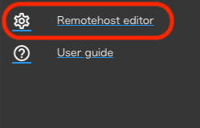
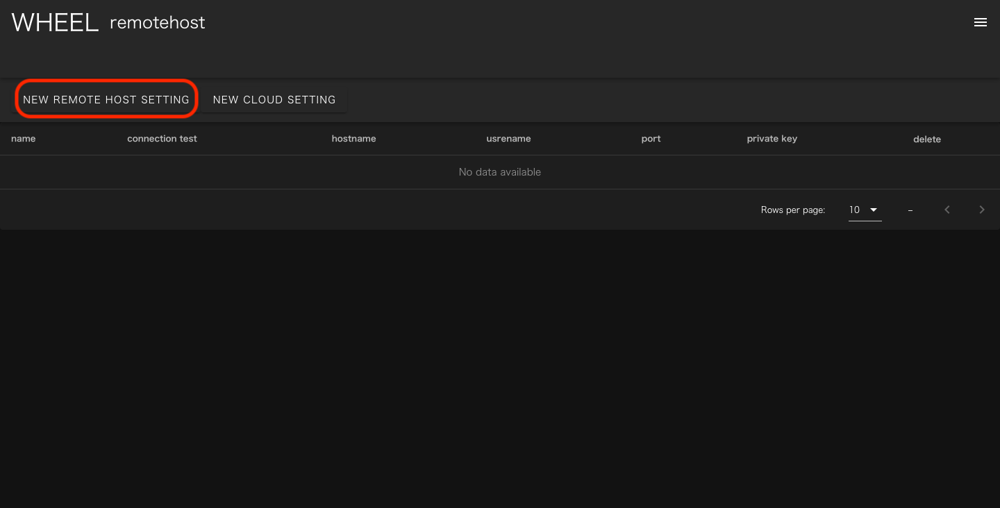
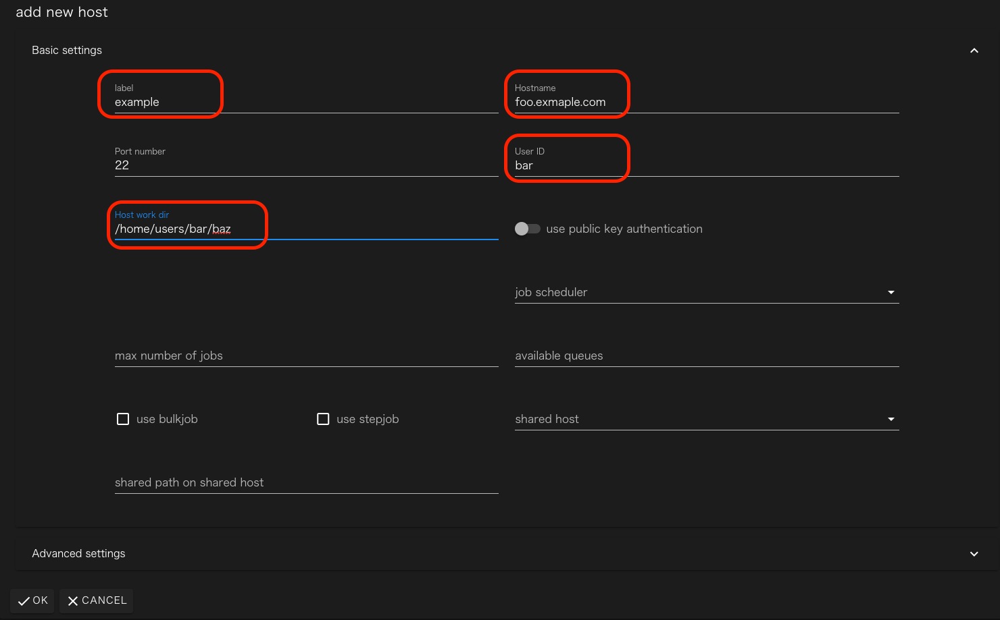
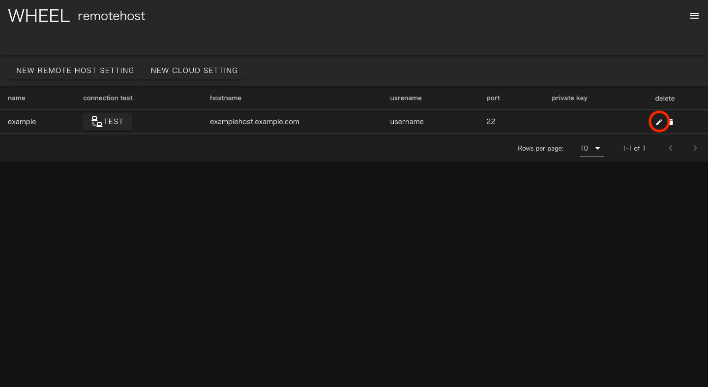

## チュートリアル(基礎編)について
本チュートリアルでは、WHEELの基本的な機能のみを使ってワークフローを作成・実行することで
WHEELの使い方を学んでいきます。

### 1. 新規プロジェクトの作成
WHEELでは、1つのワークフローの実行単位のことを __プロジェクト__ と呼びます。
プロジェクトの中には、実際にプログラムを実行する __タスクコンポーネント__ を1つ以上作成し
これらの間で入出力ファイルをやりとりしたり、実行順序を制御することで1つのワークフローを構成します。

まず初めに空のプロジェクトを作成しましょう。

#### ブラウザを起動して home 画面へアクセス
ブラウザを起動して、WHEELサーバへ接続するとhome画面が表示されます。
画面左上に表示されている __NEW__ ボタンをクリックしてください。


ディレクトリツリーが表示されるので、新規プロジェクトを作成するディレクトリを選択し(1)
プロジェクト名を入力して(2) __CREATE__ ボタンをクリックしてください(3)


プロジェクト名はディレクトリ名の一部として使われるため、アルファベット、数字および一部の記号のみしか使えません。

#### プロジェクトを開く
新しく作成したプロジェクトが一覧の中に表示されるので、プロジェクト名の左側にあるチェックボックスにチェックを入れて(1)
__OPEN__ ボタンをクリックしてください(2)


画面が遷移して、ワークフロー画面が表示されます。


### 2. 最初のコンポーネントの追加
ワークフロー画面では、画面左側にあるパレットからワークフローの部品である __コンポーネント__ を
ドラッグ&ドロップすることでワークフローを作成します。

ここでは、設定されたプログラムを実行する __Taskコンポーネント__ を1つプロジェクトに追加してみましょう。

#### Taskコンポーネントの追加
まずはじめにTaskコンポーネント(1)をドラッグして、画面中央の黒い部分(2)にドロップしてください。


これで、プロジェクトに1つ目のコンポーネントが追加されました。


続けてこのTaskコンポーネントの中で実行する処理を定義します。

### 3. Taskコンポーネントのプロパティ設定
Taskコンポーネントを含む全てのコンポーネントは、動作を規定する __プロパティ__ を設定することで
初めてワークフローの部品として機能するようになります。
Taskコンポーネントでは、実行したいプログラムを直接指定するのではなく、
そのプログラムを呼び出すbashスクリプトを作成し、実行したいスクリプトを指定する必要があります。

ここではサンプルとして、echoコマンドを呼び出すだけの単純なシェルスクリプトを作成して実行します。

#### シェルスクリプトの作成
さきほど作成した、__task0__ と書かれた箱(1)をクリックすると画面右側にプロパティを設定するためのサブ画面(2)が表示されます。


プロパティ画面上で下にスクロールすると、最下段に __Files__ と書かれた行があります。(1)


この行をクリックすると、ファイル操作エリアが下側に展開されます。
シェルスクリプトの元となる空ファイルを作成するために、__new file__ ボタン(1)をクリックしてください。


ファイル名を入力するダイアログが表示されるので、作成するシェルスクリプトの名前を入力(1)し、
__OK__ ボタンをクリックしてください。(2)


正常にファイルが作成できたら、ファイル操作エリアの下にファイル名が表示されるのでクリックして選択してください(1)
ワークフロー画面左上の __text editor__ ボタンをクリック(2)することで、このファイルを編集することができます。


ここでは、数値計算プログラムを実行する代わりにechoコマンドを用いて文字列を出力するシェルスクリプトを作成して実行します。
テキストエディタ部分(1)に `echo Hello WHEEL` と入力して画面右上の __SAVE ALL FILES__ ボタン(2)をクリックします
最後に画面左上の __graph view__ ボタン(3)をクリックして元の画面に戻ってください。


#### 実行スクリプトの指定
プロパティサブ画面を表示し、__script__ とかかれたドロップダウンリストから、
さきほど作成したスクリプトファイルを選択してください。


最後に、画面右上の __save project__ ボタン(1)をクリックして作成したプロジェクトをsaveしましょう。

WHEELでは、プロジェクトファイルの管理にgitを使っており、save処理を行なったタイミングで
リポジトリにコミットされます。
__revert project__ ボタン(2)をクリックすると、直前にsaveした状態まで巻き戻すことができますが
redo(元に戻す処理を取り止めること)はできませんので、注意してください。


### 4. プロジェクトの実行
続いて、作成したプロジェクトを実行してみましょう。
__run project__ ボタン(1)をクリックすると、プロジェクトの実行が始まります。


今回のプロジェクトでは、`echo`コマンドを使っているので、標準出力に文字が表示されます。
画面下部の▽ ボタン(2)をクリックすると、WHEELのログ出力や、プロジェクト内で実行したコマンドの
標準出力、標準エラー出力を表示するログ画面が表示されます。

ログ画面を開いた直後は __INFO__ タブが表示されていて、WHEELのログ出力見えます。
標準出力に未読の出力がある時は、 __STDOUT__ タブ(1)が緑色になります。このタブをクリックすると、echoコマンドの出力が確認できます。


プロジェクトの実行が終了すると、画面上部のステータス表示が __FINISHED__ に変わります。もしプロジェクト内で実行したプログラムが正常に終了しなかった時は、 __FAILED__ となります。


### 5. プロジェクトの初期化
プログラムによっては、実行後にファイルが出力されていたり、既存のファイルが書き換えられていることが
あります。
また、WHEELはプロジェクト内の個々のコンポーネントの実行状態を管理しているため、
プロジェクトの修正をしたり、再実行する時には一度実行開始前の状態に戻す必要があります。

本チュートリアルでは、この後プロジェクトに修正を加えながら何回か再実行していくので
画面上部にある __clean project__ ボタンをクリックして、実行開始前の状態に戻してください。


### 6. リモートホスト設定の作成
最初のプロジェクトでは、ローカルホスト(WHEELを実行しているマシン)で全てのタスクを実行しました。
WHEELは、sshでログインした先のマシン上でタスクを実行する機能があります。

この機能を使うためには、初めに接続先ホストの情報をWHEEL上で設定する必要があります。

まず、画面右上のハンバーガーメニューをクリックしてください。


表示されたメニュー内の __Remotehost editor__ をクリックすると別のタブでリモートホスト設定画面が表示されます。




画面上部の __NEW REMOTE HOST SETTING__ ボタンをクリックすると新規ホスト設定ダイアログが表示されます。



フォームのうち次の項目に、値を入力してください。

- label          任意の文字列
- Hostname       接続先のホスト名またはIPアドレス
- User ID        接続先ホストでのユーザID
- Host work dir  リモートホスト内で使用するディレクトリのパス

例えば、 `foo.example.com` ホストに対して、ユーザー `bar` で接続し
タスクの実行を `/home/users/bar/baz` ディレクトリ以下で行なう設定を
`example` という名前で作成するとすれば、入力内容は次のようになります。




labelはWHEELが接続先ホストを区別するための文字列で、大文字小文字が区別されます。

Hostname, UserIDは接続先のホスト名(IPアドレスでも可)とユーザIDです。
これらのフィールドには、 `~/.ssh/config` で設定した値を指定することもできます。

Host work dirには接続先ホストでの作業ディレクトリを絶対パスで指定します。
WHEELがリモートホストでプログラムを実行する時には、ここで指定したディレクトリの下に
ファイルを転送してから、実行します。

通常は接続先ホストのホームディレクトリを指定しますが
システムによっては、容量制限やI/O性能の都合で他の領域を使う方が良い場合もあります。
接続先システムの利用ガイド等を参照して適切なディレクトリを選択してください。

また、リモートホストへの接続に公開鍵認証を使う場合は、 __use public key authentication__
のスイッチを有効にしてください。
下側に、秘密鍵を指定する欄が表示されるので、秘密鍵のパスを入力するか、 __BROWSE__ ボタンをクリックして
ファイルを選択してください。

その他の詳細な設定内容は[リファレンスマニュアル](../../3_reference_manual/2_remotehost_screen/index.md "remotehost設定") を
ご参照ください。

### 7. リモートホスト上でのタスクの実行
リモートホスト上でプログラムを実行する準備が整ったので、さきほどのタスクをリモートホストで実行してみましょう。

ワークフロー画面に戻って、task0コンポーネントをクリックしプロパティ画面を表示します。
__host__ と書かれた欄をクリックすると、設定したremotehostの一覧が表示されるので、
さきほど作成したリモートホストのラベルを選択してください。


__save__ ボタンをクリックすると準備完了です。ローカルホストで実行した時と同じく
__run project__ ボタンをクリックするとプロジェクトの実行が始まりますが
ここでは、リモートホストに接続するためのパスワードを入力するダイアログが
表示されます。

パスワード認証での接続の場合はパスワードを、公開鍵認証での接続の場合は
秘密鍵に設定したパスフレーズを入力して __OK__ ボタンをクリックしてください。


ログ画面を開くと、実行終了時に __OUTPUT(SSH)__ の部分にechoコマンドの出力が表示されています。

出力内容を確認したら、__clean project__ ボタンをクリックしてプロジェクトを初期化してください。

### 8. バッチシステム経由でのタスクの実行
次は、同じ内容のワークフローをバッチシステム経由で実行してみます。
まずは、リモートホストエディタを起動してください。
さきほど登録したリモートホストが表示されているので、右端の鉛筆アイコンをクリックして
ホスト情報編集ダイアログを表示します



リモートホストで使われているジョブスケジューラの種類を、 __job scheduler__ (1) の欄から選んでください。
現在設定可能な値は次の6種類です。

- PBSPro
- PBSProWithoutHistory
- SLURM
- TCS (Technical Computing Suite)
- Fugaku
- UGE (Univa Grid Engine)

富岳では、TCSが採用されていますが他サイトとは一部挙動が違うため、富岳専用の設定(Fugaku)が用意されています。
また、PBSProは、ジョブスケジューラの設定で、実行終了したジョブの情報を保存しないものがあります。
この場合 __PBSPro__ ではなく __PBSProWithoutHistory__ を使ってください。

続いて、使用可能なキュー名を __available queues__ の欄(2)にカンマ区切りで入力してください。
デフォルトキューが設定されているシステムで、デフォルトキューのみを使う場合は
空欄のままでも構いません。

最後に、ジョブの同時投入本数に制限を行ないたい場合は、 __max number of jobs__ の欄(3) に入力してください。

例えば、同時投入本数が10本に制限されているシステムでは11本目のジョブを投入しようとするとエラーになり
ジョブ投入が受け付けられません。WHEEL側で制限を行なうことでこのようなエラーの発生を抑制できます。
ただし、WHEELを使わずに投入されたジョブ数は数えられませんので、グループ単位での同時投入ジョブ数が
制限されているような場合は、制限に抵触する可能性もあります。

以上でリモートホスト設定の変更は終了です。

ワークフロー画面に戻って、再度task0のプロパティ画面を表示してください。

バッチシステムを介してジョブを実行すると、標準出力の内容を取得する方法がシステムによって異なるので、
さきほどのスクリプトを変更して、 `stdout.txt` というファイルにechoコマンドの結果を出力するように変更しましょう。

プロパティ画面下部のFiles から `3. Taskコンポーネントのプロパティ設定` で作成したスクリプトを
選択し、テキストエディタで開いてください。

echoコマンドの行末に追記して `echo Hello WHEEL > stdout.txt` と変更してください。


1回目のスクリプト作成時は、 __SAVE ALL FILES__ ボタンをクリックしてファイルを保存しましたが、
今回は別の方法で保存してみましょう。

ファイル名が書かれたタブ部分をクリックすると、__save__ __close without save__ という2つのメニューが表示されます。

ここでは、 __save__ を選択してください。


__close without save__ をクリックすると編集したテキストが破棄されてタブが閉じられます。

今は、1ファイルしか開いていませんが複数ファイルを開いて編集し、一部のファイルのみを保存したい場合は
こちらの方法で不要なファイルを破棄し、__SAVE ALL FILES__ ボタンで一括保存(または、必要なファイルをさらに個別に保存)してください。

スクリプトの編集が終わったらグラフビュー画面に戻って、再びtask0のプロパティを編集します。

まず、__use job scheduler__ スイッチ(1)を有効にしてください。
ジョブに関する設定を入力できるようになるので __queue__ (2) の欄から投入先のキューを選択してください。


続いて、スクリプトが出力する __stdout.txt__ をダウンロードする設定を追加します。
プロパティ画面の最上部にある __basic__ の右にある上向き矢印をクリックしてください。


上段の設定項目が折り畳まれて、全てのカテゴリが表示されるので、__remote file setting__ を
クリックして開いてください。


includeの欄(1)に __stdout.txt__ と入力してエンターキーを押すか、
右にある __+__ ボタン(2)をクリックしてください。


設定が終了したら、プロジェクトをsaveして実行してください。

実行終了後に、task0コンポーネントのプロパティから、 __stdout.txt__ を選択して
テキストエディタを立ち上げてください。


echoコマンドの実行結果がファイルに出力されています。


以上でバッチシステム経由でのタスク実行は終了です。次のチュートリアルのために
__clean project__ ボタンをクリックしてプロジェクトを初期化してください。

### 9. 入出力ファイルの受け渡し
これまでは、タスクが1つしか無いワークフローを実行してきましたが
実際のワークフローでは、先行するプログラムが出力したファイルを
別のプログラムに渡して処理を行なうことがよくあります。

ここでは、WHEELのタスクコンポーネント間でファイルを受け渡す方法について学びましょう。

まず、ワークフローに2つ目のタスクを追加してください。
最初のタスクの名前を変更しておらずtask0のままにしていた場合、task1という名前のタスクが作成されます。


次に、task0が実行結果として __stdout.txt__ というファイルを出力することを指定します。
task0のプロパティ画面を開いて下にスクロールすると、 __input/output files__ という行があります。
これをクリックして入力欄を表示し、__output files__に __stdout.txt__ を入力してください。


task0の箱の右下に __stdout.txt__ という表示が追加されます。


この右にある▶をドラッグすると線が伸びていくので、task1の上にドロップしてください。


これで、task0が出力する __output.txt__ を受けとってtask1を実行するという設定ができました。

実際には、まだtask1は未設定ですので、最初のタスクの時と同様に空ファイルを作成して
スクリプトを作りましょう。

スクリプトは `ls -l stdout.txt` としてtask0からファイルが渡ってきたか確認できるようにしてください。

プロジェクトをsaveして実行すると、ログ出力に次のような出力が見えます


この結果から分かるように、output fileに指定されたファイルは、後続のコンポーネントに
シンボリックリンクとして渡されます。

実際には、先行するタスクでソルバを実行して、実行結果ファイルを後続のポスト処理コンポーネントに渡したり
先行するタスクでプリ処理を行なって、入力ファイルを後続のソルバコンポーネントに渡すといった使い方が考えられます。

この時、前後のコンポーネントで実行するホストが違っていても、WHEELが自動的にダウンロードして転送するので
ライセンスや、計算機アーキテクチャの都合でそれぞれの処理を別のシステムで実行
同様のワークフローで実行することができます。


以上でコンポーネント間のファイルの受け渡し方法のチュートリアル終了です。次のチュートリアルのために
__clean project__ ボタンをクリックしてプロジェクトを初期化してください。


### 10. タスク実行順の制御
前の章では、先行するコンポーネントが出力したファイル受けとってから、後続のコンポーネントを実行しました。

実際のワークフローでは、ファイルの受け渡しは発生しないが、
あるプログラムが終わってから、次のプログラムを実行する必要がある
という状況があります。

WHEELには、先行コンポーネントの終了を待ってから実行する機能があるので
この機能を使って2つのタスクの実行順を制御してみましょう。

#### タスク内容の変更
さきほどの、task0, task1の内容ではどちらが先に実行されたのか分かり難いので
それぞれのスクリプトを次のように変更してください。

task0
```
sleep 10
echo task0
```

task1
```
echo task1
```

また、remotehostでの実行待ちなどが発生するのを避けるために、 __host__ を
__localhost__ に変更してローカル環境で実行するように設定してください。

続いて、stdout.txtは今回は使わないので、output fileの設定を削除します。

まず、 __task0__ のプロパティ画面を開いて __input/output files__ の
設定欄を表示させ、 __stdout.txt__ の右にあるゴミ箱アイコンをクリックしてください。


__output files__ から__stdout.txt__ が削除され、task1の __stdout.txt__ と接続された線も削除されます。


task1のinput files には、__stdout.txt__ の指定が残っていますが、これも同様の操作で削除することができます。
なお、線で結ばれていない input/output files の指定はワークフローの動作には影響しませんので、
一時的に変更する場合などは、使わない設定を残したままでも問題ありません。

この状態で、一旦saveしてワークフローを実行してみましょう。
今は実行順の制御を行なっていないので、task0とtask1はほぼ同時に実行されます。
ログ画面の __STDOUT__ タブを見るとtask1は実行開始直後に表示され
task0の方はsleep10 が入っているので10秒後に表示されるはずです。


では、一回プロジェクトを初期化して、task0が先に実行されるようにしてみましょう。

task0の箱の下部にある▼をドラッグして、task1の箱の上部にある■にドロップしてください。
両taskが緑の線で接続されます。


これで、task0の実行が終了してからtask1が実行されるようになりました。

では、プロジェクトをsaveして実行してみましょう。

ログ出力を見ると今度はtask0が表示されてからtask1が表示されているはずです。


これで基本編のチュートリアルは終了です。

本チュートリアルでは扱わなかったWHEELの高度な機能について
知りたい方は [応用編のチュートリアル](../2_advanced_tutorial/index.md) に進んでください。

また、個々の機能の詳細な内容については、[リファレンスマニュアル](../../3_reference_manual/index.md) をご参照ください。


--------
[チュートリアルのトップページに戻る](../index.md)
