本チュートリアルでは、WHEELの基本的な機能のみを使ってワークフローを作成・実行することでWHEELの使い方を学んでいきます。

ここでは以下の3つのステップで、学習を進めます。

||項目|説明|
|-----|-----|-----|
|1| [1つのコンポーネントを持つワークフローの作成と実行](#1-1つのコンポーネントを持つワークフローの作成と実行) |最小単位のワークフローを作成し、ローカルホストで実行します。WHEELの基本となる使い方を学習します|
|2| [様々な実行環境でのワークフローの実行](#2-様々な実行環境でのワークフローの実行) |ステップ1. で作成したワークフローを使用し、リモートホストやバッチシステム経由での実行方法を学習します|
|3| [複数コンポーネントを持つワークフローの作成と実行](#3-複数コンポーネントを持つワークフローの作成と実行) |ワークフロー内に複数コンポーネントがある場合の制御について学習します|


## 1. 1つのコンポーネントを持つワークフローの作成と実行
ここでは、"Hello WHEEL"と標準出力する最小単位のワークフローを作成します。
本ステップを通じ、1つのコンポーネントを持つワークフローの作成方法と、ローカルホストでの実行方法を習得してください。

<!--本ステップでの学習概要は以下のとおりです。

||項目|説明|
|-----|-----|-----|
|1| [ワークフローの作成準備](#1-1-ワークフローの作成準備) |プロジェクトを新規作成し、ワークフローを作成する準備を行います|
|2| [ワークフローの作成](#1-2-ワークフローの作成) |プロジェクトにコンポーネントを追加し、ワークフローを作成します|
|3| [ワークフローの実行](#1-3-ワークフローの実行) |作成したワークフローを実行します|-->

### ワークフローの作成準備
はじめに、ここではワークフローを作成する準備として、プロジェクトを新規作成し、開く手順を学習します。

__"プロジェクト" とは__  
WHEELでは、1つのワークフローの実行構成のことを __プロジェクト__ と呼びます。  
プロジェクトの中には、実際にプログラムを実行する __タスクコンポーネント__ を1つ以上作成し
これらの間で入出力ファイルをやりとりしたり、実行順序を制御することで1つのワークフローを構成します。
{: .notice--info}

では実際に、空のプロジェクトを新規作成しましょう。

#### プロジェクトの新規作成
プロジェクトはホーム画面で作成します。ホーム画面では、新規プロジェクトの作成や既存プロジェクトの編集ができます。

ブラウザを起動して、WHEELサーバへ接続するとホーム画面が表示されます。
画面左上に表示されている __NEW__ ボタンをクリックしてください。

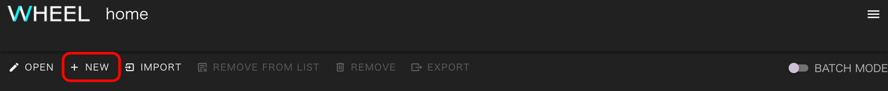


ディレクトリツリーが表示されるので、必要に応じて新規プロジェクトを作成するディレクトリ(1)を選択します。
プロジェクト名(2)を入力して __create__ ボタン(3)をクリックしてください。

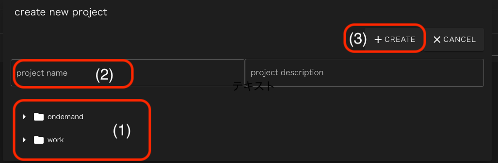

__プロジェクト名について__  
プロジェクト名はディレクトリ名の一部として使われるため、アルファベット・数字および一部の記号のみしか使えません。
{: .notice--info}

#### プロジェクトを開く
作成したプロジェクトを開き、グラフビュー画面に遷移します。グラフビュー画面では、ワークフローの作成や実行ができます。

ホーム画面に、新規作成したプロジェクトが一覧表示されます。プロジェクト名の左側にあるチェックボックス(1)にチェックを入れて、 __OPEN__ ボタン(2)をクリックしてください。

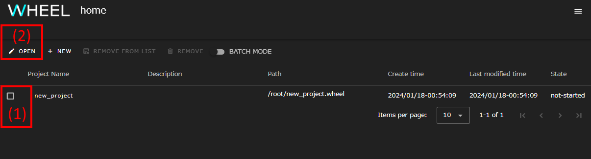

画面が遷移して、グラフビュー画面が表示されます。

以上で、ワークフローの作成準備が完了となります。

### ワークフローの作成
つづいて、プロジェクトにコンポーネントを追加し、ワークフローを実際に作成します。
ここで作成するワークフローは、"Hello WHEEL"と標準出力するシンプルなワークフローとなります。

#### コンポーネントの追加
グラフビュー画面では、画面左側にあるパレットからワークフローの部品である __コンポーネント__ を
ドラッグ&ドロップすることで、ワークフローの構成要素を追加します。

ここでは、設定されたプログラムを実行する __Taskコンポーネント__ を1つプロジェクトに追加してみましょう。

まずはじめにTaskコンポーネント(1)をドラッグして、画面中央の黒い部分(2)にドロップしてください。

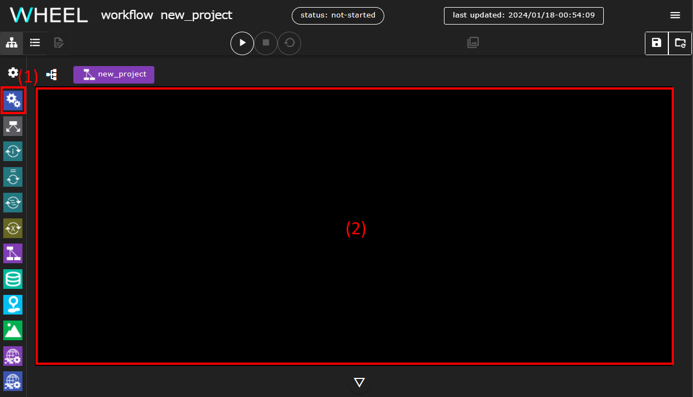

これで、ワークフローに1つのコンポーネントが追加されました。

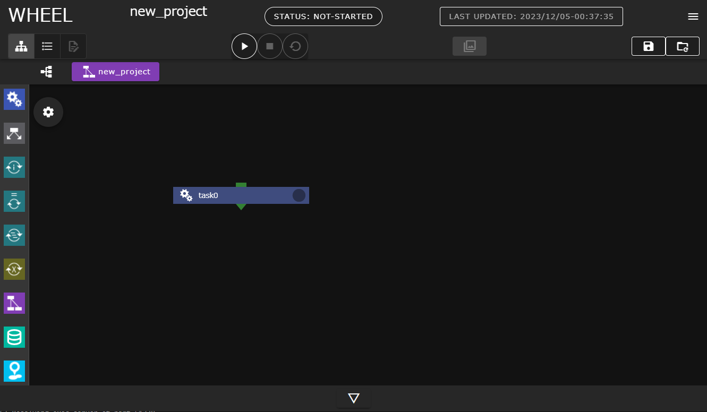


つづいて、このTaskコンポーネントの中で実行する処理を定義します。

#### コンポーネントの動作を設定
Taskコンポーネントを含む全てのコンポーネントは、動作を規定する __プロパティ__ を設定することで
初めてワークフローの部品として機能するようになります。
Taskコンポーネントでは、実行したいプログラムを直接指定するのではなく、
そのプログラムを呼び出すシェルスクリプトを作成し、実行したいスクリプトを指定する必要があります。

ここではサンプルとして、echoコマンドを呼び出すだけの単純なシェルスクリプトを作成します。
その後、作成したシェルスクリプトを実行するようコンポーネントの動作としてプロパティ設定します。

##### シェルスクリプトの作成
はじめに、シェルスクリプトとなる空ファイルを作成します。

さきほど作成した __task0__ コンポーネント(1)をクリックすると、画面右側にプロパティを設定するためのプロパティ画面(2)が表示されます。

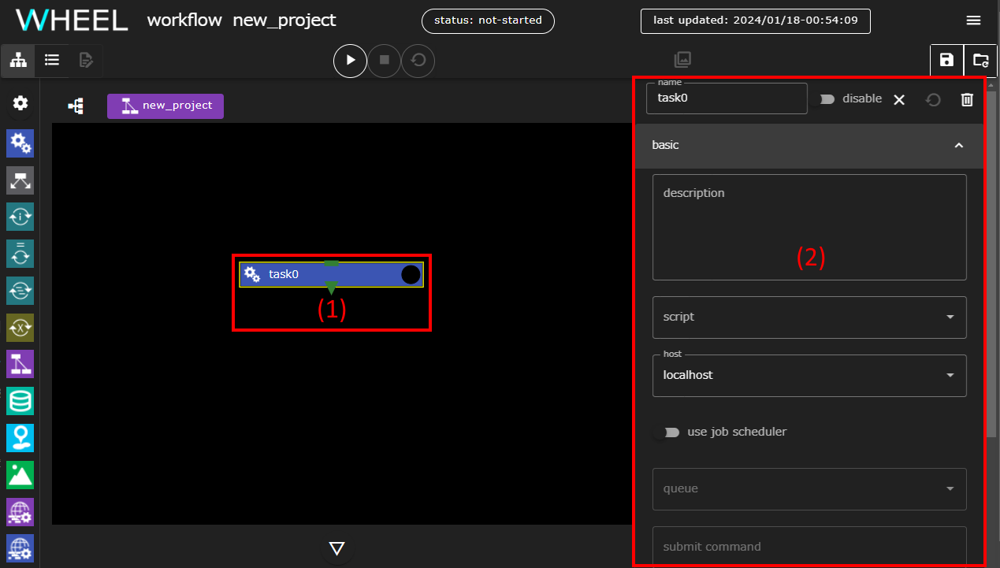

プロパティ画面上で下にスクロールすると、最下段に __Files__ と書かれた行(1)があります。

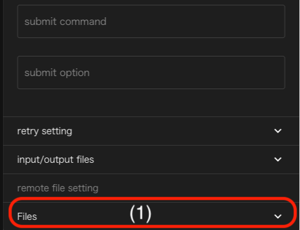

この行をクリックすると、ファイル操作エリアが下側に展開されます。
シェルスクリプトとなる空ファイルを作成するために、__new file__ ボタン(1)をクリックしてください。

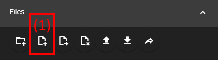


ファイル名を入力するダイアログが表示されるので、作成するシェルスクリプトの名前(1)を入力し、
__ok__ ボタン(2)をクリックしてください。

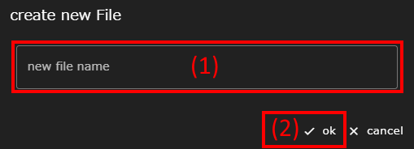

シェルスクリプト用の空ファイルが作成されます。

##### シェルスクリプトの処理を記述
つづいて、作成したシェルスクリプトに処理を記述します。

ファイル操作エリアの下にファイル名(1)が表示されるのでクリックして選択してください。
グラフビュー画面左上の __text editor__ ボタン(2)をクリックすることで、選択したファイルをテキストエディタ画面で開きます。テキストエディタ画面では、ファイルの編集や確認ができます。

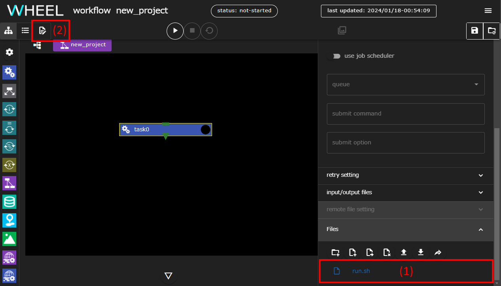

ここでは、数値計算プログラムを実行する代わりに、echoコマンドを用いて文字列を出力するシェルスクリプトを作成します。
テキストエディタ部分(1)に `echo Hello WHEEL` と入力します。編集内容を保存するため、画面右上の __save all files__ ボタン(2)をクリックします。
最後に画面左上の __graph view__ ボタン(3)をクリックして元の画面に戻ってください。

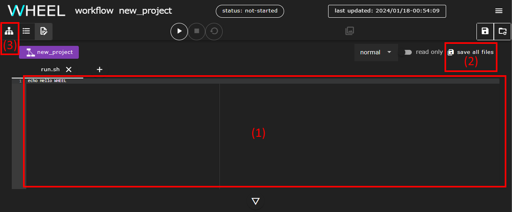

__Taskコンポーネントの実行結果について__  
Taskコンポーネントを実行した際の成否は指定されたスクリプトの戻り値で判定されます。（0:正常終了、0以外:異常終了）  
従いまして、スクリプト内で複数のコマンドを実行する際は適宜、戻り値を指定してください。
{: .notice--info}

##### 実行スクリプトの指定
Taskコンポーネントの動作として、作成したシェルスクリプトが呼び出されるようコンポーネントのプロパティに指定します。

プロパティ画面を表示し、__script__ ドロップダウンリスト(1)から、スクリプトファイルを選択してください。

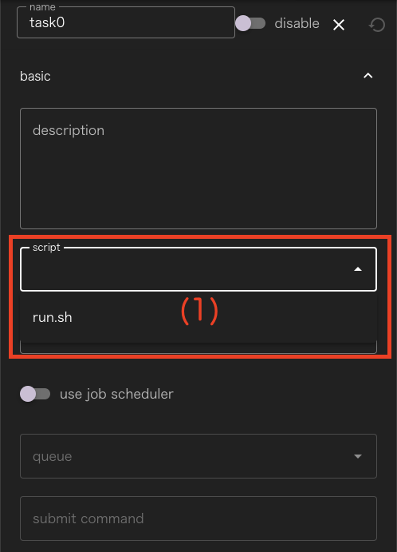

最後に、画面右上の __save project__ ボタン(1)をクリックして作成したプロジェクトをsaveしましょう。
<!--__revert project__ ボタン(2)をクリックすると、直前にsaveした状態まで巻き戻すことができますが
redo(元に戻す処理を取り止めること)はできませんので、注意してください。-->

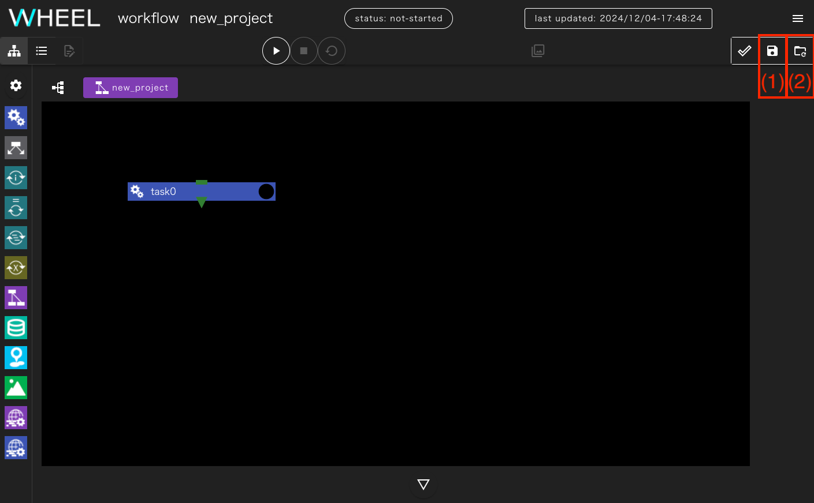

__save処理について__  
WHEELでは、プロジェクトファイルの管理にgitを使っています。  
__save project__ ボタンをクリックしたタイミングで、save処理としてgitリポジトリにコミットされます。
{: .notice--info}

__revert project ボタンについて__  
__revert project__ ボタン(2)をクリックすると、直前にsaveした状態まで巻き戻すことができます。  
ただし、redo(元に戻す処理を取り止めること)はできませんので、ご注意ください。
{: .notice--info}

### ワークフローの実行
ここでは、作成したワークフローを実行する手順を学習します。

#### プロジェクトの実行
作成したプロジェクトを実行してみましょう。
__run project__ ボタン(1)をクリックすると、プロジェクトが実行されます。

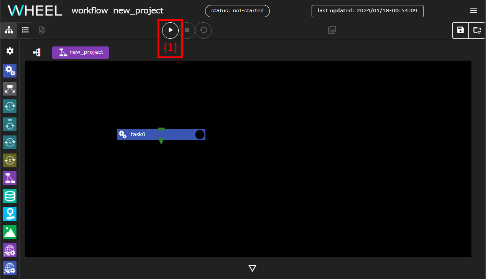

プロジェクトの実行が終了すると、画面上部のステータス表示が __finished__ に変わります。もしプロジェクト内で実行したプログラムが正常に終了しなかった時は、 __failed__ となります。

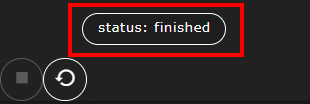


#### ログの確認
WHEELのログ出力や、ワークフロー内で実行したコマンドの標準出力、標準エラー出力はログ画面から確認できます。

画面下部の▽ ボタン(1)をクリックすると、ログ画面が表示されます。
今回のプロジェクトでは、`echo`コマンドを使っているので、標準出力に文字が表示されます。


ログ画面を開いた直後は __info__ タブが表示されていて、WHEELのログ出力が確認できます。
標準出力に未読の出力がある時は、 __stdout__ タブ(1)が緑色になります。このタブをクリックすると、echoコマンドの出力が確認できます。

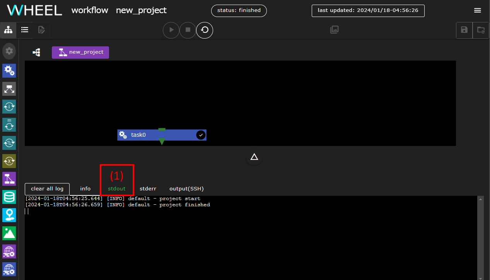


#### プロジェクトの初期化
プログラムによっては、実行後にファイルが出力されていたり、既存のファイルが書き換えられていることがあります。
また、WHEELはプロジェクト内の個々のコンポーネントの実行状態を管理しているため、
プロジェクトの修正をしたり、再実行する時には一度実行開始前の状態に戻す必要があります。

本チュートリアルでは、この後プロジェクトに修正を加えながら何回か再実行していくのでプロジェクトを初期化して実行開始前の状態に戻します。

プロジェクトを初期化する際は、画面上部にある __cleanup project__ ボタンをクリックします。


以上で、本ステップでの学習は終了です。


## 2. 様々な実行環境でのワークフローの実行
前項では、コンポーネントのTaskコンポーネントをローカルホストで実行しました。
ここでは、前項で作成したワークフローの設定を変更し、タスクを様々な実行環境で実行してみます。
タスクをリモートホストや、バッチシステム経由で実行する方法を習得してください。

### リモートホスト上でのタスクの実行
前項のワークフローのタスクをリモートホストで実行してみましょう。

タスクの実行環境は、プロパティ設定で指定します。

task0コンポーネントをクリックしプロパティ画面を表示します。
__host__ ドロップダウンリストをクリックすると、[リモートホスト設定]({{ site.baseurl }}/for_admins/how_to_boot/#リモートホスト設定)で設定されたリモートホストの一覧が表示されるので、
使用するリモートホストのラベルを選択してください。


__save project__ ボタン(1)をクリックすると準備完了です。
ローカルホストで実行した時と同じく、 __run project__ ボタン(2)をクリックするとプロジェクトの実行が始まります。

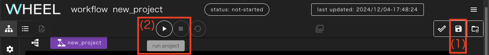

今回はリモートホストを指定しているので、リモートホストに接続するためのパスワードを入力するダイアログが表示されます。
パスワード認証での接続の場合はパスワードを、公開鍵認証での接続の場合は
秘密鍵に設定したパスフレーズを入力して __OK__ ボタンをクリックしてください。

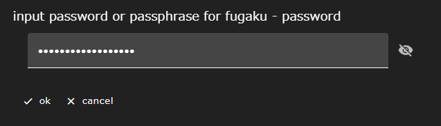

ログ画面を開くと、実行終了時に __STDOUT(SSH)__ タブにechoコマンドの出力が表示されています。

")

出力内容を確認したら、次の学習のため、 __cleanup project__ ボタンをクリックしてプロジェクトを初期化してください。


### バッチシステム経由でのタスクの実行
次は、同じ内容のワークフローをバッチシステム経由で実行してみます。

__バッチシステム経由でタスクを実行するための事前準備について__   
バッチシステム経由でタスクを実行する場合は、事前に[バッチシステムがある場合の追加設定]({{ site.baseurl }}/for_admins/how_to_boot/#バッチシステムがある場合の追加設定)に従いリモートホスト設定が実施されている必要があります。
{: .notice--info}


再度task0のプロパティ画面を表示してください。

バッチシステムを介してジョブを実行する場合、標準出力の内容を取得する方法がシステムによって異なります。
そこで、前項で作成したスクリプトを変更して、 `stdout.txt` というファイルにechoコマンドの結果を出力するように変更しましょう。

プロパティ画面下部のFilesから [シェルスクリプトの作成](#シェルスクリプトの作成) で作成したスクリプトを選択し、テキストエディタ画面で開いてください。

echoコマンドの行末に追記して `echo Hello WHEEL > stdout.txt` と変更してください。

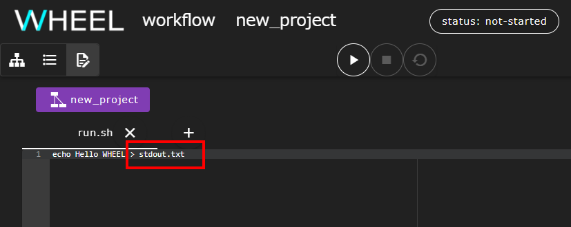

前項でのスクリプト作成時は、 __save all files__ ボタンをクリックしてファイルを保存しましたが、今回は別の方法で保存してみましょう。

ファイル名が書かれたタブ部分をクリックすると、__save__、__close without save__ という2つのメニューが表示されます。

ここでは、 __save__ を選択してください。

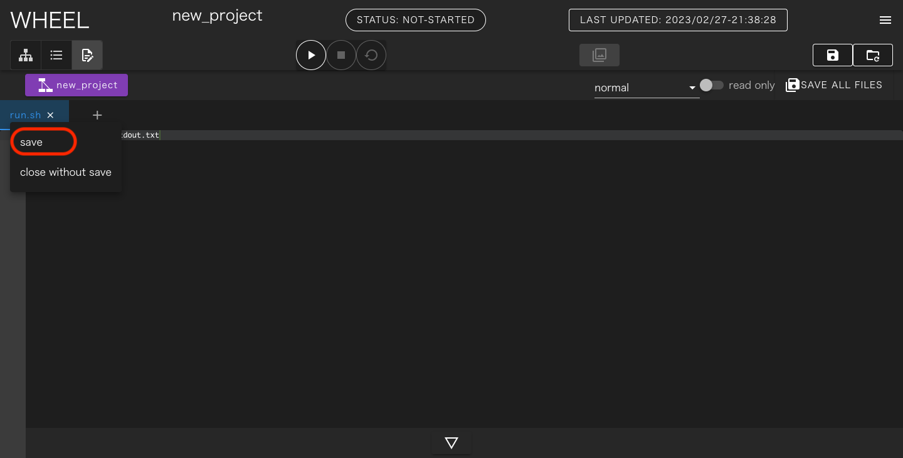

__ファイル編集の破棄方法__  
ファイルの編集を破棄したい場合は、__close without save__ ボタンを利用します。  
__close without save__ ボタンをクリックすると、編集したテキストが破棄されてタブが閉じられます。
{: .notice--info}


__一部のファイルのみを保存する方法__  
複数ファイルを開いて編集し、一部のファイルのみを保存したい場合は以下の手順で保存します。  
1. __close without save__ ボタンをクリックし、不要なファイル編集を破棄します。  
1. __save all files__ ボタンで一括保存(または、 __save__ ボタンにて必要なファイルを個別に保存)します。

<div class="notice--info">
  {{ notice-save | markdownify }}
</div>

スクリプトの編集が終わったらグラフビュー画面に戻って、再びtask0のプロパティを編集し、バッチシステム経由で実行するように設定します。

まず、ジョブに関する設定を入力できるように __use job scheduler__ スイッチ(1)を有効にしてください。
__queue__ (2) の欄から投入先のキューを選択してください。


続いて、スクリプトが出力する __stdout.txt__ をダウンロードする設定を追加します。
プロパティ画面の最上部にある __basic__ の右にある上向き矢印をクリックしてください。

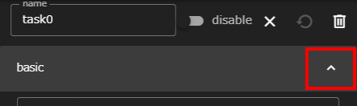

上段の設定項目が折り畳まれて、全てのカテゴリが表示されるので、__remote file setting__ を
クリックして開いてください。

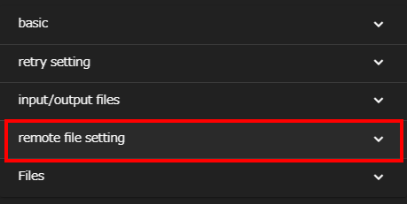

includeの欄(1)に __stdout.txt__ と入力してEnterキーを押すか、
右にある __+__ ボタン(2)をクリックしてください。

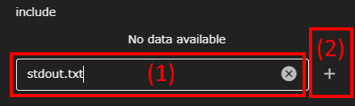

設定が終了したら、プロジェクトをsaveして実行してください。

実行終了後に、task0コンポーネントのプロパティから、 __stdout.txt__ を選択して
テキストエディタを立ち上げてください。

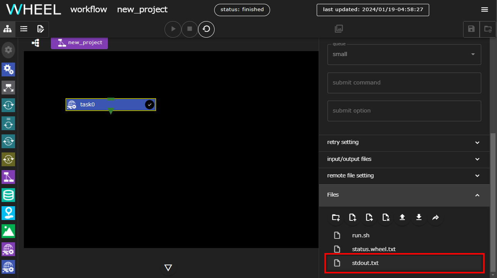

echoコマンドの実行結果がファイルに出力されています。

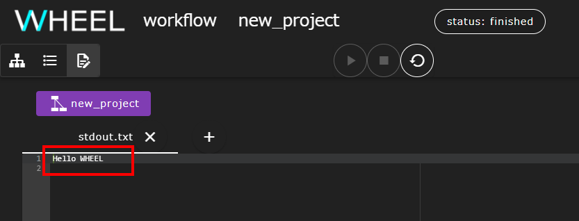

以上でバッチシステム経由でのタスク実行は終了です。  
次のチュートリアルのために __cleanup project__ ボタンをクリックしてプロジェクトを初期化してください。

<!--### 9. 入出力ファイルの受け渡し-->
## 3. 複数コンポーネントを持つワークフローの作成と実行
前項までは、コンポーネントが1つのワークフローを実行してきました。
しかし、実際のワークフローでは、先行するプログラムが出力したファイルを別のプログラムに渡して処理を行なうことがよくあります。
ここでは、ワークフロー内に複数のコンポーネントがある場合の制御について学習します。

### コンポーネント間での入出力ファイルの受け渡し
まず、先行するコンポーネントが出力したファイル受け取ってから、後続のコンポーネントを実行する方法について学びましょう。

前項までのワークフローに、2つ目のコンポーネントを追加してください。
最初のコンポーネントの名前をデフォルトのtask0から変更していない場合、task1という名前のコンポーネントが作成されます。

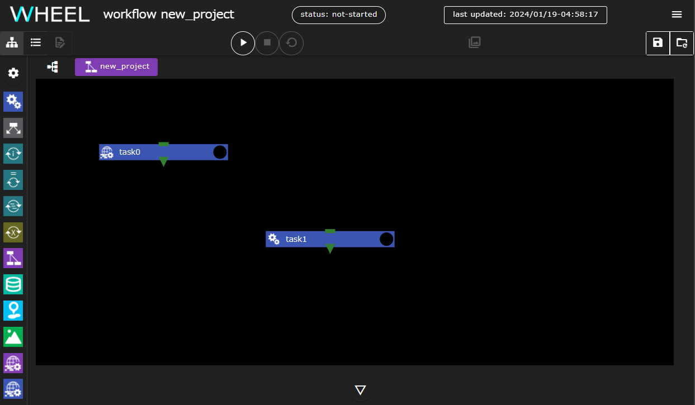

次に、task0が実行結果として __stdout.txt__ というファイルを出力するよう設定します。

task0のプロパティ画面を開いて下にスクロールすると、 __input/output files__ という行があります。
これをクリックして入力欄を表示し、__output files__ に __stdout.txt__ と入力してください。

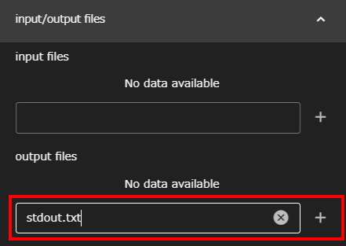

task0コンポーネントの右下に __stdout.txt__ という表示が追加されます。

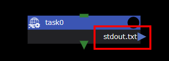

task0が出力する __stdout.txt__ を、task1に渡す設定を行います。
__stdout.txt__ の右にある▶をドラッグすると線が伸びていくので、task1の上にドロップしてください。

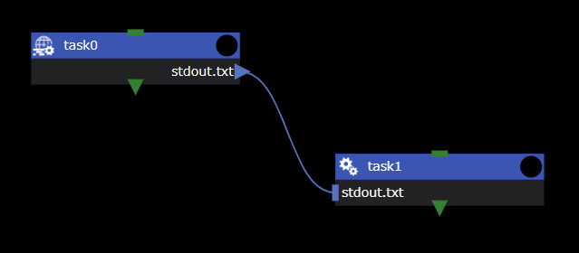

これで、task0から __stdout.txt__ を受けとってtask1を実行するという設定ができました。

task1では、まだその他の設定が未設定ですので、task0の作成時と同様に空ファイルを作成してスクリプトを作りましょう。

スクリプトの内容は、
```
ls -l stdout.txt
```
として、task0からファイルが渡ってきたか確認できるようにしてください。
また、scriptプロパティに作成したスクリプトファイルを指定してください。

プロジェクトをsaveして実行すると、ログ画面に次のような標準出力が表示されます。

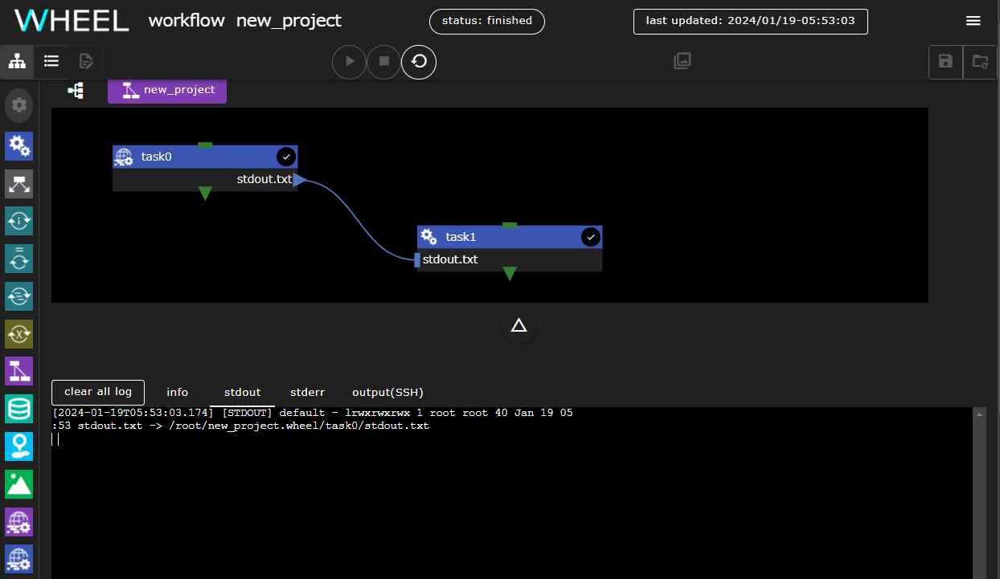

この結果から分かるように、output filesに指定されたファイルは、後続のコンポーネントにシンボリックリンクとして渡されます。

実際には、以下のような使い方が考えられます。
* 先行するタスクでソルバを実行し、実行結果ファイルを後続のポスト処理コンポーネントに渡す
* 先行するタスクでプリ処理を実行し、入力ファイルを後続のソルバコンポーネントに渡す


この時、前後のコンポーネントで実行するホストが違っていても、WHEELが自動的にダウンロードして転送します。
そのため、ライセンスや、計算機アーキテクチャの都合でそれぞれの処理を別のシステムで実行しても、
同様のワークフローで実行することができます。


以上でコンポーネント間のファイルの受け渡し方法のチュートリアルは終了です。  
次のチュートリアルのために __cleanup project__ ボタンをクリックしてプロジェクトを初期化してください。


<!--### 10. タスク実行順の制御-->
### コンポーネント実行順の制御
[コンポーネント間での入出力ファイルの受け渡し](#コンポーネント間での入出力ファイルの受け渡し)では、先行するコンポーネントが出力したファイル受け取ってから、後続のコンポーネントを実行しました。

実際のワークフローでは、ファイルの受け渡しは発生しないが、
あるプログラムが終わってから、次のプログラムを実行する必要がある
という状況があります。

WHEELには、先行コンポーネントの終了を待ってから実行する機能があるので
この機能を使って2つのタスクの実行順を制御してみましょう。

#### タスク内容の変更
先ほどの、task0, task1の内容ではどちらが先に実行されたのか分かり難いので
それぞれのスクリプトを次のように変更してください。

task0
```
sleep 10
echo task0
```

task1
```
echo task1
```

また、リモートホストでの実行待ちなどが発生するのを避けるために、 __host__ を
__localhost__ に変更してローカルホスト上で実行するように設定してください。

続いて、stdout.txtは今回は使わないので、output filesの設定を削除します。

まず、 __task0__ のプロパティ画面を開いて __input/output files__ の
設定欄を表示させ、 __stdout.txt__ の右にあるゴミ箱アイコンをクリックしてください。

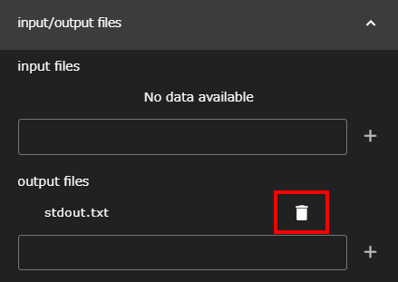

__output files__ から __stdout.txt__ が削除され、task1の __stdout.txt__ と接続された線も削除されます。

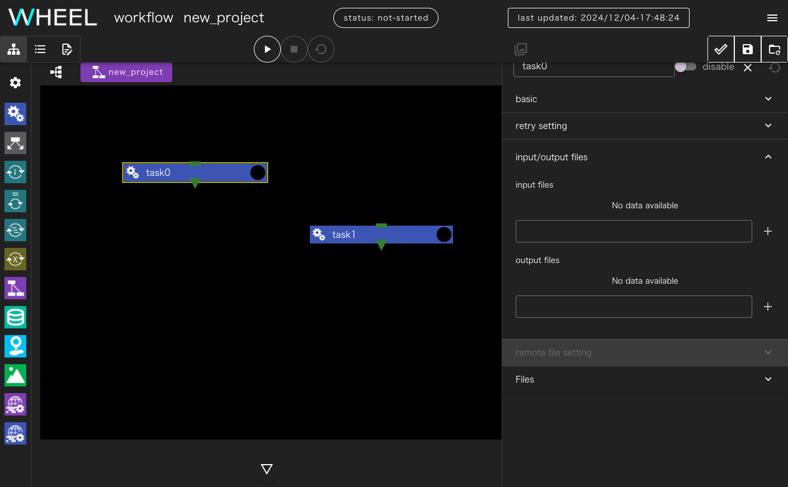

task1のinput files には、__stdout.txt__ の指定が残っていますが、これも同様の操作で削除することができます。  
なお、線で結ばれていない input/output files の指定はワークフローの動作には影響しませんので、
一時的に変更する場合などは、使わない設定を残したままでも問題ありません。

この状態で、一旦saveしてワークフローを実行してみましょう。
今は実行順の制御を行なっていないので、task0とtask1は順不同で実行されます。
ログ画面の __STDOUT__ タブを見るとtask1は実行開始直後に表示され
task0の方はsleep10 が入っているので10秒後に表示されるはずです。


では、一回プロジェクトを初期化して、task0が先に実行されるようにしてみましょう。


#### コンポーネントの実行順の設定
コンポーネントの実行順を設定します。

task0コンポーネントの下部にある▼(1)をドラッグして、task1コンポーネントの上部にある■(2)にドロップしてください。
両taskが緑の線で接続されます。

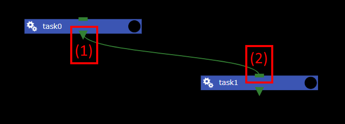

これで、task0の実行が終了してからtask1が実行されるようになりました。

では、プロジェクトをsaveして実行してみましょう。

ログ出力を見ると今度はtask0が表示されてからtask1が表示されているはずです。


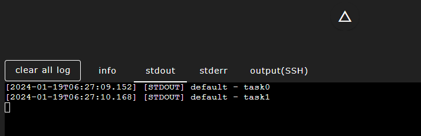


これで基本編のチュートリアルは終了です。

本チュートリアルでは扱わなかったWHEELの高度な機能について知りたい方は
[応用編チュートリアル]({{ site.baseurl }}/tutorial/2_advanced_tutorial/) に進んでください。

また、個々の機能の詳細な内容については、[リファレンスマニュアル]({{ site.baseurl }}/reference/) をご参照ください。


--------
[利用者向けのトップページに戻る]({{ site.baseurl }}/tutorial/)
