This tutorial covers features not covered in the basics.

Unlike the basic section, all items are independent.
Create a new project individually and then follow the tutorial.

### 1. Conditional Branch
In a workflow, depending on the result of a process
It may change subsequent actions.

WHEEL provides an if component to achieve such conditional branching.

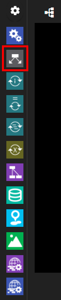

Here, we use the if component to determine whether the execution of the script succeeds or fails.
Let's run different scripts.

First, create a new project.
Then add two task components and an if component to the workflow.
Each of the following is called task0, task1, if0.


First, create task0, task1 to run after branching from if0.

Create a new file for each component and enter the following in a text editor:
In addition, specify the created file in the script property.

task0:

```
echo task0
```

task1:

```
echo task1
```

Output __task0__ or __task1__ to the standard output, respectively.

Then specify the conditional branch for the if component.
Open the properties screen and create a new file named `check.sh`
Open this file with a text editor.

If the return value of check.sh is 0, it branches to a green ▼ (if clause), and if it is not 0, it branches to a purple ▼ (else clause).
First,
```
exit 0
```
and make sure to pass the green ▼ (if clause).

Return to the component properties screen, click the __condition setting__ line,
Specify `check.sh` from the __script name for condition check__ drop-down list.


Finally, connect the purple ▼ (else clause) displayed under if0 to task0 and the green ▼ (if clause) to task1.

The green connector (if clause) returns 0 when check.sh returns 0.
The purple connector (else clause) indicates the component that advances when the return value is non-zero.


When you run this workflow, check.sh returns 0, so only task1 is run.
stdout displays only `task1`.


Let's initialize the project, change the contents of check.sh to `exit 1`, and try again.
This time, only task0 is executed, and stdout displays only `task0`.

### 2. Loop
The same process may be repeated in a workflow.

WHEEL can use for (1), while (2), and foreach (3)
There are three types of loop components:

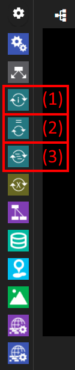

Within each component, you can define a nested workflow.
Runs the subordinate workflow repeatedly until the conditions specified for these components are met.

You can specify conditions for each component in the following ways:

for
: Count up or down from the opening price to the closing price

while
: Executes the specified shell script or javascript statement with a return value of 0 (true for javascript)

foreach
: List all the values to be used

Let's use the for component as a representative example to create a workflow that prints from 1 to 10.

First, add a for component to the project.

There is a text box in the for component property that specifies three numbers: __start__, __end__, and __step__.
Specify 1, 5, and 2, respectively.


Then double-click the for component.
The components in the for component are now visible.
It is not displayed because there are no components now.


Add one task component here.
Also, add an empty file run.sh to the task component and specify it in the script property.


The task component in the for component has a $WHEEL_CURRENT_INDEX` environment variable that indicates the value of the loop variable.
Open the file specified in the script in a text editor and write the following lines:

```
echo $WHEEL_CURRENT_INDEX
```

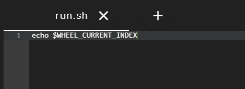

When you run the project, the standard output shows 1,3,5.


If the end property of the for component and the index variable ($WHEEL_CURRENT_INDEX) are equal, as shown in this example,
The internal components are executed.


### 3. Parameter Study
In a computer simulation workflow, you may want to perform the same calculation over and over again, varying some of the input data parameters incrementally.

WHEEL has a parameterStudy component (The following PS components) that supports such processing.

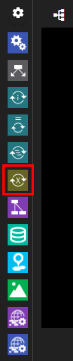

You can define nested workflows within PS components.
By rewriting and executing any file in a subordinate workflow with a specified parameter value, you can perform the same operation multiple times with different parameters.

In this case, you can rewrite and execute the parameter values in the shell script.
Let's pass various arguments to the echo command.


First, add one PS component to the project.


Then double-click the PS component to see inside the PS component and add one task component.
Also, add an empty file called `run.sh` in the task component and specify it in the script property.

In `run.sh`

```
echo number
```

and write.


Save run.sh and return to the graph view.
Click the project name (In the following example, __tutorial_PS__) at the top of the screen to return to the root component of the project.

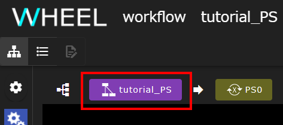

Open the PS component properties screen to display the Files area. With parameterSetting.json selected by clicking on it
Go to the text editor screen.

The left side of the screen is the same text editor as before, but the right side of the screen provides a screen for setting up parameter studies.

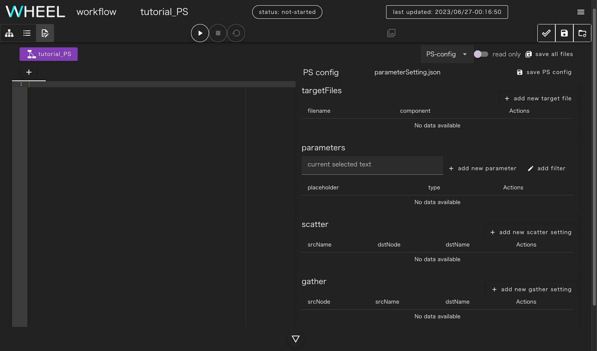

First, click the __+ add new target file__ button at the top right of the screen.
The component tree screen appears, click __task0__. Type __run.sh__ for the file name and click the __OK__ button.


The run.sh you just created appears in the text editor section. Drag the `number` part to select it.
The __parameters__ text box on the right side of the screen displays __number__.

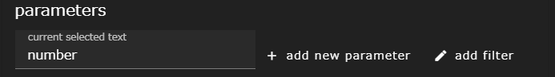

In this state, you can click the __+ add new parameter__ button to set the parameter for __number__.
<!--For now, change the drop-down list to __list__ and enter three values: __foo__ __bar__ __baz__.-->
For now, change the drop-down list to __list__.

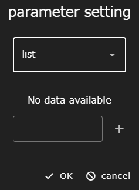

Next, set three values for __foo__ __bar__ __baz__. Type __foo__ in the text box and click the __+__ button. Follow the same steps to set __bar__ and __baz__.


Finally, click the __OK__ button.

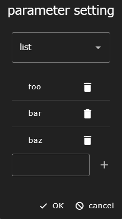

The parameter settings for __number__ are registered.
The __number__ part of __run.sh__ is rewritten as __\{\{ number \}\}__.


At runtime, this __\{\{ number \}\}__ is replaced by the actual parameters (foo, bar, baz) and executed respectively.

Finally, click the __save all files__ button at the top right of the screen to save your edits.

When you run the project, stdout displays foo, bar, and baz, respectively, as output from the echo command.

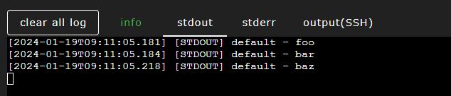

__About the order in which parameter studies are run__  
The PS component executes the subcomponents as parallel as possible for all combinations in the parameter space specified by parameterFile.  
Therefore, the execution order of the lower components is out of order, and the output order of the results is out of order.
{: .notice--info}

#### Addendum to Parameter Replacement
If __{{ number }}__ appears elsewhere in the file specified in the targetfile, it will be replaced by a parameter as well.

You can also add filters within double parentheses.
For example, __{{ number | upper }}__ allows the parameter to be capitalized.

Another alternative is __{{ "true" if number == "foo" else "false" }}__, which is replaced by "true" only when number is foo, and "false" otherwise.

See here for available filters.

[https://mozilla.github.io/nunjucks/templating.html#builtin-filters](https://mozilla.github.io/nunjucks/templating.html#builtin-filters)


### 4. Input File
Depending on the nature of the simulation, you may want preprocessing to be done interactively before the workflow is run, 
but you may want the workflow to automatically perform subsequent operations after the solver.

WHEEL uploads a file at run time as __input data__ for the workflow.
Provides the source component to handle.


In this section, any text file created on your client PC
Learn about the source component by creating a workflow to display with the cat command.

First, add a task component and a source component to your project.

Open the properties of the source component and click the upload setting line to enable the __upload on demand__ switch.
The output files of the source component displays __UPLOAD_ON_DEMAND__.

Then add an empty file called `run.sh` in the task component and specify it in the script property.
In run.sh, include the following:

```
cat input.txt
```

Finally, add __input.txt__ to the input files of the task component and connect to __UPLOAD_ON_DEMAND__ of the source component.
This completes the workflow creation process.

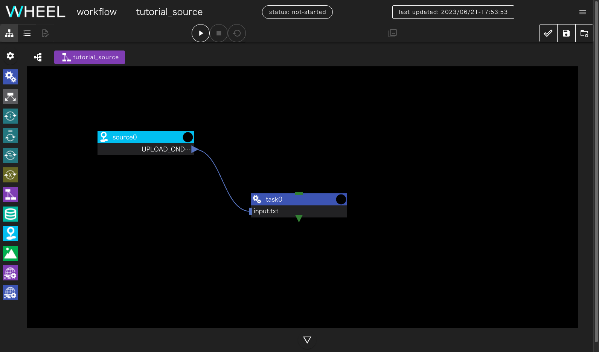

In fact, prepare a text file on your client PC to use as an input file.

When you run the project, you will be prompted to upload a file to use as the outputfile for the source component.
Specify the file you prepared earlier.
When the upload is complete, the part that says __drop file here__ changes to the name of the uploaded file.


Clicking the __ok__ button resumes project execution 
and prints the contents of the file uploaded by the cat command to stdout.

You can upload the file again and again until you click the __ok__ button.
If you specify the wrong file, upload it again and the specified file will be used later.


### 5. Result Display
For workflows that are automated to post-process,
Image files are often output as the result of calculations.

WHEEL provides a viewer component that displays image files in typical formats in the browser.
You can use this component without downloading the resulting file to your client PC.
You can easily see the results.


In this section, you will create a workflow that passes a pre-prepared image file to the viewer component.
Learn about the viewer component.

To get started, add a task component and a viewer component to your project.

Then add an empty file called `run.sh` in the task component and specify it in the script property.
In run.sh, include the following:

```
ls *
```

Uploads image data for display in the viewer component to the task component.
Upload by dragging and dropping the image data to the Files area with the __upload file__ button.

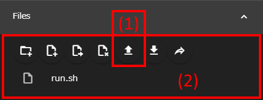

Specify the file name of the uploaded image data in the output files property.  
By writing __\*.extension__, you can specify all files with the same extension or omit the file name. (For example, for a JPEG file, write __\*.jpg__)  
If you want to display only one file as image data, you can specify the file name as it is.  
It is also acceptable to specify multiple file names in the output files property without combining them into one.


Finally, add __./__ to the input files of the viewer component and connect to the output files of the task component.
This completes the workflow creation process.

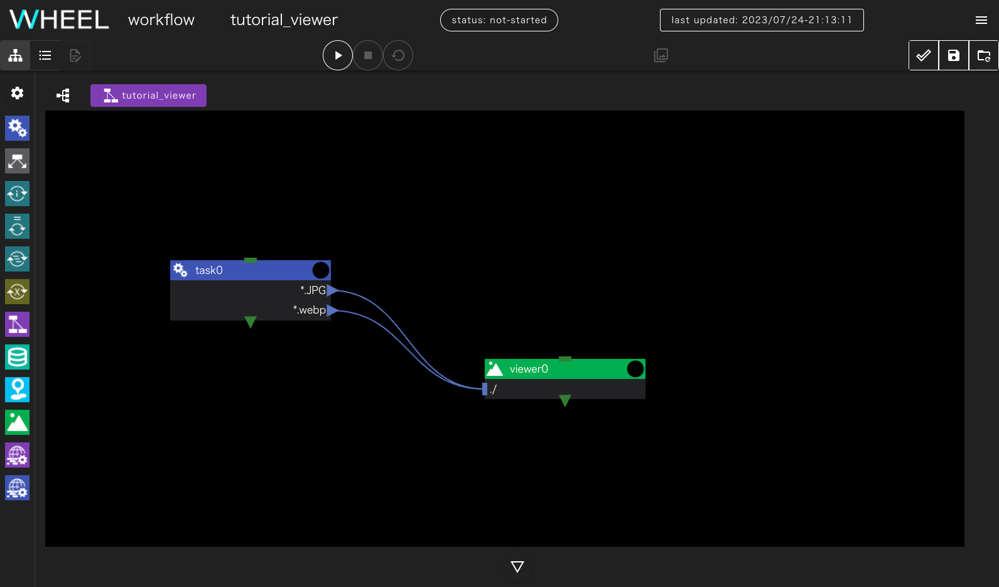

__When "./" is set for input files__  
Setting input files to __./__ places all files passed as input files (In this case, \*.JPG and \*.web) directly under the viewer component directory.
{: .notice--info}

When you run the project, you will see a dialog called __open viewer screen__.

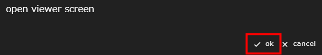

Click the ok button to display the Image Viewer in a separate tab.


By default, the displayed image is tiled, but when you click the displayed image, it enters the slideshow state.
In this state, you can zoom in and out of the image.


### 6. File Save
When you run a workflow in WHEEL, the output files that are created, for example,
It is deleted every time you initialize a project.

If you run the same workflow over and over with a human intervention, checking results and adjusting settings, 
you may want to save the results from each run.

In these cases, you can use the storage component to leave it undeleted during project initialization.


Here, we use the storage component to store files while
Run and initialize the project multiple times to make sure all files are saved.

To get started, add one task component and one storage component to your project.

Then add an empty file called `run.sh` in the task component and specify it in the script property.
In run.sh, include the following:

```
echo foo >foo.txt
```

Also, add __\*.txt__ to the output files of the task component.
This component only prints __foo.txt__, but I'm going to rename the output file
The file name is __\*__ to run the project several times.

Next, open the storage component properties screen and enter __directory path__
Write __/tmp__ . Also, specify __./__ for input files.

__About setting directory path__  
If/tmp does not exist or/tmp does not have write permission, specify any other directory.  
However, you must specify a path that is outside the scope of the directory tree where the project files are stored.  
{: .notice--info}

Finally, connect the output files of the task component and the intpuFile of the storage component.
This completes the workflow creation process.


When you run the project, foo.txt appears in the Files area for each task0, storage0 component.

When you initialize the project, foo.txt for task0 is deleted, but foo.txt for storage0 remains.

If you edit run.sh in task0, rename the output file to bar.txt, and then rerun it, you will see a file in the storage0 component.
foo.txt, bar.txt is displayed.

Thus, when you initialize a project, the files you save in the storage component
It is retained and can be used to save files for restart calculations.


### 7. Bulk Job
Fugaku and other Fujitsu Limited HPC middleware "FUJITSU Software Technical Computing Suite"
The bulk job feature is available on the adopted system.

WHEEL provides a bulkjobTask component to facilitate this functionality from the GUI.


Let's use bulk jobs to create a workflow that is the same as the parameter study.

Before you begin, create a new project and add a builkjobTask component.

The default is to run on localhost, so you can change the host property to
Specify a remote host on which the bulkjob function is available.

__Remote host settings when using the bulk job function__  
Even if the batch system running on the actual host supports the bulk job function,
Note that the bulkjob function is not available unless __use bulkjob__ is enabled in the remotehost configuration.  

{: .notice--info}

Open the properties screen and create an empty file named `run.sh`
Open a text editor and write `echo ${PJM_BULKNUM}`.
When the job is executed, the `${PJM_BULKNUM}` part is replaced with the set parameters.

Return to the properties screen and set script to `run.sh`.

Finally, click in the __bulkjob setting__ row to specify the parameters.
In this section, uncheck the __use parameter setting file for bulk number__
Specify __5__ for __0__ end for start.


Finally, to collect the standard output for each subjob, click the __remote file setting__ line
Specify `run.sh*` for __include__.


When the project has finished running, standard output is output with a file name of the form run.sh.xxxxx[`${PJM_BULKNUM}`].out .
Make sure that each `PJM_BULKNUM` matches the output of the echo command output to the file.


### 8. Step Job
Fugaku and other Fujitsu Limited HPC middleware "FUJITSU Software Technical Computing Suite"
You can use the Step Job feature on your system.

WHEEL includes the stepJob and stepJobTask components to facilitate this functionality from the GUI.
It's ready.


The WHEEL step job function defines multiple stepJobTask components within the stepJob component.
A defined dependency is executed using the stepjob function of the batch system.

First, create a new project and add a stepJob component.

The default is to run on localhost, so you can change the host property to
Specify a remote host on which the stepjob function is available.


__Remote host settings when using the step job function__  
Even if the batch system running on the actual host supports the step job function,
Note that the stepjob function cannot be used unless __use stepjob__ is enabled in the remotehost setting.  
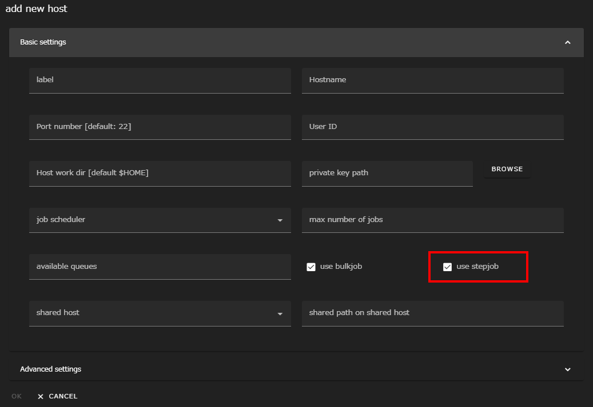
{: .notice--info}

Then double-click __stepjob0__ to view the components below stepjob0.

You can only place a stepjobTask component within a stepjob component.
This switches the component library portion on the left side of the screen to show only the stepjobTask component.

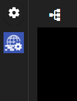

Add two stepjobTask components here.

You have two components, sjTask0 and sjTask1.
Create an empty file named __run.sh__ for each component.
Must be specified in the __script__ property.

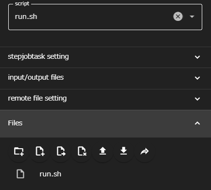

The script for sjTask0 should be:

```
exit 1
```

This will cause sjTask0 to fail each time.

The script for sjTask1 must be:

```
echo stepjobTask1 > stdout.txt
```

It then specifies the order in which sjTask0 and sjTask1 run.
Drag the ▼ of sjTask0 and drop it on sjTask1

The lines connect, and the icon on the left shoulder of sjTask1 changes to 1.

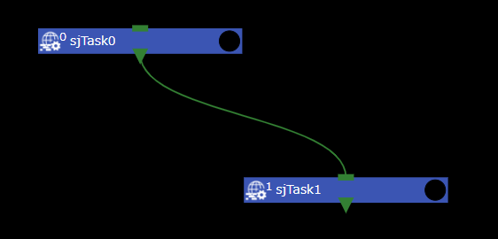

In addition, specify a run condition for sjTask1.
Click to open the __stepjobtask setting__ area of the Properties window.
Enable __use dependency__ to __dependencyForm__  Enter `sd=ec==1`.  
Now, sjTask1 is executed only when sjTask0 returns 1.  
For information about how to write __dependencyForm__, see the TCS documentation or the
See the User Guide.

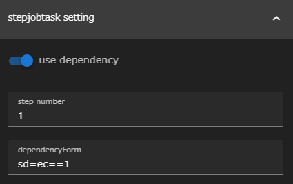

Finally, in order to retrieve the file output by sjTask1,
Click to open the __remote file setting__ area and type `stdout.txt` in the include text box.

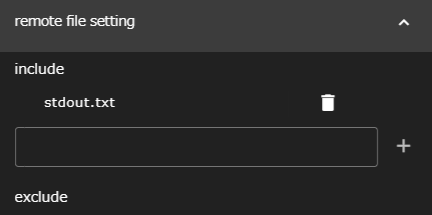

When you run the project, sjTask0 fails.
sjTask1 is executed and output as `stepjobTask1` in stdout.txt.

Once the project is initialized, the __dependencyForm__ of sjTask1
Change `sd=ec==0` and execute the command.

Now, after sjTask0 fails, sjTask1 is not executed and remains
The entire workflow ends.

This concludes the application tutorial.

If you want to know about workflows that actually run applications,
Go to [Practical Tutorial]({{site.baseurl}}/tutorial/3_application_tutorial/).

For detailed information about each function, refer to the [Reference Manual]({{site.baseurl}}/reference/).


--------
[Return to home page]({{site.baseurl}}/tutorial/)
