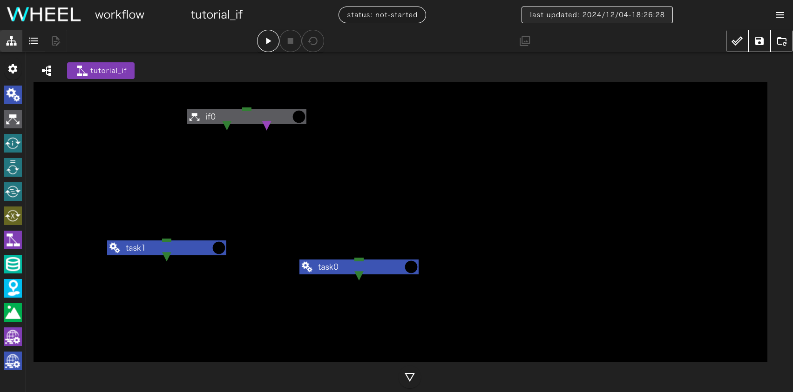
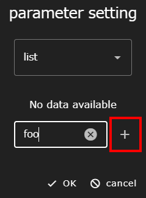
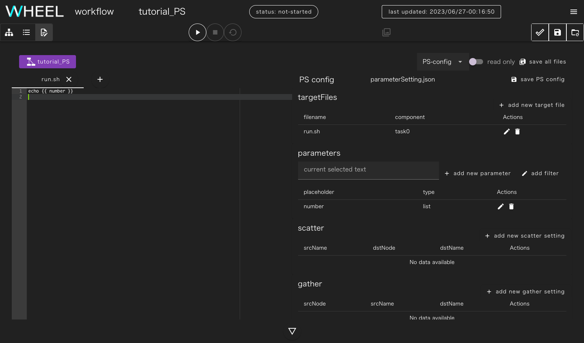
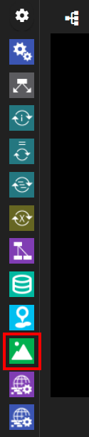
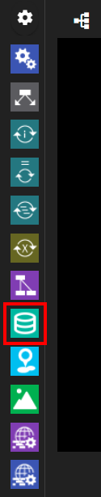
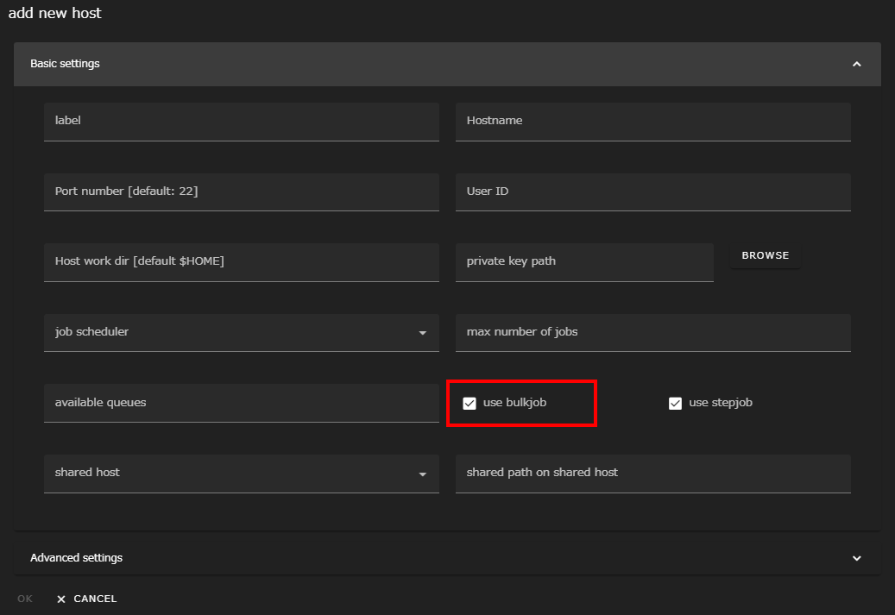

本チュートリアルでは、基礎編では触れなかった機能を扱います。

基礎編とは違い全ての項目は独立しています。
個々に新規プロジェクトを作成してからチュートリアルを実行してください。

### 1. 条件分岐
ワークフローの中で、ある処理の実行結果に応じて後続の処理を変えることがあります。

WHEELでは、このような条件分岐を実現するために ifコンポーネントを用意しています。


ここではifコンポーネントを使って、スクリプトの実行結果の成否に応じてそれぞれ異なるスクリプトを実行してみましょう。

まず、新規プロジェクトを作成してください。
続いて、ワークフローに、taskコンポーネントを2つとifコンポーネントを1つ追加してください。
以降はそれぞれ、task0, task1, if0 という名前で呼びます。



先に、if0から分岐した後で実行するtask0, task1を作成します。

それぞれのコンポーネントで新規ファイルを作成し、テキストエディタで次の内容を入力してください。
また、scriptプロパティに作成したファイルを指定しておいてください。

task0:

```
echo task0
```

task1:

```
echo task1
```

それぞれ、標準出力に対して __task0__ または __task1__ と出力します。

続いて、ifコンポーネントの条件分岐を指定します。
プロパティ画面を開いて、 `check.sh` という名前で新規ファイルを作成し、このファイルをテキストエディタで開いてください。

check.shの戻り値が0であれば緑色の▼（if節）、0以外であれば紫色の▼（else節）へと分岐するので
まずは、
```
exit 0
```
とだけ記入して必ず緑色の▼（if節）を通るようにしてみましょう。

コンポーネントのプロパティ画面に戻って __condition setting__ の行をクリックし __script name for condition check__ ドロップダウンリストから `check.sh` を指定してください。


最後に、if0の下に表示されている紫色の▼（else節）をtask0に、緑色の▼（if節）をtask1に接続してください。

緑色のコネクタ（if節）はcheck.shの戻り値が0のとき、紫色のコネクタ（else節）は戻り値が0以外のときに進むコンポーネントを示します。


このワークフローを実行すると、check.shは0を返すので、task1のみが実行されstdoutには `task1` とだけ表示されます。


一度、プロジェクトを初期化してcheck.shの内容を `exit 1` に変更して再度実行してみましょう。
今度は、task0のみが実行され、stdoutには `task0`とだけ表示されます。

### 2. ループ
ワークフローの中で繰り返し同じ処理を実行することがあります。

WHEELにはこのような時に使える、for(1)、while(2)、foreach(3)という3種類のループコンポーネントがあります。


各コンポーネントの中には入れ子にしたワークフローを定義することができ、これらのコンポーネントに指定された条件を満たすまで下位ワークフローを繰り返し実行します。

それぞれのコンポーネントでは次の方法で条件を指定できます。

for
: 始値から終値までのカウントアップまたはカウントダウン

while
: 指定されたシェルスクリプトまたはjavascriptの文を実行して戻り値が0（javascriptの場合はtrue）の間

foreach
: 使用する値を全て列挙する

ここでは、代表例としてforコンポーネントを使って、1から10まで順に出力するワークフローを作りましょう。

始めにプロジェクトにforコンポーネントを1つ追加してください。

forコンポーネントのプロパティに __start__、__end__、__step__ という3つの数字を指定するテキストボックスがあります。
それぞれ、 1、5、2 と指定してください。


次に、forコンポーネントをダブルクリックしてください。
これで、forコンポーネント内のコンポーネントが表示された状態になりますが、今は何もコンポーネントが無いので表示されていません。


ここに、taskコンポーネントを1つ追加してください。
また、taskコンポーネントに空のファイル run.sh を追加してscriptプロパティに指定してください。


forコンポーネント内のtaskコンポーネントでは、ループ変数の値を示す `$WHEEL_CURRENT_INDEX` 環境変数が利用できます。
スクリプトに指定したファイルをテキストエディタで開き、以下の行を記入してください。

```
echo $WHEEL_CURRENT_INDEX
```


プロジェクトを実行すると、標準出力に 1,3,5 と表示されます。


この例で示したように、forコンポーネントのendプロパティとindex変数(`$WHEEL_CURRENT_INDEX`)の値が等しい時も内部のコンポーネントは実行されます。

### 3. パラメータスタディ
計算機シミュレーションのワークフローでは、入力データのパラメータの一部を少しづつ変化させて、同じ計算を繰り返し実行することがあります。

WHEELには、このような処理をサポートするparameterStudyコンポーネント（以下、PSコンポーネント）があります。


PSコンポーネントの中には入れ子にしたワークフローを定義することができます。
下位ワークフロー内の任意のファイルを指定されたパラメータ値で書き換えて実行することで、同じ処理をパラメータを変えながら複数回実行することができます。

ここでは、シェルスクリプト内のパラメータ値を書き換えて実行することで、echoコマンドに様々な引数を渡してみましょう。


始めにプロジェクトに1つPSコンポーネントを追加してください。


続いて、PSコンポーネントをダブルクリックしてPSコンポーネント内部を表示しtaskコンポーネントを1つ追加してください。
また、taskコンポーネント内に `run.sh` という空ファイルを追加してscriptプロパティに指定してください。

`run.sh`の中には

```
echo number
```

と書いてください。


run.shを保存したらグラフビューに戻ります。
さらに画面上部に表示されているプロジェクト名(以下の例では、__tutorial_PS__) をクリックして、プロジェクトのrootコンポーネントに戻ります。


PSコンポーネントのプロパティ画面を開いてFilesエリアを表示します。
parameterSetting.jsonをクリックして選択した状態でテキストエディタ画面へ移動します。

画面左側はこれまでと同様のテキストエディタですが、画面右側にパラメータスタディ用の設定を行なうための画面が表示されます。


まず、画面右上の __+ add new target file__ ボタンをクリックしてください。
コンポーネントツリー画面が表示されるので、 __task0__ をクリックします。ファイル名に __run.sh__ と入力して __OK__ ボタンをクリックしてください。


テキストエディタ部に、さきほど作成したrun.shが表示されるので、`number`の部分をドラッグして選択してください。
画面右側の __parameters__ テキストボックスに __number__ と表示されます。


この状態で、 __+ add new parameter__ ボタンをクリックすると、 __number__ の部分に対するパラメータ設定を行うことができます。
ここでは、ドロップダウンリストを __list__ に変更します。


続いて、 __foo__ __bar__ __baz__ の3つの値を設定します。
テキストボックスに __foo__ と入力し、__+__ ボタンをクリックしてください。同様の手順で __bar__、__baz__ を設定します。



最後に __OK__ ボタンをクリックします。


__number__ に対するパラメータ設定が登録され、
__run.sh__ の __number__ の部分は、 __\{\{ number \}\}__ と書き換えられます。



実行時には、この __\{\{ number \}\}__ が実際のパラメータ(foo, bar, baz)で置き換えられてそれぞれ実行されます。

最後に、画面右上の __save all files__ ボタンをクリックして編集結果を保存してください。

プロジェクトを実行すると、stdoutに foo, bar, baz とそれぞれechoコマンドの出力結果が表示されます。


__パラメータスタディの実行順について__
PSコンポーネントでは、parameterFileに指定されたパラメータ空間内で、全ての組み合わせについて下位コンポーネントを可能な限り並列実行します。
そのため、下位コンポーネントの実行順は順不同となり、結果の出力順も順不同となります。
{: .notice--info}

#### パラメータ置換に関する補足
先ほどの、 __{{ number }}__ をtargetfileに指定したファイル内の別の場所に記載すれば、そちらも同様にパラメータに置換されます。

また、二重括弧の中には、フィルタを追加することができます。
例えば __{{ number | upper }}__ とすればパラメータを大文字にすることができます。

他にも __{{ "true" if number == "foo" else "false" }}__ とすれば、number がfooの時のみ "true"それ以外の時は"false" に置き換えられます。

利用可能なフィルタはこちらをご参照ください。

[https://mozilla.github.io/nunjucks/templating.html#builtin-filters](https://mozilla.github.io/nunjucks/templating.html#builtin-filters)


### 4. 入力ファイル
シミュレーションの内容によっては、プリプロセスはワークフロー実行前にインタラクティブに実施したいが、ソルバー以降の処理はワークフローで自動的に実行したいというケースもあります。

WHEELには、実行時にファイルをアップロードしてワークフローの __入力データ__ として扱うsourceコンポーネントが用意されています。


ここでは、クライアントPCで作成した任意のテキストファイルをcatコマンドで表示するワークフローを作成して、sourceコンポーネントについて学びましょう。

まずはじめに、プロジェクトにtaskコンポーネントとsourceコンポーネントを1つずつ追加してください。

sourceコンポーネントのプロパティを開いて、upload settingの行をクリックし __upload on demand__ のスイッチを有効にしてください。
sourceコンポーネントのoutput filesに __UPLOAD_ON_DEMAND__ と表示されます。

続いて、taskコンポーネント内に `run.sh` という空ファイルを追加してscriptプロパティに指定してください。
run.shには次の内容を記載してください。

```
cat input.txt
```

最後にtaskコンポーネントのinput filesに __input.txt__ を追加し、sourceコンポーネントの __UPLOAD_ON_DEMAND__ と接続してください。
以上でワークフローの作成は完了です。


実際に、入力ファイルとして使うためのテキストファイルをクライアントPC上に用意してください。

プロジェトを実行すると、sourceコンポーネントのoutputfileとして使うファイルをアップロードするためのダイアログが表示されます。
先ほど用意したファイルを指定してください。
アップロードが完了すると、 __drop file here__ と書かれた部分がアップロードされたファイル名に変更されます。


__ok__ ボタンをクリックするとプロジェクトの実行が再開され、catコマンドによってアップロードされたファイルの中身がstdoutに出力されます。

なお、__ok__ ボタンをクリックするまでは、ファイルのアップロードは何度でもやり直すことができます。
指定するファイルを間違えた場合は、再度アップロードすれば後から指定したファイルが使われます。


### 5. 結果表示
ポストプロセスまで自動化されたワークフローでは、計算結果として画像ファイルを出力することがよくあります。

WHEELには、代表的な形式の画像ファイルをブラウザ上で表示するviewerコンポーネントが用意されています。
このコンポーネントを使うと、計算結果のファイルをクライアントPCにダウンロードすることなく簡単に結果を確認することができます。



ここでは、事前に用意した画像ファイルをviewerコンポーネントに渡すワークフローを作成してviewerコンポーネントについて学びましょう。

まずはじめに、プロジェクトにtaskコンポーネントとviewerコンポーネントを1つずつ追加してください。

続いて、taskコンポーネント内に `run.sh` という空ファイルを追加してscriptプロパティに指定してください。
run.shには次の内容を記載してください。

```
ls *
```

viewerコンポーネントで表示するための画像データを、taskコンポーネントにアップロードします。
Filesエリアの __upload file__ ボタン、もしくはFilesエリアに画像データをドラッグ&ドロップすることでアップロードしてください。


output filesプロパティに、アップロードした画像データのファイル名を記述します。
__\*.拡張子__ と記載することで、同じ拡張子のファイルをまとめて指定したり、ファイル名を省略して指定することができます。(例えば、JPEGファイルの場合は、__\*.jpg__ と記載します)
画像データとして1ファイルのみを表示する場合は、ファイル名をそのまま指定しても構いません。
また、1つにまとめず複数のファイル名をoutput filesプロパティに指定しても問題ありません。


最後にviewerコンポーネントのinput filesに __./__ を追加し、taskコンポーネントのoutput filesと接続してください。
以上でワークフローの作成は完了です。


__input filesに "./" と設定した場合について__
input filesに __./__ と設定することで、input filesとして渡されるファイル（本チュートリアルの場合、\*.JPGと\*.webp）はすべてviewerコンポーネントディレクトリ直下に置かれます。
{: .notice--info}

プロジェクトを実行すると、 __open viewer screen__ というダイアログが表示されます。


okボタンをクリックすると別のタブで画像ビューワーが表示されます。


初期状態ではタイル表示になっていますが、表示された画像をクリックするとスライドショー状態になります。
この状態では、画像の拡大縮小などを行うことができます。


### 6. ファイル保存
WHEELでワークフローを実行した時に、作成される出力ファイルなどはプロジェクトを初期化した際に毎回削除されてしまいます。

人間が介在して、結果の確認や設定の調整を行ないながら同じワークフローを何度も実行する時には毎回の実行時の結果を保存しておきたいこともあります。

このような時には、storageコンポーネントを使うとプロジェクトの初期化時にも削除されずに残すことができます。



ここでは、storageコンポーネントを使って、ファイルを保存しながら複数回プロジェクトの実行と初期化を繰り返して、全てのファイルが保存されることを確認しましょう。

まずはじめに、プロジェクトにtaskコンポーネントとstorageコンポーネントを1つずつ追加してください。

続いて、taskコンポーネント内に `run.sh` という空ファイルを追加してscriptプロパティに指定してください。
run.shには次の内容を記載してください。

```
echo foo >foo.txt
```

また、taskコンポーネントのoutput filesに __\*.txt__ を追加してください。
このコンポーネントは __foo.txt__ しか出力しませんが、これから出力ファイル名を書き換えながら何回かプロジェクトを実行するため、ファイル名を __\*__ で指定しています。

次にstorageコンポーネントのプロパティ画面を開き __directory path__ の欄に __/tmp__ と記述してください。
また、input filesに __./__ を指定してください。

__directory pathの設定について__
もし、/tmpが存在しない、または/tmpに書き込み権限が無い場合は他の任意のディレクトリを指定してください。
ただし、プロジェクトファイルが保存されているディレクトリツリーの範囲外のパスを指定する必要があります。
{: .notice--info}

最後に、taskコンポーネントのoutput filesと、storageコンポーネントのintpuFileを接続してください。
以上でワークフローの作成は完了です。


プロジェクトを実行すると、task0, storage0それぞれのコンポーネントのFilesエリアに foo.txtが表示されます。

プロジェクトを初期化すると、task0のfoo.txtは削除されますが、storage0のfoo.txtは残ります。

task0のrun.shを編集して、出力ファイル名をbar.txtに変更して再実行すると、storage0コンポーネント内に foo.txt, bar.txt が表示されます。

このように、プロジェクトの初期化を行なってもstorageコンポーネント内に保存したファイルは保持されるので、リスタート計算用のファイルの保存などに活用することができます。


### 7. バルクジョブ
富岳を初めとした、富士通株式会社製HPCミドルウェア「FUJITSU Software Technical Computing Suite」を採用したシステムでは、バルクジョブ機能を使用することができます。

WHEELには、この機能をGUIから簡単に使うための bulkjobTask コンポーネントが用意されています。


ここではバルクジョブを用いてパラメータスタディと同じ内容のワークフローを作成してみましょう。

はじめに、新規プロジェクトを作成し、builkjobTaskコンポーネントを1つ追加してください。

デフォルトではlocalhostでの実行になっているので、プロパティのhostを変更してbulkjob機能が利用可能なリモートホストを指定してください。

__バルクジョブ機能使用時のリモートホスト設定について__
実際に利用するホストで稼動しているバッチシステムがバルクジョブ機能をサポートしていても、remotehost設定で __use bulkjob__ を有効にしていないとバルクジョブ機能は使えませんので、ご注意ください。

{: .notice--info}

プロパティ画面を開いて、 `run.sh` という名前で空ファイルを作成し、テキストエディタを開いて `echo ${PJM_BULKNUM}` と記入してください。
ジョブ実行時には、`${PJM_BULKNUM}` の部分が設定したパラメータに置き換えられます。

プロパティ画面に戻って、scriptに `run.sh` を設定してください。

最後に、 __bulkjob setting__ の行をクリックしてパラメータを指定します。
ここでは、 __use parameter setting file for bulk number__ のチェックを外して、startに __0__ 、endに __5__ を指定してください。


最後に、各サブジョブの標準出力を回収するために、__remote file setting__ の行をクリックして、__include__ に `run.sh*` と指定してください。


プロジェクトの実行が完了すると、標準出力がrun.sh.xxxxx[`${PJM_BULKNUM}`].out という形式のファイル名で出力されます。
各`PJM_BULKNUM`とファイルに出力されたechoコマンドの出力が一致することを確認してください。


### 8. ステップジョブ
富岳を初めとした、富士通株式会社製のHPCミドルウェア「FUJITSU Software Technical Computing Suite」を採用したシステムでは、ステップジョブ機能を使用することができます。

WHEELには、この機能をGUIから簡単に使うための stepJob および stepJobTask コンポーネントが用意されています。


WHEELのステップジョブ機能は、stepJobコンポーネントの中にstepJobTaskコンポーネントを複数定義して依存関係を定義したものを、バッチシステムのstepjob機能を用いて実行するものです。

はじめに、新規プロジェクトを作成しstepJobコンポーネントを1つ追加してください。

デフォルトではlocalhostでの実行になっているので、プロパティのhostを変更してstepjob機能が利用可能なリモートホストを指定してください。


__ステップジョブ機能使用時のリモートホスト設定について__
実際に利用するホストで稼動しているバッチシステムがステップジョブ機能をサポートしていても、remotehost設定で __use stepjob__ を有効にしていないとステップジョブ機能は使えませんので、ご注意ください。

{: .notice--info}

続いて、__stepjob0__ をダブルクリックしてstepjob0コンポーネント以下を表示してください。

stepjob コンポーネント内には、stepjobTask コンポーネントしか配置できません。
そのため画面左側のコンポーネントライブラリ部分が切り替わって、stepjobTask コンポーネントのみが表示された状態になります。


ここに、stepjobTaskコンポーネントを2つ追加してください。

sjTask0とsjTask1という2つのコンポーネントができるので、それぞれのコンポーネントに __run.sh__ という名前で空ファイルを作成し、__script__ プロパティに指定してください。


sjTask0のスクリプトには、次のように指定してください。

```
exit 1
```

これでsjTask0は毎回エラー終了するようになります。

sjTask1のスクリプトは次のように指定してください。

```
echo stepjobTask1 > stdout.txt
```

続いて、sjTask0とsjTask1の実行順を指定します。
sjTask0の ▼ をドラッグしてsjTask1にドロップしてください

線が接続され、sjTask1の左肩に表示されているアイコンの番号が1に変わります。


さらに、sjTask1の実行条件を指定します。
プロパティ画面の __stepjobtask setting__ エリアをクリックして開き、__use dependency__ を有効に、__dependencyForm__ に  `sd=ec==1`と入力してください。
これで、sjTask1はsjTask0の戻り値が1の時のみ実行されます。
__dependencyForm__ の記述方法については、TCSのドキュメントやお使いのスパコンシステムのユーザガイドを参照してください。


最後にsjTask1が出力するファイルを回収するために、__remote file setting__ エリアをクリックして開き、includeテキストボックスに `stdout.txt` と入力してください。


プロジェクトを実行するとsjTask0がfaildとなりますが、sjTask1は実行され、stdout.txtの中に `stepjobTask1` と出力されています。

一度、プロジェクトを初期化してから、sjTask1の __dependencyForm__ を `sd=ec==0` と変更して実行してください。

今度は、sjTask0がfaildになった後、sjTask1は実行されずそのままワークフロー全体が終了します。

これで、応用編のチュートリアルは終了です。

実際にアプリケーションを動かすワークフローについて知りたい方は [実践編チュートリアル]({{ site.baseurl }}/tutorial/3_application_tutorial/) に進んでください。

また、個々の機能の詳細な内容については、[リファレンスマニュアル]({{ site.baseurl }}/reference/) をご参照ください。


--------
[利用者向けのトップページに戻る]({{ site.baseurl }}/tutorial/)
