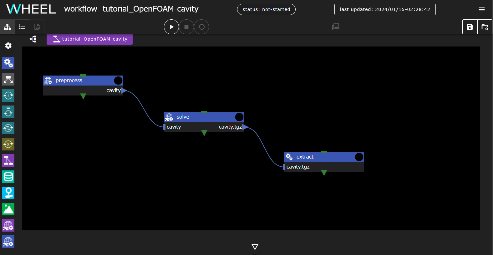
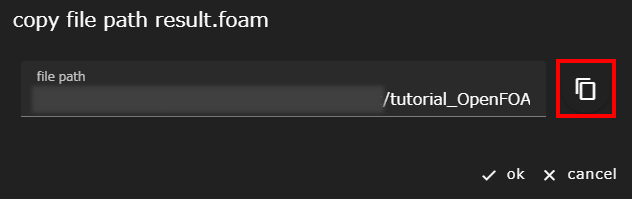

In this chapter, we introduce a calculation example using WHEEL, "Analysis workflow of cavity case using OpenFOAM."

## 1. Overview

### About Analysis Contents
The model covered in this chapter is the "cavity" model, which is a well-known basic validation of CFD software.
Analyze a model in which the top wall moves horizontally at a constant velocity, causing the internal fluid to move as it is dragged.


As an example, the OpenFOAM distribution contains data for analysis using this model, so you can perform calculations using that file.

This tutorial assumes that you are running on Mt. Fugaku.
If you are running in a different environment, change the script settings accordingly.

In the final step of this tutorial, you also use ParaView, which is installed on the WHEEL server, to visualize the calculation results.

Therefore, if you are running the tutorial with WHEEL installed on a remote server, or if you are running in an environment where ParaView is not installed, you cannot run the Review Analysis Results chapter.

### Workflow Overview

Throughout this tutorial, you will create a workflow with three task components:



preprocess component
: Prepare the cavity model provided with OpenFOAM and perform preprocessing (mesh generation and segmentation).

solve component
: Perform the analysis using the data created by the preprocess component. The calculation result file is compressed as a post-processing.

extract component
: Expand the output of the solve component so that it is open in ParaView.

## 2. Creating a Workflow
Create a new project and add three Task components first.

Change the names from the properties screen of each component to __preprocess__, __solve__, and __extract__, respectively.

### Configuring the preprocess component
Create a script file for the __preprocess__ component.
Create a new file named __run.sh__ in the __preprocess__ component with the following contents:

```
. /vol0004/apps/oss/spack-v0.17.0/share/spack/setup-env.sh

spack load 'openfoam@2012%fj@4.8.0'

echo $FOAM_TUTORIALS
cp -r ${FOAM_TUTORIALS}/incompressible/icoFoam/cavity/cavity ./
mv decomposeParDict cavity/system/

cd cavity
blockMesh || exit $?
decomposePar || exit $?
```

The script copies the cavity case from the OpenFOAM system directory, then meshes it with blockMesh and divides it into regions with decomposePar.

Next, open the component property screen and set the following four items.

- script: run.sh
- host: fugaku
- use job scheduler: Enabled
- output files: cavity

This completes the __preprocess__ setting.

### Setting up the solve component
Create a script file in the __solve__ component.
Create a new file named __run.sh__ in the __solve__ component with the following contents:

```
. /vol0004/apps/oss/spack-v0.17.0/share/spack/setup-env.sh

spack load 'openfoam@2012%fj@4.8.0'

cd cavity
mpiexec -np 4 icoFoam -parallel > ./log.icoFoam 2>&1 || exit $?
reconstructPar || exit $?
touch result.foam

cd ../
tar cfzh cavity.tgz ./cavity/
```

This script uses the input data created by the __preprocess__ component to perform an analysis using icoFoam.
Also, post-processing is done to compress the result file for ParaView visualization.

Next, open the component property screen and set the following four items.

- script: run.sh
- host: fugaku
- use job scheduler: Enabled
- output files: cavity.tgz

### Configuring the extract Component
Create a new file named __run.sh__ in the __extract__ component and fill in the following:

```
tar xfz cavity.tgz
```

This script expands the output of the __solve__ component and prepares to launch ParaView.

Finally, open the component properties and set script to __run.sh__.

### Setting File Dependencies
Finally, I/O settings between components are made.
Drop the `cavity` ▶ set in the __preprocess__ output files into the __solve__ component and connect it.
Also, drop ▶ of `cavity.tgz` set in the output files of the __solve__ component into the __extract__ component and connect it.

This completes the workflow creation process. Click the __save project__ button to save the project you created.


## 3. Running the Project
Click the __run project__ button to run the project.
First, you will be asked for the password for the private key you need to log in to Fugaku, but after that, no further action is required until the end of the workflow.

## 4. Checking Analysis Results

This section reviews the analysis results.

To get the path of the calculation result file:
Open the __extract__ component properties window, display the Files area, and open the `cavity` directory.
The `result.foam` file appears below it, click to select it and click the __share file__ button.


Displays the path to the __result.foam__ file.
When you click the Copy button, the file path is copied to the clipboard, so start ParaView with this file name as an argument.



### Analysis Results

The flow velocity vector visualization result is shown as a reference.


This completes the cavity case execution workflow.

--------
[Return to Practical Tutorial]({{site.baseurl}}/tutorial/3_application_tutorial/)
