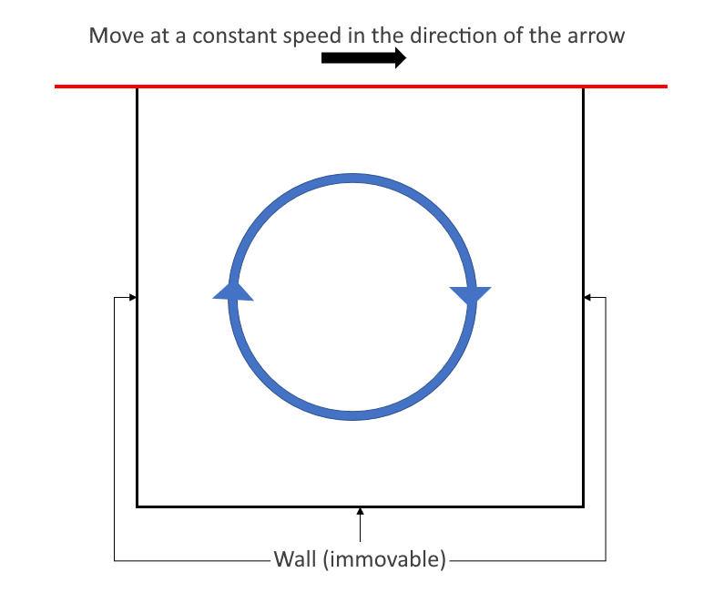
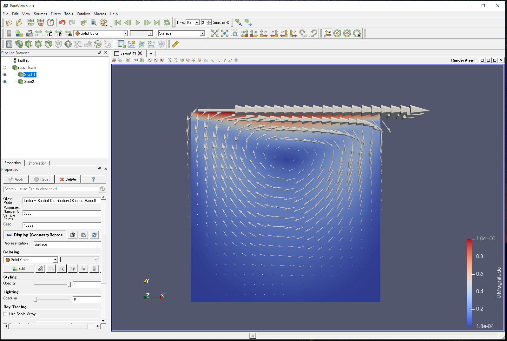

In this chapter, we introduce a calculation example using WHEEL, "Analysis workflow of cavity case using OpenFOAM."

## 1. Analysis Summary
The model covered in this chapter is the "cavity" model, which is a well-known basic validation of CFD software.
Analyze a model in which the top wall moves horizontally at a constant velocity, causing the internal fluid to move as it is dragged.



As an example, the OpenFOAM distribution contains data for analysis using this model.
Use the file to perform the calculation.

This tutorial assumes that you are running on Fugaku. 
If you are running in a different environment, change the script settings accordingly.

In the final step of this tutorial, the WHEEL server
Using the installed ParaView
Visualize calculation results.

For this reason, you may have installed WHEEL on a remote server to perform the tutorial.
If you are running in an environment where ParaView is not installed,
You cannot run the Review Results chapter.

## 2. Creating Workflows
Create a new project and add three Task components first.

Change the names from the properties screen of each component to __preprocess__, __solve__, and __extract__, respectively.

### Configuring the preprocess component
In the __preprocess__ component,
__run.sh__  Create a new file named and fill in the following:

```
. /vol0004/apps/oss/spack-v0.17.0/share/spack/setup-env.sh

spack load 'openfoam@2012%fj@4.8.0'

echo $FOAM_TUTORIALS
cp -r ${FOAM_TUTORIALS}/incompressible/icoFoam/cavity/cavity ./
mv decomposeParDict cavity/system/

cd cavity
blockMesh || exit 1
decomposePar || exit 1
```

This script uses the OpenFOAM system directory
After copying cavity cases, mesh generation with blockMesh, decomposePar
Performs area division.

Open the component properties window and set the following four items.

- script: run.sh
- host: fugaku
- use job scheduler: Enabled
- output files: cavity

This completes the __preprocess__ setting.

### Setting up the solve component
To the __solve__ component
__run.sh__  Create a new file named and fill in the following:

```
. /vol0004/apps/oss/spack-v0.17.0/share/spack/setup-env.sh

spack load 'openfoam@2012%fj@4.8.0'

cd  cavity
mpiexec -np 4 icoFoam -parallel > ./log.icoFoam 2>&1
reconstructPar || exit 1
touch result.foam

cd ../
tar cfzh  cavity.tgz ./cavity/
```

This script uses the input data created by the __preprocess__ component
Perform an analysis using icoFoam.
Also, post-processing is done to compress the result file for ParaView visualization.

Open the component properties window and set the following four items.

- script: run.sh
- host: fugaku
- use job scheduler: Enabled
- output files: cavity.tgz

### Configuring the extract Component
To the __extract__ component
__run.sh__  Create a new file named and fill in the following:

```
tar xfz cavity.tgz
```

This script expands the output of the __solve__ component and prepares to launch ParaView.

Finally, open the component properties and set script to __run.sh__.

### Setting File Dependencies
Drop the `cavity` ▶ set in the __preprocess__ output files into the __solve__ component and connect it.
Also, drop ▶ of `cavity.tgz` set in the output files of the __solve__ component into the __extract__ component and connect it.

This completes the workflow creation process. Click the __save project__ button to save the project you created.


## 3. Run Project
Click the __run project__ button to run the project.
First, you will be asked for the password for the private key you need to log in to Fugaku, but after that, no further action is required until the end of the workflow.

## 4. Review analysis results

Review the analysis results.

Open the __extract__ component properties screen to display the Files area,
Open the `cavity` directory.
The `result.foam` file appears below it, click to select it and click the __share file__ button.


Displays the path to the __result.foam__ file.
Click the Copy button to copy and use this file name as an argument
Start ParaView.


### Analysis Results

The flow velocity vector visualization result is shown as a reference.




This completes the cavity case execution workflow.

--------
[Return to Practical Tutorial]({{site.baseurl}}/tutorial/3_application_tutorial/)
