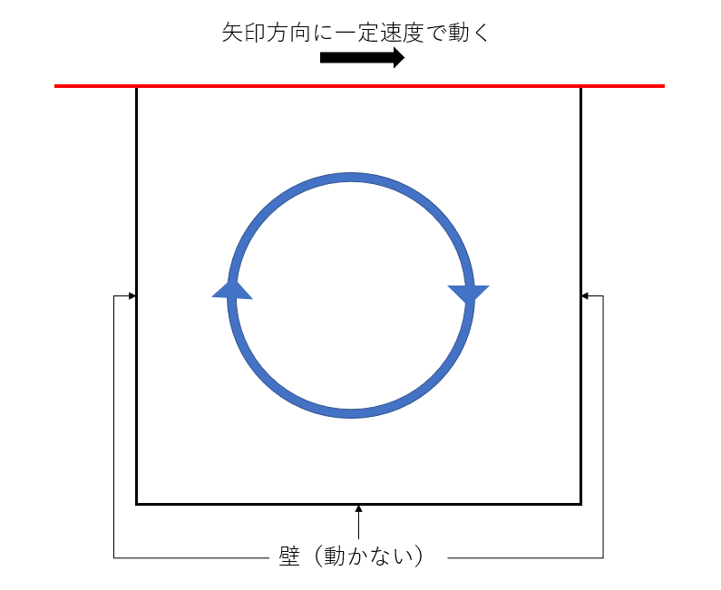
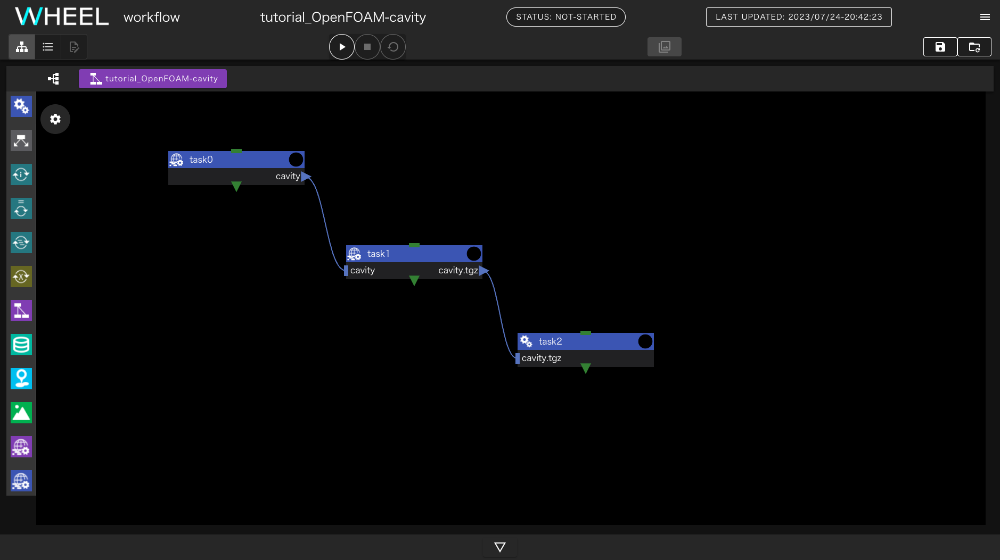
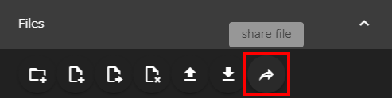
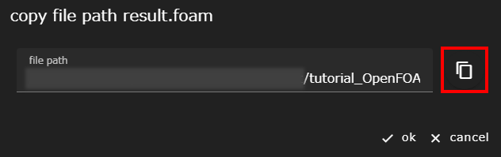
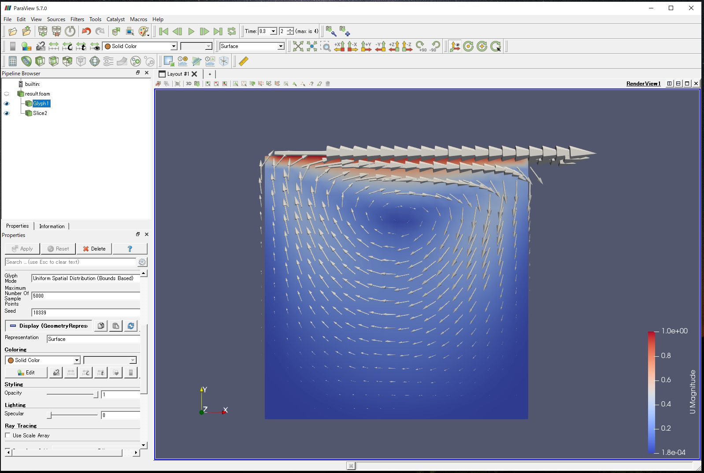

本章では、WHEELを用いた計算事例として「OpenFOAMを利用したcavityケースの解析ワークフロー」を紹介します。

## 1. 解析概要
この章で扱うモデルはCFDソフトウェアの基礎的な検証として有名な "cavity"モデルです。
上端の壁が水平方向に一定速度で動き、引きずられるように内部の流体が動くようなモデルの解析を行ないます。



OpenFOAMの配布物には例題として、このモデルを用いる解析用のデータが含まれているので
そのファイルを用いて計算を実行します。

なお、本チュートリアルの最終ステップでは、WHEELサーバに
インストールされたParaViewを使用して
計算結果の可視化を行ないます。

このため、WHEELをリモートのサーバにインストールしてチュートリアルを実行していたり
ParaViewがインストールされていない環境で実行している場合は、
「解析結果の確認」の章は実行できません。

## 2. ワークフローの作成
新規プロジェクトを作成し、始めに3つのTaskコンポーネントを追加してください。

各コンポーネントのプロパティ画面から、名前をそれぞれ __preprocess__、__solve__、__extract__ に変更してください。

### preprocess コンポーネントの設定
__preprocess__ コンポーネントに、
__run.sh__  という名前で新規ファイルを作成し次の内容を記入してください。

```
. /vol0004/apps/oss/spack-v0.17.0/share/spack/setup-env.sh

spack load 'openfoam@2012%fj@4.8.0'

echo $FOAM_TUTORIALS
cp -r ${FOAM_TUTORIALS}/incompressible/icoFoam/cavity/cavity ./
mv decomposeParDict cavity/system/

cd cavity
blockMesh
decomposePar
```

このスクリプトでは、OpenFOAMのシステムディレクトリから
cavityケースをコピーした後、blockMeshによるメッシュ生成、decomposeParによる
領域分割を行ないます。

コンポーネントのプロパティ画面を開いて以下の4項目を設定してください。

- script: run.sh
- host: fugaku
- use job scheduler: 有効
- output files: cavity

以上で __preprocess__ の設定は終了です。

### solveコンポーネントの設定
__solve__ コンポーネントに
__run.sh__  という名前で新規ファイルを作成し次の内容を記入してください。

```
. /vol0004/apps/oss/spack-v0.17.0/share/spack/setup-env.sh

spack load 'openfoam@2012%fj@4.8.0'

cd  cavity
mpiexec -np 4 icoFoam -parallel > ./log.icoFoam 2>&1
reconstructPar
touch result.foam

cd ../
tar cfzh  cavity.tgz ./cavity/
```

このスクリプトでは、 __preprocess__ コンポーネントで作成した入力データを用いて
icoFoamを用いた解析を実施します。
また、ParaViewでの可視化のために後処理を行ない、結果ファイルを圧縮しています。

コンポーネントのプロパティ画面を開いて、以下の4項目を設定してください。

- script: run.sh
- host: fugaku
- use job scheduler: 有効
- output files: cavity.tgz

### extractコンポーネントの設定
__extract__ コンポーネントに
__run.sh__  という名前で新規ファイルを作成し次の内容を記入してください。

```
tar xfz cavity.tgz
```

このスクリプトは、 __solve__ コンポーネントの出力結果を展開し、ParaViewを起動する準備をします。

最後にコンポーネントのプロパティを開いて、scriptに __run.sh__ を設定してください。

### ファイル依存関係の設定
__preprocess__ のoutput filesに設定した `cavity` の▶を __solve__ コンポーネントにドロップして接続してください。
また、__solve__ コンポーネントのoutput filesに設定した `cavity.tgz` の▶を __extract__ コンポーネントにドロップして接続してください。

以上でワークフローの作成は完了です。__save project__ ボタンをクリックして作成したプロジェクトをsaveします。



## 3. プロジェクトの実行
__run project__ ボタンをクリックして、プロジェクトを実行してください。
初めに、富岳へのログインに必要な秘密鍵のパスワードを聞かれますが、それ以降はワークフローの終了まで操作は不要です。

## 4. 解析結果の確認

解析結果の確認を行います。

__extract__ コンポーネントのプロパティ画面を開いてFilesエリアを表示し
`cavity` ディレクトリを開いてください。
その下に `result.foam` ファイルが表示されるので、クリックして選択し __share file__ ボタンをクリックしてください。



__result.foam__ ファイルのパスが表示されます。
コピーボタンをクリックしてコピーし、このファイル名を引数に
ParaViewを起動してください。




### 解析結果

参考として流速ベクトルの可視化結果を記載します。




以上で、cavityケースの実行ワークフローは終了です。

--------
[実践編チュートリアルに戻る]({{ site.baseurl }}/tutorial/3_application_tutorial/)
