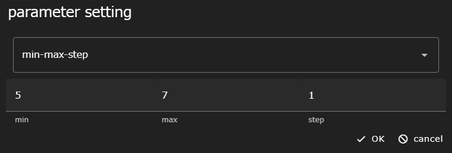
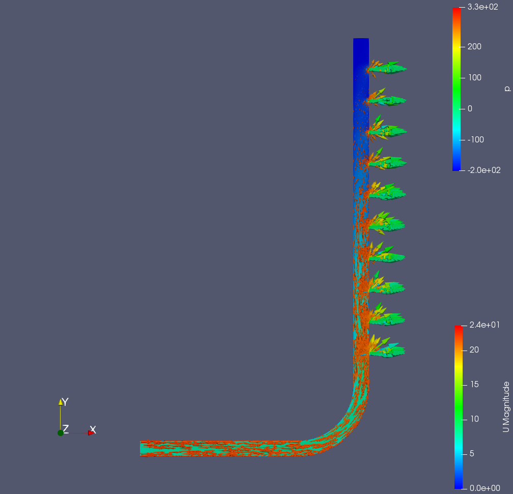

This chapter introduces the parametric study analysis workflow using OpenFOAM as a calculation example using WHEEL.

Perform a parameter study of inlet flow velocity on a distribution pipe model created in 3D CAD.


## 1. Analysis Summary
The analysis target model used in this example is the distributed-pipe model.

### Analytical Model D50-d10


Perform an analysis where the fluid coming in from the inlet leaves the outlet.

This tutorial assumes that you are running on Fugaku. 
If you are running in a different environment, change the script settings accordingly.

Please download and extract the [file](sample/OpenFOAM_tutorial_sample.zip) in advance.
The archive contains three files:

pipe.unv
: Mesh ("SALOME-MECA" is used to create a CAD model and export mesh data in Ideas universal format.)

U
: velocity initial condition file

D50-d10.tgz
: Case Files


In the final step of this tutorial, you install the software on the WHEEL server.
Visualize calculation results using ParaView.

For this reason, you may have installed WHEEL on a remote server to perform the tutorial.
If you are running in an environment where ParaView is not installed,
You cannot run the Review Results chapter.


## 2. Workflow Creation
Create a new project and add two task components and one PS component.
The first task component is named __convert__ and the second task component is named
__extract__.

Also, add one task component inside the PS component.
Name it __solve__.

### Configure the convert component
Open the __Files__ area of the __convert__ component and download the
Please upload __pipe.unv__.

Uploading a file can be done by dropping the file into the __Files__ area or
Click the __upload file__ button to select the file you want to upload.
For detailed instructions, see the [Reference Manual]({{site.baseurl}}/reference/3_workflow_screen/1_graphview.html "Reference Manual - Graph View Screen").

followed by __run.sh__  Create a new file named and fill in the following:

```
. /vol0004/apps/oss/spack-v0.17.0/share/spack/setup-env.sh

spack load 'openfoam@2012%fj@4.8.0'

ideasUnvToFoam pipe.unv
```

This script converts a mesh file in the format Ideas universal to
Convert to OpenFOAM format.

On successful completion, the following file is generated in the __constant/polyMesh__ directory:

- boundary
- owner
- faces
- neighbor
- points

Open the component properties window and set the following four items.

- script: run.sh
- host: fugaku
- use job scheduler: Enabled
- output files: constant

### Setting up the solve component
Open the __Files__ area of the __solve__ component and upload the following pre-downloaded files:
 * Case Files (__D50-d10. tgz__)
 * Initial velocity condition file (__U__)

Also, __run.sh__  Create a new file named and fill in the following:

```
. /vol0004/apps/oss/spack-v0.17.0/share/spack/setup-env.sh

spack load 'openfoam@2012%fj@4.8.0'

tar xvzf D50-d10.tgz
mv ./U ./D50-d10/0
cd ./D50-d10

decomposePar || exit 1
mpiexec -n 12 simpleFoam -parallel
reconstructPar || exit 1
touch result.foam

cd ..
tar cvzf D50-d10.tar.gz D50-d10
```

Open the component properties window and set the following three items.

- script: run.sh
- host: fugaku
- use job scheduler: Enabled


### Configuring PS Components
Click the PS component and add `results` to __output files__.

__parameterSetting.json__ in __Files__ area
With the file selected, open a text editor and enter PS configuration mode.

<!--Click the __add new target file__ button in the __solve__ component.
Target __U__.-->
Click the __add new target file__ button. 
To target __U__ in the __solve__ component, select __solve__, enter __U__ in the text box, and click the __OK__ button.


<!--The __U__ file is opened in the left pane, so the boundaryField -> inlet -> value line
__uniform (5 0 0);__ the __5__ portion of 
Drag to select.-->
The __U__ file opens in the left pane.
In the line boundaryField -> inlet -> value, change __5__ of __uniform (5 0 0);__ to __vel_U__.


Drag the __vel_U__ part of __uniform (vel_U 0 0);__ to select it. 
The __parameters__ text box in the right pane displays __vel_U__.


Now click the __add new parameter__ button and enter the value you want to set for the inlet velocity.
Set min=5, max=7, and step=1 to perform the parameter study in steps of 1 m/s from 5 m/s to 7 m/s.



Finally, add a setting to collect the execution results of the __solve__ component.  
Click the __add new gather setting__ button to display the gather settings dialog.
Select __solve__, set __srcName__ to `D50-d10.tar.gz`, set __dstName__ to
<code>results/&lbrace;&lbrace; vel_U &rbrace;&rbrace;/D50-d10.tar.gz</code>.


This completes the editing of the PS configuration file. the __save all files__ button at the top right of the screen.
Click to save your edits.

### Configuring the extract Component
To the __extract__ component
__run.sh__  Create a new file named and fill in the following:

```
for i in results/*
  do
    pushd $i
    tar xfz  D50-d10.tar.gz
    popd
  enddo
```

This script sequentially expands the output of the __solve__ component.
Prepare to start ParaView.

Finally, open the component properties and set script to __run.sh__.


### Setting File Dependencies
▶ of `constant` set in output files of __convert__ to PS component
Drop and connect.

In addition, ▶ of `results` set in outputFile of PS component
Drop and connect to the __extract__ component.

This completes the workflow creation process. Click the __save project__ button to save the project you created.


## 3. Run Project
Click the __run project__ button to run the project.
First, you will be asked for the password for the private key you need to log in to Fugaku, but after that, no further action is required until the end of the workflow.

## 4. Review analysis results

Review the analysis results.

Open the __extract__ component properties screen to display the Files area,
Go to the `results` directory -> Inflow Speed directory.
The `result.foam` file appears below it, click on it and select it.
Click the __share file__ button.


Displays the path to the __result.foam__ file.
Click the Copy button to copy and start ParaView with this file name as the argument.


### Analysis Results
For reference, here are the visualization results for the inflow velocities of 5[m/s], 6[m/s], and 7[m/s].

*In the analysis result of * inflow velocity 5[m/s] **, ** velocity U** is displayed in the cross-sectional view of the distribution pipe and ** pressure p** is displayed as a vector, and the result is as follows.

##### Inflow velocity 5[m/s]


Similarly, the results for **Inflow velocity 6[m/s]** and **Inflow velocity 7[m/s]** are shown.

##### Inflow velocity 6[m/s]


##### Inflow velocity 7[m/s]




That's all for an example of a parametric study analysis workflow using OpenFOAM.

--------
[Return to Practical Tutorial]({{site.baseurl}}/tutorial/3_application_tutorial/)
