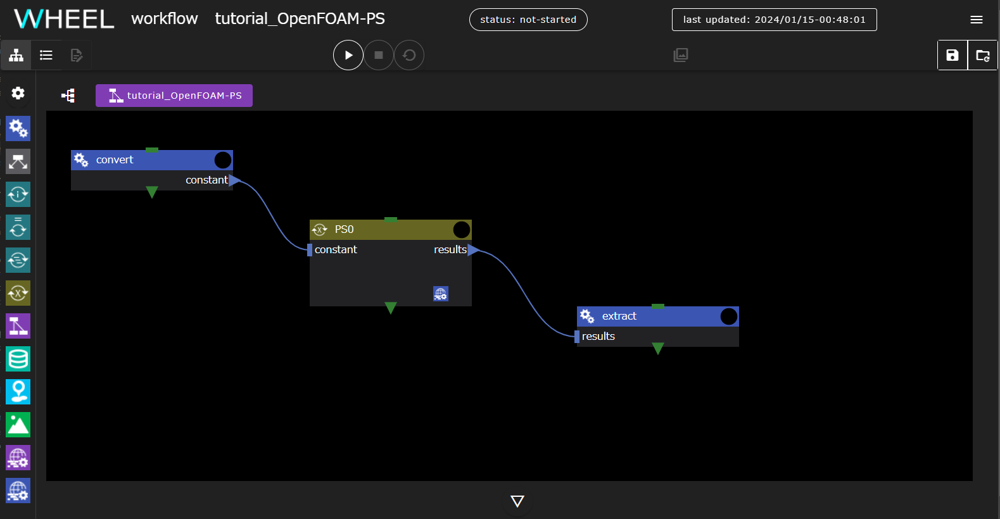
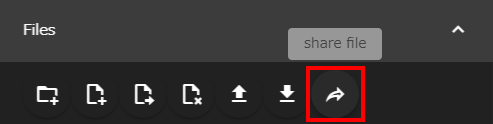
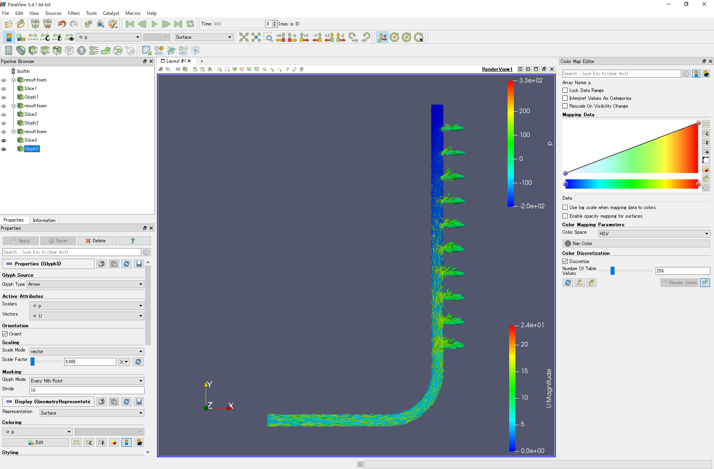

This chapter introduces the Parameter Study Analysis Workflow using OpenFOAM as a calculation example using WHEEL.

Perform a parameter study of inlet flow velocity on a distribution pipe model created in 3D CAD.


## 1. Overview
The analysis target model used in this example is the distributed-pipe model.

### Analytical Model D50-d10


Perform an analysis where the fluid coming in from the inlet leaves the outlet.

This tutorial assumes that you are running on Fugaku.
If you are running in a different environment, change the script settings accordingly.

Also, be sure to download and extract the [file](sample/OpenFOAM_tutorial_sample.zip) in advance.
The archive contains three files:

pipe.unv
: Mesh ("SALOME-MECA" is used to create a CAD model and export mesh data in Ideas universal format.)

U
: velocity initial condition file

D50-d10.tgz
: Case Files


In the final step of this tutorial, you use ParaView, which is installed on the WHEEL server, to visualize the calculation results.

Therefore, if you are running the tutorial with WHEEL installed on a remote server, or if you are running in an environment where ParaView is not installed, you cannot run the Review Analysis Results chapter.

### Workflow Overview
In this tutorial, we will use the parameter study component as shown below to analyze the inlet velocity in 1 m/s increments from 5 to 7 m/s.



convert component
: Prepare a mesh file for OpenFOAM.

PS0 Component
: The analysis is performed while changing the inlet flow velocity. It has the __solve__ component described below as an internal component.

solve component
: Perform an OpenFOAM analysis using a mesh created with the __convert__ component.

extract
: Expands the analysis results and opens them in ParaView.

## 2. Workflow Creation
Create a new project and add two task components and one PS component.
The first task component should be named __convert__ and the second task component should be named __extract__.

Also, add one task component inside the PS component and name it __solve__.

### Configure the convert component
First, place the distribution pipe model created in CAD in the __convert__ component.
Open the __Files__ area of the __convert__ component and upload the previously downloaded __pipe.unv__.

You can upload a file by dropping it in the __Files__ area or by selecting the file to upload in the dialog that appears when you click the __upload file__ button.
For detailed instructions, see the [Reference Manual]({{site.baseurl}}/reference/3_workflow_screen/1_graphview.html "Reference Manual - Graph View Screen").

You then create a script that runs on the __convert__ component. Create a new file named __run.sh__ with the following contents:

```
. /vol0004/apps/oss/spack-v0.17.0/share/spack/setup-env.sh

spack load 'openfoam@2012%fj@4.8.0'

ideasUnvToFoam pipe.unv
```

This script converts a mesh file in Ideas universal format to OpenFOAM format.

On successful completion, the following file is generated in the __constant/polyMesh__ directory:

- boundary
- owner
- faces
- neighbor
- points

Finally, open the component properties window and set the following four items.

- script: run.sh
- host: fugaku
- use job scheduler: Enabled
- output files: constant

### Setting up the solve component
First, place the case file and velocity initial condition file used for the analysis in the __solve__ component.
Open the __Files__ area of the __solve__ component and upload the following pre-downloaded files:
 * Case Files (__D50-d10. tgz__)
 * Initial velocity condition file (__U__)

Next, create a script file. Create a new file named __run.sh__ with the following contents:

```
. /vol0004/apps/oss/spack-v0.17.0/share/spack/setup-env.sh

spack load 'openfoam@2012%fj@4.8.0'

tar xvzf D50-d10.tgz
mv ./U ./D50-d10/0
cd ./D50-d10

decomposePar || exit $?
mpiexec -n 12 simpleFoam -parallel || exit $?
reconstructPar || exit $?
touch result.foam

cd ..
tar cvzf D50-d10.tar.gz D50-d10
```

Finally, open the component properties window and set the following three items.

- script: run.sh
- host: fugaku
- use job scheduler: Enabled


### Configuring PS Components
The __PS__ component provides settings for changing inlet flow velocity.

#### Preparing a folder for storing calculation results
Prepare a folder for storing calculation results. Click the PS component and add `results` to __output files__.

#### Parameter Study Condition Settings
The conditions for the parameter study are in __parameterSetting.json__.
With the __parameterSetting.json__ file selected in the __Files__ area, open a text editor and enter PS settings mode.

Edit the velocity initial condition file __U__ in the __solve__ component to change the velocity.
First, click the __add new target file__ button.
Select __solve__, type __U__ in the text box, and click the __OK__ button.


The __U__ file opens in the left pane.
In the line boundaryField -> inlet -> value, change __5__ of __uniform (5 0 0);__ to __vel_U__.


Drag the __vel_U__ part of __uniform (vel_U 0 0);__ to select it.
The __parameters__ text box in the right pane displays __vel_U__.


Now click the __add new parameter__ button and enter the value you want to set for the inlet velocity.
Set min=5, max=7, and step=1 to perform the parameter study in steps of 1 m/s from 5 m/s to 7 m/s.


With these settings, the software automatically generates 5, 6, and 7 m/s velocity condition files and runs the analysis for each condition.

#### Collection of calculation results
Add a setting to aggregate the results calculated for each condition into a `results` folder set to __output files__.
Click the __add new gather setting__ button to display the gather settings dialog.
Select __solve__, set __srcName__ to `D50-d10.tar.gz`, and __dstName__ to <code>results/&lbrace;&lbrace; vel_U &rbrace;&rbrace;/D50-d10.tar.gz</code>.


This completes the editing of the PS configuration file. Click the __save all files__ button at the top right of the screen to save your edits.

### Configuring the extract Component
Create a script file for the __extract__ component.
To the __extract__ component
Create a new file named __run.sh__ with the following contents:

```
for i in results/*
  do
    pushd $i
    tar xfz D50-d10.tar.gz
    popd
  enddo
```

This script sequentially expands the output of the __solve__ component and prepares to launch ParaView.

Finally, open the component properties and set script to __run.sh__.


### Setting File Dependencies
Sets input/output settings between components.
Drop ▶ of `constant` set in the output files of __convert__ into the PS component and connect it.

Also, drop ▶ of `results` set in outputFile of PS component into __extract__ component and connect it.

This completes the workflow creation process. Click the __save project__ button to save the project you created.


## 3. Running the Project
Click the __run project__ button to run the project.
First, you will be asked for the password for the private key you need to log in to Fugaku, but after that, no further action is required until the end of the workflow.

## 4. Checking Analysis Results

Review the analysis results.

To obtain the path of the calculation result file, open the __extract__ component property screen, display the Files area, and navigate to the `results` directory -> Inflow Speed directory.
The `result.foam` file appears below it, click to select it and click the __share file__ button.



Displays the path to the __result.foam__ file.
When you click the Copy button, the file path is copied to the clipboard, so start ParaView with this file name as an argument.


### Analysis Results
For reference, here are the visualization results for the inflow velocities of 5[m/s], 6[m/s], and 7[m/s].

In the analysis result of **Inflow velocity 5[m/s]**, **velocity U** is displayed in the cross-sectional view of the distribution pipe and **pressure p** is displayed as a vector, and the result is as follows.

##### Inflow velocity 5[m/s]



Similarly, the results for **Inflow velocity 6[m/s]** and **Inflow velocity 7[m/s]** are shown.

##### Inflow velocity 6[m/s]


##### Inflow velocity 7[m/s]


That's all for an example of a parameter study analysis workflow using OpenFOAM.

--------
[Return to Practical Tutorial]({{site.baseurl}}/tutorial/3_application_tutorial/)
