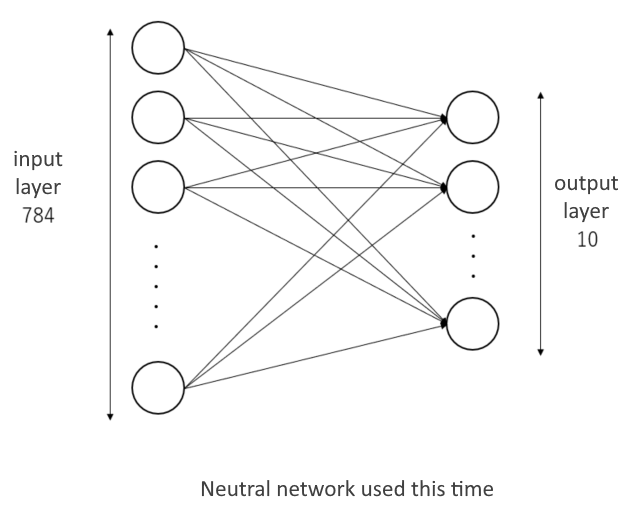

In this chapter, we will introduce an example of computing using WHEEL, "MNIST data analysis workflow using TensorFlow."

## 1. Workflow Overview
In this case, we used TensorFlow on Mt. Fugaku.
Create and infer handwritten digit image learning models using MNIST data.

This tutorial assumes that you are running on Fugaku. 
If you are running in a different environment, change the script settings accordingly.

MNIST data is an image data set of 60,000 handwritten digit images and 10,000 test images.
It is renowned as a very useful image dataset for learning neural networks.  
The data set contains the following structure:
```
MNIST data
　├ Learning data (60,000 pieces)
　│ 　├ image data
　│ 　└ Label data (correct answer data)
　│
　└ Validation data (10,000 pieces)
　　 　├ image data
　　 　└ Label data (correct answer data)
```
For each image data, label data which is correct data is given one by one.


## 2. About NN (Neural Network)

This section describes the NN method used to analyze MNIST data.
NN stands for neural network, which is a mathematical model of artificial neurons representing nerve cells (neurons) and their connections, or networks, in the human brain.
It consists of an input layer, an output layer, and a hidden layer, with a "weight" between the layers that indicates the strength of the connections between the neurons.



Features are extracted from the image, and the weights of nodes are updated and learned.
In this case, the MNIST data set is used, so the input layer is 784 nodes and the output layer is 10 nodes in order to obtain an output of one of 0~9 digits from an input of 28*28 pixels.

## 3. Workflow Creation
Create a new project and add two task components.
Each component is named __train__ and __estimate__.

### Configuring the train component
Create a new file named __run.sh__ in the __train__ component and fill in the following:

```
#PJM --rsc-list "elapse=01:00:00"
#PJM -L "node=1"
#PJM -x PJM_LLIO_GFSCACHE=/vol0004


export PATH=/home/apps/oss/TensorFlow-2.2.0/bin:$PATH
export LD_LIBRARY_PATH=/home/apps/oss/TensorFlow-2.2.0/lib:$LD_LIBRARY_PATH

cat  <<EOF >kerasMnist.py
from tensorflow import keras
from tensorflow.keras.datasets import mnist
from tensorflow.keras.models import Sequential
from tensorflow.keras.layers import Dense, Dropout, InputLayer
from tensorflow.keras.optimizers import RMSprop

print('download data')
---
title: load mnist data
---
(x_train, y_train), (x_test, y_test) = mnist.load_data()
print('download done')

---
title: set input data
---
x_train  = x_train.reshape(60000, 784)
x_test   = x_test.reshape(10000, 784)
x_train  = x_train.astype('float32')
x_test   = x_test.astype('float32')
x_train /= 255
x_test  /= 255
y_train  = keras.utils.to_categorical(y_train, 10)
y_test   = keras.utils.to_categorical(y_test, 10)

---
title: create model
---
model = Sequential()
model.add(InputLayer(input_shape=(784,)))
model.add(Dense(10, activation='softmax'))
model.compile(loss='categorical_crossentropy', optimizer='rmsprop', metrics=['accuracy'])


---
title: train model
---
print('start learning')
epochs = 20
batch_size = 128
history = model.fit(x_train, y_train, batch_size=batch_size, epochs=epochs, verbose=1, validation_data=(x_test, y_test))

---
title: save weights
---
print('save weights')
model.save_weights('param.hdf5')
EOF

python kerasMnist.py > learn.log

```

Open the component properties window and set the following five items.

- script: run.sh
- host: fugaku
- use job scheduler: Enabled
- output files: param.hdf5
- include: learn.log

### estimate component settings
Create a new file named __run.sh__ in the __estimate__ component and fill in the following:

```
#PJM --rsc-list "elapse=01:00:00"
#PJM -L "node=1"
#PJM -x PJM_LLIO_GFSCACHE=/vol0004


export PATH=/home/apps/oss/TensorFlow-2.2.0/bin:$PATH
export LD_LIBRARY_PATH=/home/apps/oss/TensorFlow-2.2.0/lib:$LD_LIBRARY_PATH

cat  <<EOF >kerasMnist.py
from tensorflow import keras
from tensorflow.keras.datasets import mnist
from tensorflow.keras.models import Sequential
from tensorflow.keras.layers import Dense, Dropout, InputLayer
from tensorflow.keras.optimizers import RMSprop

print('download data')
---
title: load mnist data
---
(x_train, y_train), (x_test, y_test) = mnist.load_data()
print('download done')

---
title: set input data
---
x_test   = x_test.reshape(10000, 784)
x_test   = x_test.astype('float32')
x_test  /= 255
y_test   = keras.utils.to_categorical(y_test, 10)

---
title: create model
---
model = Sequential()
model.add(InputLayer(input_shape=(784,)))
model.add(Dense(10, activation='softmax'))
model.compile(loss='categorical_crossentropy', optimizer='rmsprop', metrics=['accuracy'])

---
title: load weights
---
print('loadweights')
model.load_weights('param.hdf5')

---
title: eval model
---
print('eval')
score = model.evaluate(x_test, y_test, verbose=1)
print()
print('Test loss:', score[0])
print('Test accuracy:', score[1])
EOF

python kerasMnist.py > eval.log
```

Open the component properties window and set the following four items.

- script: run.sh
- host: fugaku
- use job scheduler: Enabled
- include: eval.log

### Setting File Dependencies
Finally, set the output files of __train__ to ▶ in `param.hdf5` to the estimate component.
After dropping and connecting, the workflow creation is complete.


## 4. Checking the execution results

Review the analysis results.
After execution is complete, you can see the following results from the __log.kerasMNIST__ and __log.kerasMNISTEval__ files created in the remote task.
```
・
・
・
('Test loss:', 0.27075190788507464)
('Test accuracy:', 0.927)
```

The meanings of the terms are as follows:

| Property name | Setting value |
| ---- | ---- |
| Test loss | Loss value when learning data is supplied. The smaller the number, the more correct the result. |
| Test accuracy | Percentage of correct data for validation. A value closer to 1 indicates higher accuracy in the validation data. |

The above results confirm that __accuracy__ is __0.927__, that is, a learning model with 92.7% accuracy in the validation data was created.

That's all for an example MNIST data analysis workflow using TensorFlow.

--------
[Return to Practical Tutorial]({{site.baseurl}}/tutorial/3_application_tutorial/)

