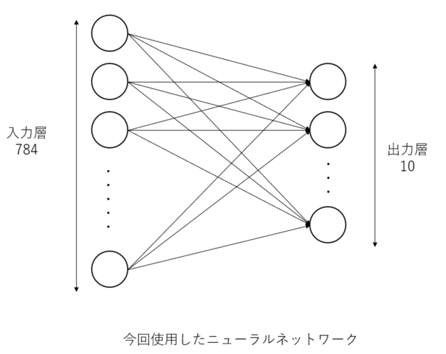
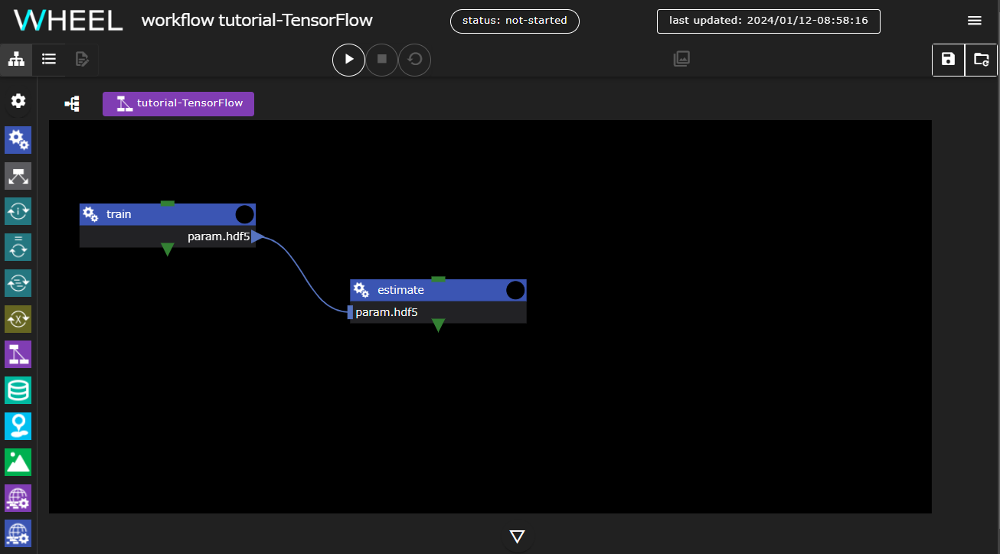

本章では、WHEELを用いた計算事例として「TensorFlowを利用したMNISTデータの解析ワークフロー」を紹介します。

目次
1. MNISTデータについて
1. NN(Neural Network)について
1. kerasについて
1. ワークフローの作成
1. ジョブの投入
1. 解析結果の確認

## 1. ワークフロー概要
本事例では、富岳上でTensorFlow利用して、
MNISTデータを用いた手書き数字画像学習モデルの作成と
推論を行ないます。

MNISTデータとは手書き数字画像60000枚とテスト画像10000枚を集めた画像データセットのことであり、
ニューラルネットワークを学習するうえで非常に便利な画像のデータセットとして著名です。
データセットの中身は以下のような構造になっています。
```
MNISTデータ
　├ 学習用データ (60,000個)
　│ 　├ 画像データ
　│ 　└ ラベルデータ(正解データ)
　│
　└ 検証用データ (10,000個)
　　 　├ 画像データ
　　 　└ ラベルデータ（正解データ）
```
各画像データに対して正解データであるラベルデータが一つずつ与えられています。


## 2. NN(Neural Network)について

ここでは、MNISTデータを解析する際に使用するNNという手法について説明します。
NNとは、ニューラルネットワークの略で、人間の脳内にある神経細胞（ニューロン）とそのつながり、つまり神経回路網を人工ニューロンという数式的なモデルで表現したものです。
入力層、出力層、隠れ層から構成されていて、層と層の間には、ニューロン同士のつながりの強さを示す「重み」があります。



画像より特徴を抽出して、ノードの重みを更新していき学習させていきます。
本事例では、MNISTのデータセットを用いたので28*28ピクセルの入力から0~9の数字のどれかという出力を出すために入力層を784ノード、出力層を10ノードとしています。

## 3. ワークフロー作成
新規プロジェクトを作成し、taskコンポーネントを2つ追加してください。
それぞれのコンポーネントの名前は __train__ __estimate__ としてください。

### trainコンポーネントの設定
__train__ コンポーネントに __run.sh__ という名前で新規ファイルを作成し次の内容を記入してください。

```
#PJM --rsc-list "elapse=01:00:00"
#PJM -L "node=1"
#PJM -x PJM_LLIO_GFSCACHE=/vol0004


export PATH=/home/apps/oss/TensorFlow-2.2.0/bin:$PATH
export LD_LIBRARY_PATH=/home/apps/oss/TensorFlow-2.2.0/lib:$LD_LIBRARY_PATH

cat  <<EOF >kerasMnist.py
from tensorflow import keras
from tensorflow.keras.datasets import mnist
from tensorflow.keras.models import Sequential
from tensorflow.keras.layers import Dense, Dropout, InputLayer
from tensorflow.keras.optimizers import RMSprop

print('download data')
---
title: load mnist data
---
(x_train, y_train), (x_test, y_test) = mnist.load_data()
print('download done')

---
title: set input data
---
x_train  = x_train.reshape(60000, 784)
x_test   = x_test.reshape(10000, 784)
x_train  = x_train.astype('float32')
x_test   = x_test.astype('float32')
x_train /= 255
x_test  /= 255
y_train  = keras.utils.to_categorical(y_train, 10)
y_test   = keras.utils.to_categorical(y_test, 10)

---
title: create model
---
model = Sequential()
model.add(InputLayer(input_shape=(784,)))
model.add(Dense(10, activation='softmax'))
model.compile(loss='categorical_crossentropy', optimizer='rmsprop', metrics=['accuracy'])


---
title: train model
---
print('start learning')
epochs = 20
batch_size = 128
history = model.fit(x_train, y_train, batch_size=batch_size, epochs=epochs, verbose=1, validation_data=(x_test, y_test))

---
title: save weights
---
print('save weights')
model.save_weights('param.hdf5')
EOF

python kerasMnist.py > learn.log

```

コンポーネントのプロパティ画面を開いて、以下の5項目を設定してください

- script: run.sh
- host: fugaku
- useJobScheduler: 有効
- outputFile: param.hdf5
- include learn.log

### estimateコンポーネントの設定
__estimate__ コンポーネントに __run.sh__ という名前で新規ファイルを作成し次の内容を記入してください。

```
#PJM --rsc-list "elapse=01:00:00"
#PJM -L "node=1"
#PJM -x PJM_LLIO_GFSCACHE=/vol0004


export PATH=/home/apps/oss/TensorFlow-2.2.0/bin:$PATH
export LD_LIBRARY_PATH=/home/apps/oss/TensorFlow-2.2.0/lib:$LD_LIBRARY_PATH

cat  <<EOF >kerasMnist.py
from tensorflow import keras
from tensorflow.keras.datasets import mnist
from tensorflow.keras.models import Sequential
from tensorflow.keras.layers import Dense, Dropout, InputLayer
from tensorflow.keras.optimizers import RMSprop

print('download data')
---
title: load mnist data
---
(x_train, y_train), (x_test, y_test) = mnist.load_data()
print('download done')

---
title: set input data
---
x_test   = x_test.reshape(10000, 784)
x_test   = x_test.astype('float32')
x_test  /= 255
y_test   = keras.utils.to_categorical(y_test, 10)

---
title: create model
---
model = Sequential()
model.add(InputLayer(input_shape=(784,)))
model.add(Dense(10, activation='softmax'))
model.compile(loss='categorical_crossentropy', optimizer='rmsprop', metrics=['accuracy'])

---
title: load weights
---
print('loadweights')
model.load_weights('param.hdf5')

---
title: eval model
---
print('eval')
score = model.evaluate(x_test, y_test, verbose=1)
print()
print('Test loss:', score[0])
print('Test accuracy:', score[1])
EOF

python kerasMnist.py > eval.log
```

コンポーネントのプロパティ画面を開いて、以下の4項目を設定してください

- script: run.sh
- host: fugaku
- useJobScheduler: 有効
- include: eval.log

最後に、trainのoutputFileにある __param.hdf5__ をestimateコンポーネントに
ドロップして接続すると、ワークフローの作成は完了です。




## 5. 実行結果の確認

解析結果の確認を行います。
実行完了後、リモートタスクに作成された「log.kerasMNIST」,「log.kerasMNISTEval」ファイルより以下の結果を確認することができます。
```
・
・
・
('Test loss:', 0.27075190788507464)
('Test accuracy:', 0.927)
```

用語の意味は以下の通りとなっています。

| プロパティ名 | 設定値 |
| ---- | ---- |
| Test loss | 学習用データを与えた時の損失値。小さくなればなるほど正しい結果を表せています |
| Test accuracy | 検証用データの正答率。1に近いほど検証用データにおいて精度が高いことを表しています |

accuracyが「0.927」すなわち検証用データにおいて精度92.7%の学習モデルが作成されたことが確認できます。
TensorFlowを利用したMNISTデータ解析ワークフロー例は以上になります。

--------
[実践編チュートリアルに戻る]({{ site.baseurl }}/tutorial/3_application_tutorial/)

