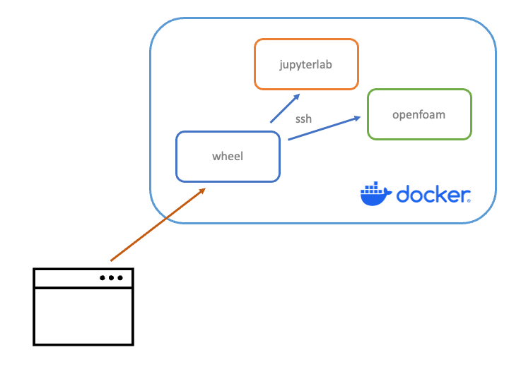
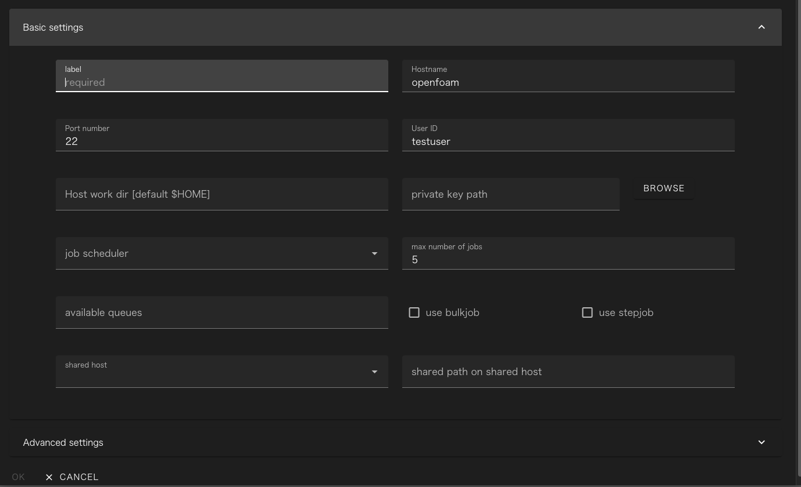
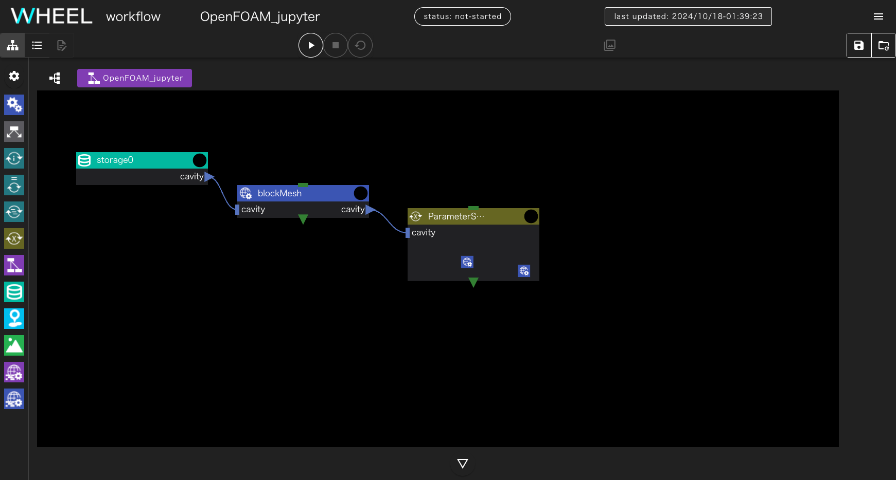
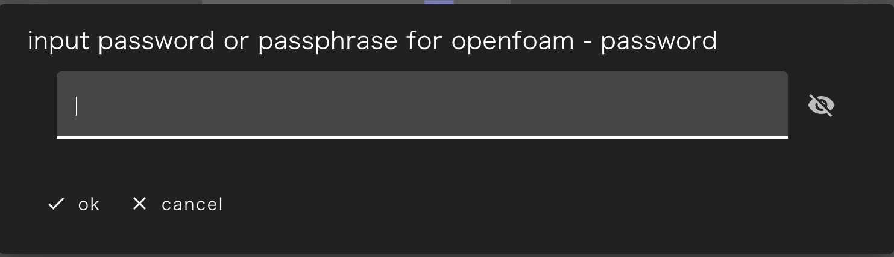
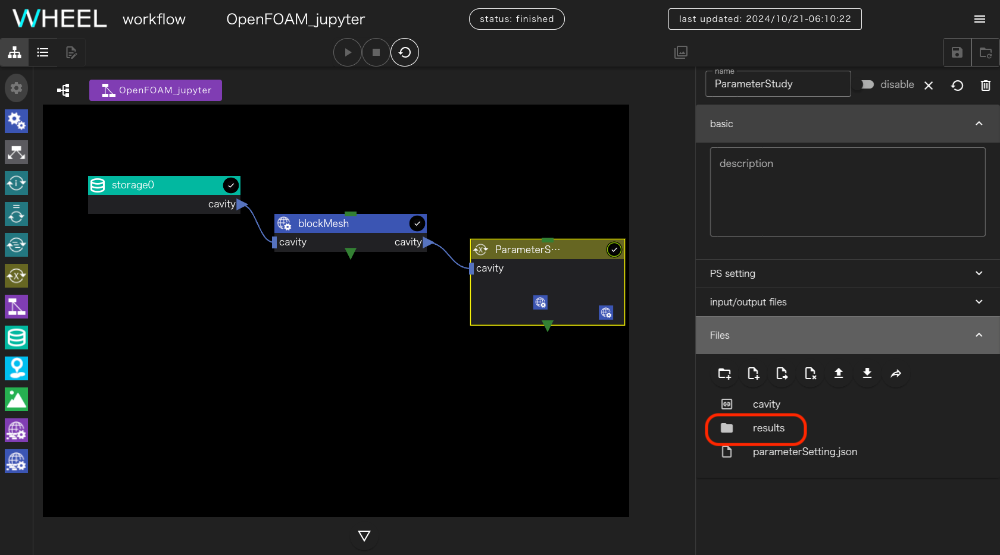
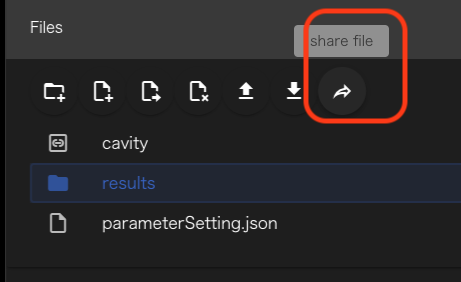
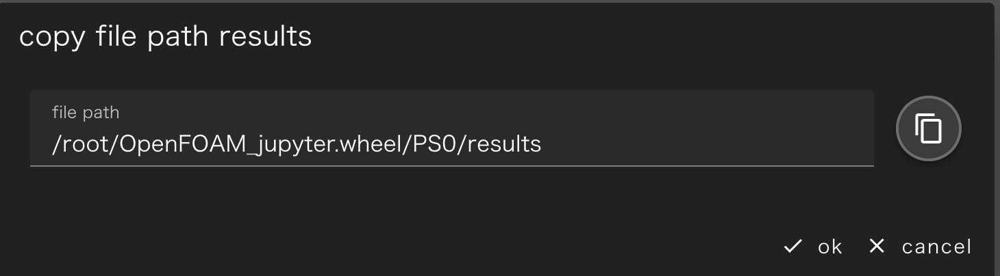
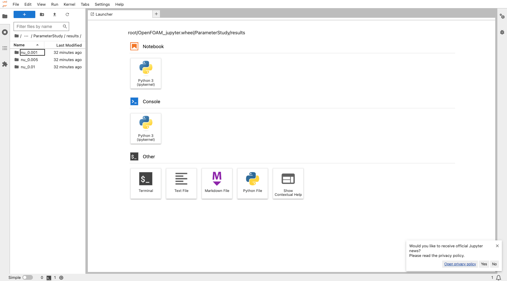
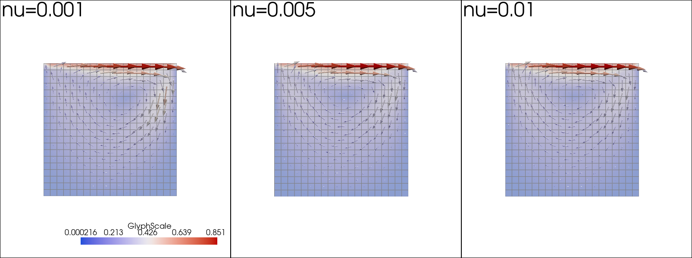
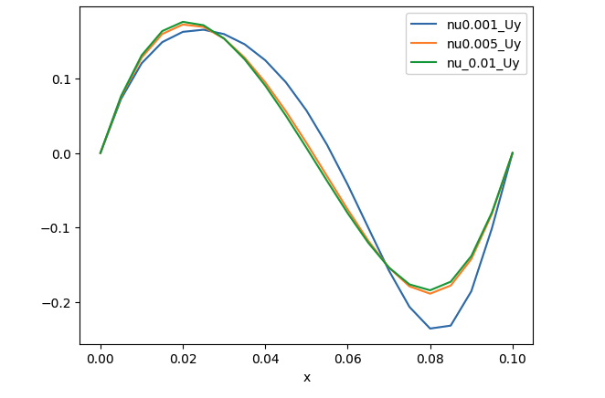

## 1.概要
### 解析の内容について
この章で扱うモデルはチュートリアル1と同じ、OpenFOAMの配布物に含まれているcavity問題です。
ここでは、パラメータスタディの例として、レイノルズ数を変えて3パターンのケースを実行し、結果をjupyter notebook上で
表示します。


### 環境設定
#dockerのインストール

事前に、次の2つのファイルをダウンロードし、同じディレクトリにtgzファイルを展開してください。
 - [project.tgz](./files/project.tgz "ワークフロープロジェクト一式")
 - [docker.tgz]( ./files/docker.tgz "docker container config files")

ダウンロードしたディレクトリに移動して `docker compose up` を実行すると、次の3つのコンテナが起動します
- WHEEL
- jupyter notebook
- OpenFOAM



ブラウザを立ち上げて `http://localhost:8089/` にアクセスするとWHEELのHOME画面が起動します。
[OPEN]ボタンをクリックして、さきほど展開したプロジェクトファイルを開いてください。


#### remotehost設定の追加
remotehost設定画面を開いて、[NEW REMOTE HOST SETTING] ボタンをクリックし
wheelコンテナからopenfoamコンテナへアクセスするための新規設定を作成します。

次の内容を入力したらOKボタンをクリックして終了してください。

|------------|------------|
|label       | 値         |
|------------|------------|
|label       | openfoam   |
|Hostname    | openfoam   |
|Port number | 22         |
|User ID     | testuser   |
|------------|------------|




### プロジェクトの内容
本プロジェクトは、OpenFOAMコンテナ内のチュートリアルデータ(cavity問題)をコピーし、
動粘性係数をそれぞれ0.01(デフォルト値)、0.005, 0.001 と設定して実行するものです。
レイノルズ数としては、それぞれ10,20,100となります。



初めに、OpenFOAMコンテナにインストール済のチュートリアルデータ(storageコンテナにパスを指定)から
cavity問題のケースをblockMeshコンポーネントにコピーしてきます。
blockMeshコンポーネントでは、OpenFOMAのblockmeshを用いてメッシュを作成し
ケースディレクトリ毎後続のPSコンポーネントに渡します。

PSコンポーネント内部には、solverコンポーネントとpostコンポーネントが含まれています。

solverコンポーネントでは、icoFoamを実行して解析を行ない、postコンポーネントでは
最終時刻のデータをVTKに変換する処理と
解析領域の中心を通り、x,y軸に並行な線上の流速のサンプリングを行ないます。

PSコンポーネントにより、これらの処理は動粘性係数の値を前述の値に書き変えながら3パターン実行されます。


### プロジェクトの実行
プロジェクト実行ボタンをクリックして実行を開始すると
OpenFOAMを実行するコンテナへログインするためのパスワードを聞かれるので `passw0rd` と入力してください。



プロジェクトが実行されPSコンテナ内の`results`ディレクトリの中に各動粘性係数での実行結果ファイルが集められます。



resultsディレクトリを選択した状態で、share fileボタンをクリックしてください。

{: align-center}

WHEELコンテナ内でのresultsディレクトリのパスがダイアログに表示されるので、コピーボタンをクリックしてください。




### jupyterlabの起動
`http://127.0.0.1:8888/lab?file-browser-path=` をブラウザのURL欄に入力しその後に
続けてさきほどのファイルパスをペーストしてenterキーを押下してください

jupyterlabがPSコンポーネント以下のresultsディレクトリを表示した状態で開くので、Launcher画面から [Notebook]->[Python 3] をクリックして新規ノートブックを作成してください。



### jupyternotebookでの可視化
初めに各流速での実行結果を読み込んで流速ベクトルを可視化します。
1つ目のセルに次のコードを入力してenterキーを押下してください。
各動粘性係数での流速ベクトルが表示されます。


import glob
import re
import pyvista as pv

num_row=3

extract_nu=lambda text:float(re.search(r'([.\d]+)', text).group(0))
filenames=sorted(glob.glob("nu*/VTK/cavity_*.vtm") ,key=extract_nu)
plotter = pv.Plotter(shape=((len(filenames)+num_row-1)//num_row,num_row))


def draw(filename,index):
    plotter.subplot(index//num_row, index%num_row)
    vtk=pv.read(filename)
    internal_grid=vtk.get(0)
    glyphs=internal_grid.glyph(orient="U", scale="U",factor=0.03, tolerance=0.05)
    slice=internal_grid.slice(normal='z')
    plotter.add_mesh(slice,show_edges=True, show_scalar_bar=False, cmap='coolwarm',opacity=0.5)
    plotter.add_mesh(glyphs, label='U', show_scalar_bar=True, cmap='coolwarm')
    plotter.view_xy()
    plotter.camera.zoom(1.7)
    plotter.add_text(f"nu={extract_nu(filename)}")


for index,filename in enumerate(filenames):
    draw(filename,index)

plotter.show()




続いて、OpenFOAMのサンプリング機能で取得した、x=0.05およびy=0.05の時のUyおよびUxのグラフを表示します。
初めにこれ以降の処理に用いるpandasおよびmatplotlibライブラリをインストールします。
セルに次のコードを入力してenterキーを押下してください

```
pip install pandas matplotlib
```

次のセルに次のコードを入力してenterキーを押下してください。
y=0.05の時のUyを壁面の流速毎にプロットします。


import pandas as pd

df1=pd.read_csv("nu_0.001/sample/1/lineX1_U.csv",usecols=[0,2])
df2=pd.read_csv("nu_0.005/sample/1/lineX1_U.csv",usecols=[2])
df3=pd.read_csv("nu_0.01/sample/1/lineX1_U.csv",usecols=[2])

df=pd.concat([df1, df2, df3], axis=1).set_axis(["x", "nu0.001_Uy", "nu0.005_Uy","nu_0.01_Uy"], axis=1)
df.plot(x="x")




さらに次のセルに次のコードを入力してenterキーを押下してください。
こちらでは、x=0.05の時のUxを壁面の流速毎にプロットします。


df1=pd.read_csv("nu_0.001/sample/1/lineY1_U.csv",usecols=[0,1])
df2=pd.read_csv("nu_0.005/sample/1/lineY1_U.csv",usecols=[1])
df3=pd.read_csv("nu_0.01/sample/1/lineY1_U.csv",usecols=[1])

df=pd.concat([df1, df2, df3], axis=1).set_axis(["y", "nu0.001_Ux","nu0.005_Ux","nu0.01_Ux"], axis=1)
df.plot(x="y")



以上でチュートリアル本編は終了です。


## 富岳でOpenFOAMの計算を実行する
本チュートリアルで使用したプロジェクトは、多少の修正を行なうことでスパコンサイトなど、別の環境で計算を行なうこともできます。
本項では、富岳にインストールされているOpenFOAMを用いて計算するための修正方法を説明します。

はじめに、remotehost 設定画面に移り新しく富岳へアクセスするためのリモートホスト設定を作成します。

labelは任意の値を指定し、Hostname, Port number, UserIDはそれぞれsshでログインノードへアクセスする時の
値を設定してください。

また、`job scheduler` の値を `Fugaku` に設定してください。

続いてワークフロー画面の次の4つのコンポーネントのhost設定を、新しく作成した富岳のlabelに指定した値に変更してください。
また、blockMesh, solver, postの3コンポーネントについては、`use jobscheduler` スイッチを有効に切り替えてください。
なお、solver, postコンポーネントはParameterStudyコンポーネントの中にあります。

- storage0
- blockMesh
- solver
- post


次に、富岳上でのOpenFOAMのインストールパスを調べるため、sshでフロントエンドへログインするか
OpenOnDemandのFugaku shell accessを開いてください。

ターミナル上で次の2つのコマンドを続けて実行しspack環境にインストールされているopenfoamを探します。

```
> . /vol0004/apps/oss/spack/share/spack/setup-env.sh
> spack find openfoam
```
2024年10月の時点では、次のような結果が得られます。

```
-- linux-rhel8-a64fx / fj@4.10.0 --------------------------------
openfoam@2012  openfoam@2106  openfoam@2112  openfoam@2206  openfoam@2212  openfoam@2306  openfoam@2312
-- linux-rhel8-cascadelake / gcc@13.2.0 -------------------------
openfoam@2306  openfoam@2312
-- linux-rhel8-skylake_avx512 / gcc@8.5.0 -----------------------
openfoam@2012  openfoam@2106  openfoam@2112  openfoam@2206  openfoam@2212
==> 14 installed packages
```

まずstorage0コンポーネントのdirectory pathの値を フロントエンドにインストールされたOpenFOAMのチュートリアルデータの
パスに置換える必要があるので、cascadelake用のopenfoamをロードして、環境変数 `${WH_PROJECT_DIR}` を調べます。
次のコマンドを続けて実行してください。

```
> spack load openfoam@2312%gcc@13.2.0
> echo $WM_PROJECT_DIR
/vol0004/apps/oss/spack-v0.21/opt/spack/linux-rhel8-cascadelake/gcc-13.2.0/openfoam-2312-h2ulkjyq62zrp3afoyeitj6ko4ovs77g
```

echoコマンドの後で出力されたファイルパスに、 `tutorials/incompressible/icoFoam/cavity/` をつなげてstorage0コンポーネントの directory path
に設定してください。

また、WHEELのプロジェクト内で環境変数 `OPENFOAM_BASHRC` にOpenFOAM実行時に読み込む設定ファイルのパスを指定しています。
これを、計算ノード上でのパスに変更する必要があるので同じターミナル上で今度はa64fx用のOpenFOAMをロードして環境変数 `${WH_PROJECT_DIR}` を調べます。
次のコマンドを続けて実行してください。


```
> spack unload openfoam@2312%gcc@13.2.0
> spack load openfoam@2312%fj@4.10.0
> echo $WM_PROJECT_DIR
/vol0004/apps/oss/spack-v0.21/opt/spack/linux-rhel8-a64fx/fj-4.10.0/openfoam-2312-cyarempgd42uk3ll7m5ygjq4c4o7oows
```

環境変数エディタを開いて `OPENFOAM_BASHRC` を
echoコマンドの後で出力されたファイルパスに `etc/bashrc` をつなげたものに変更してください。


## 本チュートリアルで利用したjupyterlabコンテナについて
本チュートリアルではjupyterlabコンテナはpyvistaの公式イメージを利用しています。

[pyvista container](https://github.com/pyvista/pyvista/pkgs/container/pyvista "pyvista docker container page")

ベースイメージはjupyterlabの公式イメージである `jupyter-base` を用いており、その上でpyvistaを動かす上で必要なソフトウェアが追加されたものです。
