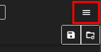
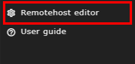
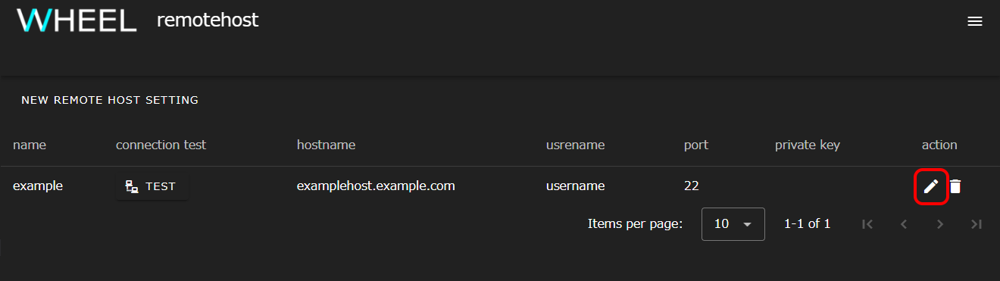
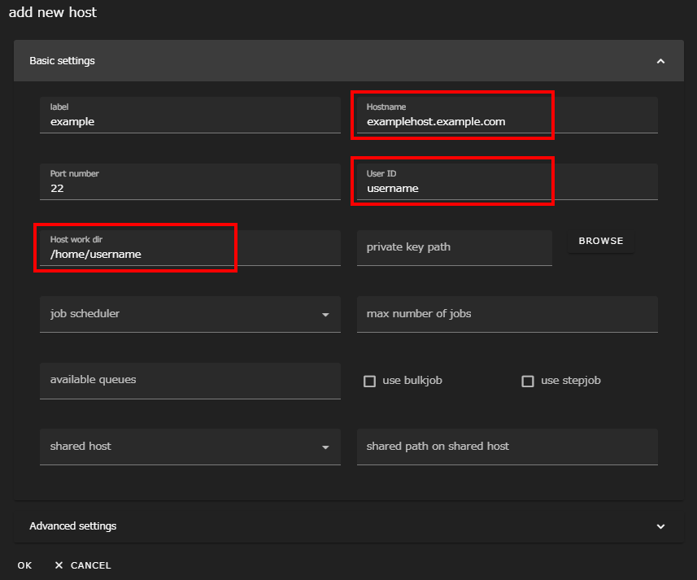
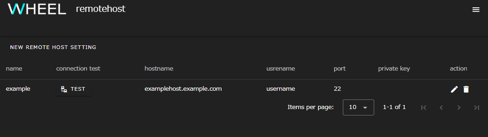
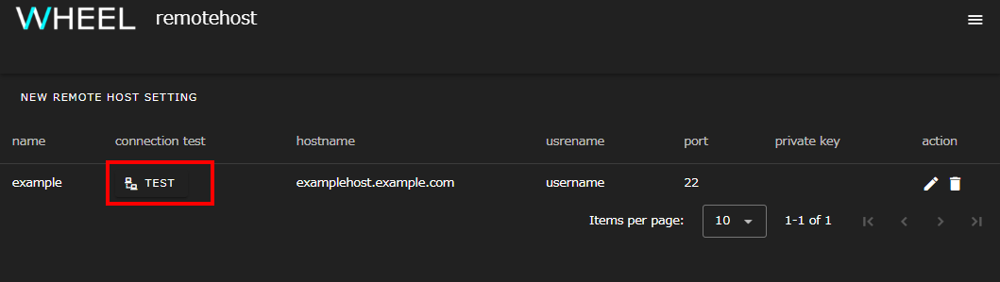
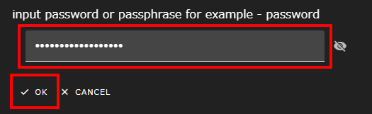
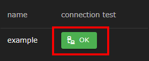
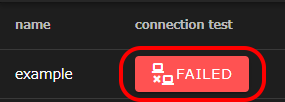

Before you start using WHEEL, make sure that the initial remote host settings are correct.

### Verifying the remote host configuration
Go to WHEEL and click the hamburger menu at the top right of the screen.

Click __Remotehost editor__ in the menu that appears. The Remote Host Settings window appears in a separate tab.

Displays the list of remote hosts registered in [Remote Host Settings]({{site.baseurl}}/for_admins/how_to_boot/#remote-host-settings). Click the pencil icon on the far right to display the Edit Host Information dialog.

Make sure that the settings are correct.

Hostname
: Host name or IP address to connect to

User ID
: User ID on the destination host

Host work dir
: Directory path used within the remote host

If the settings are incorrect, correct them.
Click the __OK__ button to close the dialog.

### Verifying the connection to the remote host
Then, verify that WHEEL can connect to the remote host.

Displays the remote host setting screen.

Click the __TEST__ button in the __connection test__ column to test the connection to the remote host.

The password entry dialog appears. Enter the password to connect to the remote host and click the __OK__ button.

The connection to the remote host is tested and the results are displayed in the __connection test__ column of the remote host list.

If the connection to the remote host is successful, the __OK__ button is displayed.

If the connection to the remote host fails, the __FAILED__ button display appears.  
Check and, if necessary, revise the settings in accordance with [Verifying the remote host configuration](#verifying-the-remote-host-configuration).

--------
[Return to home page]({{site.baseurl}}/tutorial/)