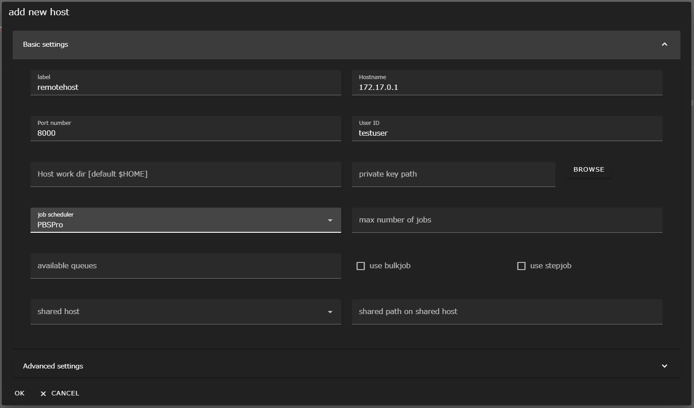
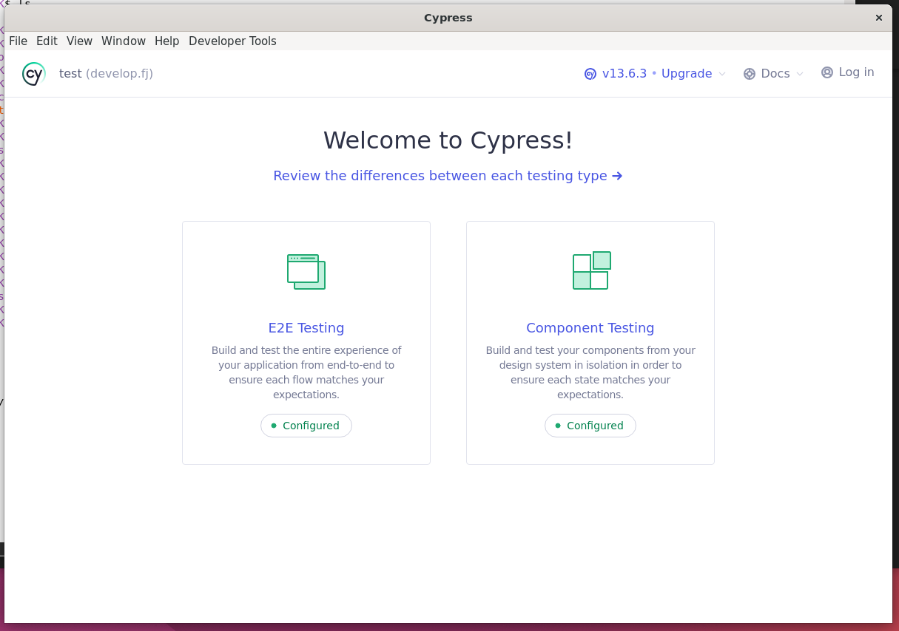
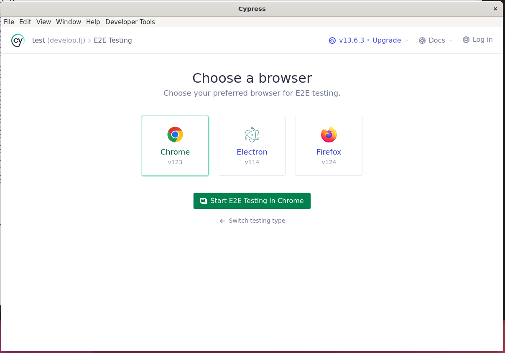
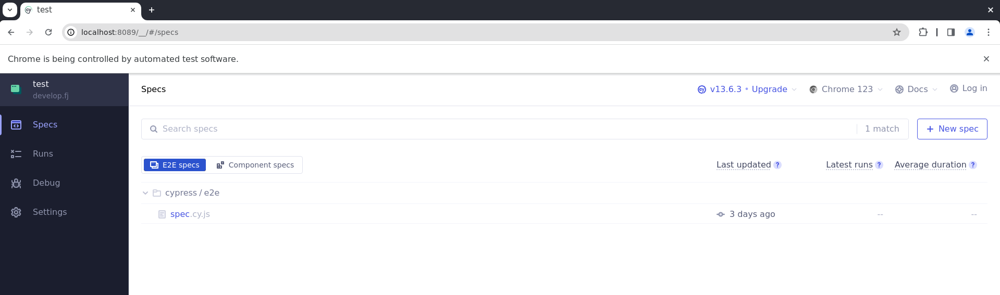
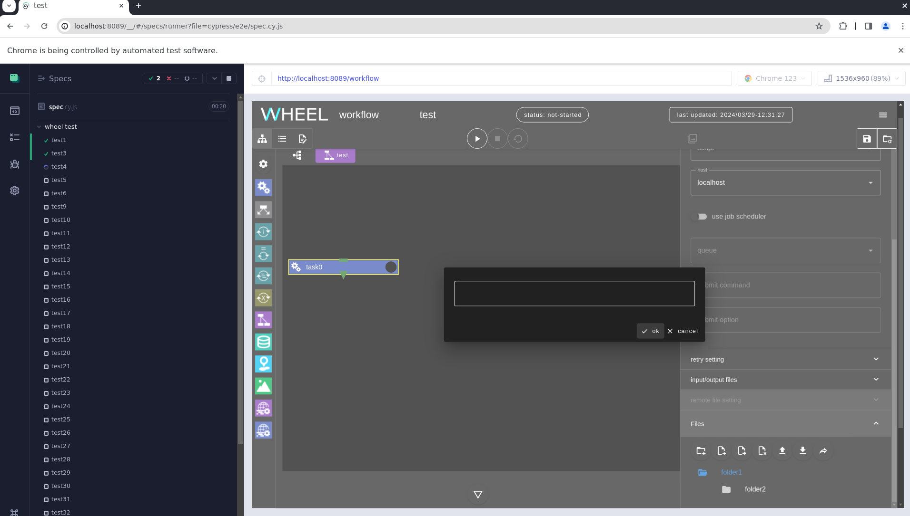

# Cypressによるテスト

- [Cypressによるテスト](#cypressによるテスト)
  - [GitHub Actions の実行](#github-actions-の実行)
    - [実行環境](#実行環境)
    - [事前準備](#事前準備)
    - [テストの実行](#テストの実行)
    - [GitHub Actions 実行時の注意点](#github-actions-実行時の注意点)
  - [ローカル実行](#ローカル実行)
    - [前提条件](#前提条件)
      - [実行環境](#実行環境-1)
      - [テスト環境のセットアップ](#テスト環境のセットアップ)
    - [事前準備](#事前準備-1)
    - [テストの実行](#テストの実行-1)
      - [一部のテストのみを実行する場合](#一部のテストのみを実行する場合)
  - [テスト対象外ケースについて](#テスト対象外ケースについて)
  - [テスト環境のカスタマイズ](#テスト環境のカスタマイズ)


## GitHub Actions の実行

### 実行環境
GitHub Actions上でテストを実行する際に前提としている実行環境は以下の通りです。



### 事前準備
本テストでは、リモートサーバへの接続等に必要な情報をsecretから読み込むことを想定しています。したがって、secretに以下の変数を定義してください。

|変数名   |説明   |
|---|---|
|CYPRESS_WHEEL_TEST_REMOTEHOST   |WHEELのREMOTE HOSTに設定されている label   |
|CYPRESS_WHEEL_TEST_REMOTE_PASSWORD   |WHEELからリモート計算サーバにアクセスするためのパスワード   |
|CYPRESS_WHEEL_TEST_HOSTNAME   |WHEELからリモート計算サーバにsshアクセスする際のアドレス。(test41, 42, 43でリモート計算サーバ上のファイル有無を確認する際も使用)|
|CYPRESS_WHEEL_TEST_PORT   |WHEELからsshアクセスする際のREMOTE HOSTのポート番号。(test41, 42, 43でリモート計算サーバ上のファイル有無を確認する際も使用)   |
|CYPRESS_WHEEL_TEST_USER   |WHEELからリモート計算サーバにアクセスするためのユーザID。(test41, 42, 43でリモート計算サーバ上のファイル有無を確認する際も使用)   |
|CYPRESS_WHEEL_PATH   |WHEELプロジェクトが保存される場所。(test10で[share file]ボタンの表示内容をチェックするために使用)   |

### テストの実行
**master**ブランチを push した際にテストが自動実行されます。
テスト結果は、'Actons'タブの'Cypress Test' をクリックすることで確認できます。
エラーが表示された場合、ログを確認してください。また、[GitHub Actions 実行時の注意点](#github-actions-実行時の注意点)を参照の上、該当する場合再実行をお願いします。
エラーの詳細は[ローカル実行](#ローカル実行)でご確認ください。

### GitHub Actions 実行時の注意点
- GitHub Actions から割り当てられたリソースによっては Cypress の負荷に対応できない場合があり、エラーとなるケースがあります。その際は、再実行が必要となります。
- テスト再実行は、workflow ログの右上の'Re-run jobs'から実行できます。

## ローカル実行

### 前提条件

#### 実行環境
ローカル実行については、下記環境で検証しています。



また、以下の条件を満たすことを前提としています。
* ホストOS上でGUIおよびChromeが実行できること(CypressがGUIを表示します)。
* WHEELからリモート計算サーバに対して計算ジョブを投入できること。

#### テスト環境のセットアップ
以下はテスト環境のセットアップ手順です。
リポジトリからコードを取得し、必要なモジュールをインストールします。
```bash
$ git clone https://github.com/RIKEN-RCCS/OPEN-WHEEL.git
$ cd OPEN-WHEEL/test
$ npm install # Cypressを含めた必要なモジュールがインストールされます。
```
なお、google chromeはこの操作ではインストールされないため、テスト環境に別途インストールしてください。

#### リモート計算サーバ設定の作成
WHEELを起動して `Remotehost editor` 画面に遷移し次の内容でリモートホスト設定を作成してください。



|設定項目|設定値|備考|
|-|-|-|
|label|remotehost| WHEEL内での設定名 |
|Host name|172.17.0.1|本書ではDockerコンテナ上の`リモート計算サーバ`にアクセスすることを想定。|
|Port number|8000|本書ではDockerコンテナ上の`リモート計算サーバ`にアクセスすることを想定。|
|User ID|testuser|`リモート計算サーバ`へsshログインする際のログインID。なお、パスワードは`passw0rd`を想定。|
|job scheduler|PBS Pro|一部のテストで利用するため、バッチシステムは必須。|


### テストの実行
1. リモート計算サーバの起動
次のコマンドを実行してdockerで仮想リモート計算サーバを起動してください。

`docker run -p 4000:22 naoso5/openpbs`


OpenPBSでのバッチジョブ実行が可能なホストが存在する場合はそちらを使うこともできます。
本ドキュメント末尾に記載の [テスト環境のカスタマイズ](#テスト環境のカスタマイズ)
の章を参照してリモートホスト設定を変更してください。

2. WHEELの起動
本テストでは、WHEELは http の 8089ポートで起動している必要があります。

開発中のコードを使う時など、dockerを使わずに起動する場合は次のコマンドを実行してください。
```
WHEEL_USE_HTTP=1 WHEEL_USE_PORT=8089 npm run start
```

ビルド済のWHEELコンテナの動作確認を行なう場合など、docker経由で起動する場合は
次のコマンドを実行してください。
```
docker run --rm -e WHEEL_USE_HTTP=1 -e WHEEL_USE_PORT=8089 -v${HOME}:/root  {コンテナ名}
```

8089番のポートが既に他のプログラムに使われていた場合は起動に失敗するので、8089番ポートを占有しているプログラムを終了させてから再度起動してください。

3. テストUIの起動
OPEN-WHEEL/testフォルダで以下のコマンドを実行してください。
   ```bash
   $ npm run test
   ```
3. cypressが起動すると以下の画面が表示されるので、"E2E Testing"をクリック。

   

4. ブラウザ選択画面が表示されるので、"Chrome"を選択して"Start E2E Testing in Chrome"をクリック。(Cypress実行環境にインストールされているブラウザによって画面の内容は異なります。)

   

5. Chromeが起動し、テストファイルの一覧が表示されるので"cypress/e2e/spec.cy.js"をクリック

   

6. Chrome上でテストが開始されます。

   

#### 一部のテストのみを実行する場合
テストを実行すると**spec.cy.js**内のすべてのテストが実行されますが、**spec.cy.js** 内のテストコードに修飾子をつけることで一部のテストのみを実行できます。以下はtest9, 10, 11のみを実行する場合の例です。
```diff
--- a/test/cypress/e2e/spec.cy.js
+++ b/test/cypress/e2e/spec.cy.js
@@ -88,7 +88,7 @@ describe('wheel test', () => {
     })
   })

-  it('test9', () => {
+  it.only('test9', () => {
     const path = require('path')
     const downloadsFolder = Cypress.config('downloadsFolder')
     const filepath = path.join(downloadsFolder, 'a.txt')
@@ -104,7 +104,7 @@ describe('wheel test', () => {
     })
   })

-  it('test10', () => {
+  it.only('test10', () => {
     cy.taskMake('task0')
     cy.scriptMake('a.txt', 'aaa')
     cy.clickFileFolder('a.txt')
@@ -119,7 +119,7 @@ describe('wheel test', () => {
     })
   })

-  it('test11', () => {
+  it.only('test11', () => {
     cy.taskMake('task0')
     cy.clickFilesTab()

```

## テスト対象外ケースについて

自動テストで実装困難なテストケースがあり、手動でテストしてください。

test No.2 Drag&Drop

- `テスト内容` ファイル表示エリアにローカルファイルをドラッグアンドドロップし、アップロードする。
- `手動テスト` Task コンポーネントの Files プロパティにローカルフォルダからファイルをドラッグアンドドロップする。
- `期待値` ファイル表示エリアにファイルが正しくアップロードされること。

test No.7 File upload 1

- `テスト内容` ファイルアップロードボタンをクリックし、ローカルファイルをアップロードする。
- `手動テスト` Task コンポーネントの Files プロパティ配下のファイルアップロードボタンをクリックし、ローカルファイルをアップロードする。
- `期待値` ファイル表示エリアにファイルが正しくアップロードされること。

test No.8 File upload 2

- `テスト内容` ファイル表示エリアに作成したフォルダを選択した状態でファイルアップロードボタンをクリックし、ローカルファイルをアップロードする。
- `手動テスト` Task コンポーネントの Files プロパティ配下のファイル表示エリアに作成したフォルダを選択した状態でファイルアップロードボタンをクリックし、ローカルファイルをアップロードする。
- `期待値` ファイル表示エリアの選択したフォルダ配下にファイルが正しくアップロードされること。


## テスト環境のカスタマイズ
WHEELからアクセスするリモートホストは、**cypress.config.cjs**内の以下の変数を編集することで変更することができます。
```javascript
env: {
   // WHEELのREMOTE HOSTに設定されている label
   WHEEL_TEST_REMOTEHOST: "remotehost",

   // WHEEL/Cypressからリモート計算サーバにアクセスするためのパスワード
   WHEEL_TEST_REMOTE_PASSWORD: "passw0rd",

   // Cypressからリモート計算サーバにsshアクセスする際のアドレス
   // (test41, 42, 43でリモート計算サーバ上のファイル有無を確認するために使用)
   WHEEL_TEST_HOSTNAME: "localhost",

   // Cypressからsshアクセスする際のREMOTE HOSTのポート番号
   // (test41, 42, 43でリモート計算サーバ上のファイル有無を確認するために使用)
   WHEEL_TEST_PORT: 4000,

   // REMOTE HOST にアクセスするためのユーザID
   // (test41, 42, 43でリモート計算サーバ上のファイル有無を確認するために使用)
   WHEEL_TEST_USER: "testuser",

   // WHEELプロジェクトが保存される場所
   // (WHEELがコンテナ実行される場合は、コンテナ内のパス)
   // (test10で[share file]ボタンの表示内容をチェックするために使用)
   WHEEL_PATH: "/root"
   }
```

なお、上記の変数は環境変数からも上書きできます。
環境変数に _CYPRESS_XXXXX_ を指定すると、**cypress.config.cjs**内の _XXXXX_ が環境変数で上書きされます。
```bash
# WHEEL_TEST_REMOTEHOST を上書きする場合
$ export CYPRESS_WHEEL_TEST_REMOTEHOST=example
   ```
