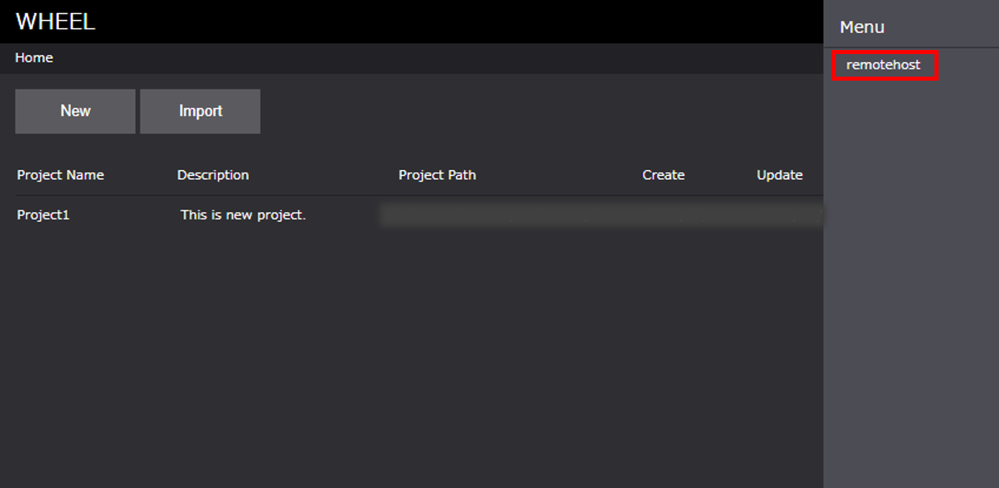
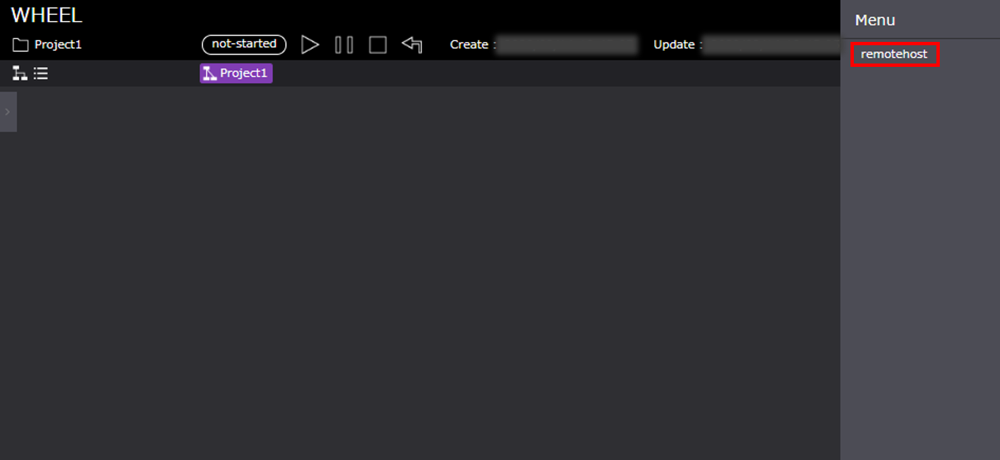
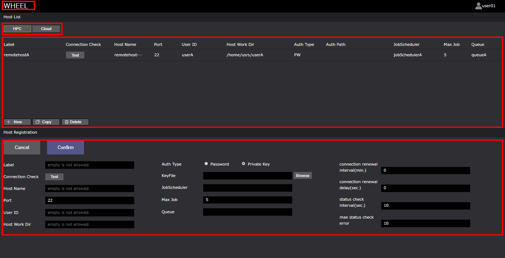
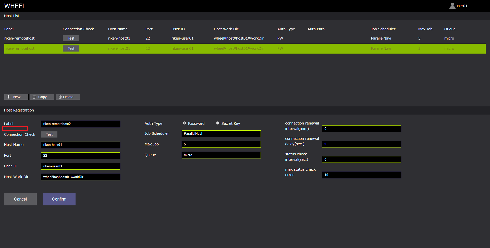
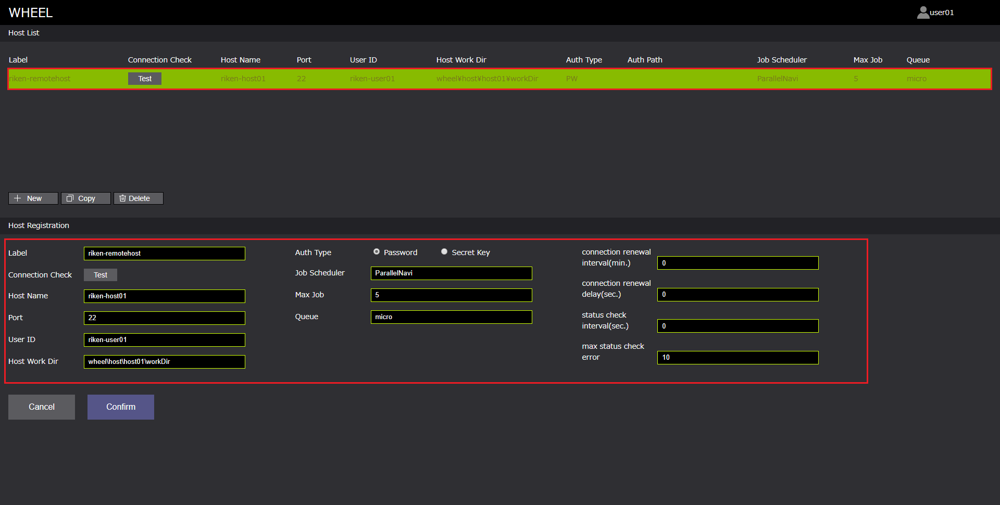
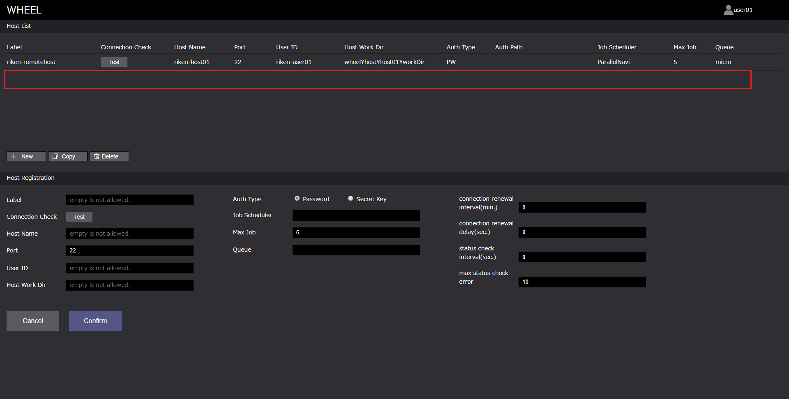
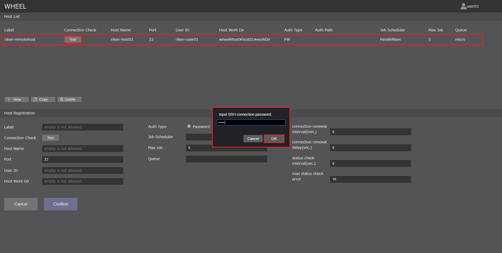

# リモートホストの登録
ワークフロー内でWHEELサーバ外の計算環境（以下、リモートホスト）を用いる場合、対象とするリモートホストにSSH接続し処理を実行します。  
WHEELでは、ワークフロー画面（Taskコンポーネント）にて使用するリモートホストの情報及びリモートホストに登録されているユーザ情報をリモートホスト登録画面にて設定します。  

## リモートホスト登録画面への移動
リモートホスト登録画面には、下記の2パターンの方法によって遷移します。

* ホーム画面右上ドロワー内の[ remotehost ]
* ワークフロー画面右上ドロワー内の[ remotehost ]  

1. ホーム画面右上ドロワー  
  

1. ワークフロー画面右上ドロワー  
  

## リモートホスト登録画面
リモートホスト登録画面の構成は以下のようになっています。  
  

1. タイトル　：ホーム画面遷移ボタン
1. リモートホスト種別選択ボタン：入力画面の切替（HPC or Cloud）
1. Host List エリア：登録済みリモートホストリスト
    1. リモートホストリスト：登録済みリモートホスト情報
    1. New ボタン：新規リモートホスト登録
    1. Copyボタン：登録済みリモートホストの複製（登録済みリモートホスト情報の引用用）
    1. Deleteボタン：登録済みリモートホストの削除
1. Host Registration エリア：リモートホスト登録用情報入力エリア
    1. リモートホスト情報入力エリア：新規リモートホスト情報、登録済みリモートホスト情報の編集エリア
    1. Cancel ボタン：入力情報のリフレッシュ
    1. Confirm ボタン：入力情報の登録

また、Host Registrationエリアの各プロパティは以下です。  

### HPC

  

| プロパティ名 | プロパティ | 備考 |
|----|----|----|
| Label | リモートホスト識別ラベル | 重複不可 * |
| Connection Check | リモートホスト接続確認ボタン | ー |
| Host Name | リモートホストIPアドレス、または、リモートホスト名 | * ex .京プリポストクラウド:134.160.188.185/ds1.r-ccs.riken.jp|
| Port | リモートホストポート番号 | SSH接続用（デフォルト値 22） |
| User ID | リモートホスト登録済みユーザ名 | * |
| Host Work Dir | リモートホストマシンでの作業ディレクトリ | * |
| Auth Type | リモートホストマシンの認証手段 | ラジオボタンより選択 |
| Auth Path | Auth Type -> Private Key 選択時のKeyFile保存先パス | ー |
| JobScheduler | ジョブスケジューラ名 | app/config/jobSceduler.jsonに定義されているジョブスケジューラ名を設定する|
| Max Job | ジョブ投入制限数 | 接続先リモートホストから同時に投入できる最大ジョブ数（デフォルト値 5）|
| Queue | キュー名 | 接続先ホストからジョブを投入する時に使えるキュー、カンマ区切りで複数入力可（ex. A, B, C）|
| connection renewal interval(min.) | ssh接続を再接続する間隔[分] |最初にSSH接続した時間から設定時間以上経過後にSSH接続を行う場合、一度切断し再接続する <br> （デフォルト値 0、再接続しない） |
| connection renewal delay(sec.) | 切断後、再接続時までの待ち時間[秒] |（デフォルト値 0）|
| status check interval(sec.) | ジョブ投入後のステータス確認を行う間隔[秒]|（デフォルト値 10）|
| max status check error | ステータス確認に失敗した時に、ジョブ自体をfailedとするしきい値 |（デフォルト値 10）|

*必須パラメータ

### Cloud　　詳細は[Cloud(AWS)インスタンス利用方法](../../../doc/Cloud.md)を参考ください

  

| プロパティ名 | プロパティ | 備考 |
|----|----|----|
| Label | リモートホスト識別ラベル | 重複不可 * |
| Cloud service provider | クラウドサービスプロバイダー名 | 現バージョン(ver1.2.3)では、「aws」のみ対応 * |
| OS | OS名 | 現バージョン(ver1.2.3)では、「ubuntu16」のみ対応 * |
| region | インスタンスを起動するリージョン | *  ex. ap-northeast-1 |
| numNodes | 起動するノード数 | * |
| InstanceType | 起動するインスタンスタイプ | * ex. t2.micro |
| rootVolume | rootのEBSボリューム | 起動するインスタンスにアタッチされるrootのEBSボリュームのサイズ（デフォルト値 8 [GB]） |
| shareStorage | 共有ストレージの利用設定 |（デフォルト値 利用する）|
| mpi | MPI | ー |
| compiler | コンパイラ | ー |
| playbook | 起動時に実行されるplaybook | ー |
| additionalParams | aws-sdkのEC2.runInstancesに渡すことのできる設定値 | access keyおよび secret access key等を設定可能 |
| additionalParamsForHead | additionalParamsのうちヘッドノードのみに適用する値 | ー |
| JobScheduler | WHEELに登録されているジョブスケジューラ名 | app/config/jobSceduler.jsonに定義されているジョブスケジューラ名を設定する <br> ただし、インスタンスにジョブスケジューラがインストールされている必要がある。<br> ジョブスケジューラ「PBSPro」を設定した場合、WHEELが起動するクラスタにPBSProをインストールする|
| Max Job | ジョブ投入制限数 | 接続先リモートホストから同時に投入できる最大ジョブ数（デフォルト値 5）|
| Queue | Queue名 | 接続先ホストからジョブを投入する時に使えるキュー、カンマ区切りで複数入力可（ex. A, B, C）|
| connection renewal interval(min.) | ssh接続を再接続する間隔[分] |最初にSSH接続した時間から設定時間以上経過後にSSH接続を行う場合、一度切断し再接続する（デフォルト値 0、再接続しない） |
| connection renewal delay(sec.) | 切断後、再接続時までの待ち時間[秒] |（デフォルト値 0）|
| status check interval(sec.) | ジョブ投入後のステータス確認を行う間隔[秒]|（デフォルト値 10）|
| max status check error | ステータス確認に失敗した時に、ジョブ自体をfailedとするしきい値 |（デフォルト値 10）|

*必須パラメータ

### JobSchedulerへの設定方法

ワークフローをリモートホスト上で処理する場合、Taskコンポーネントにリモートホストの設定を行います。（Taskコンポーネントに関する詳細は後述）  
Taskコンポーネントは、child_process又はsshを用いて指定されたスクリプトを直接実行する以外に、ジョブスケジューラにジョブとして投入することが可能です。  
本機能に関する設定は次の5つがあります。  
1. Taskコンポーネントの[ useJobScheduler ]プロパティを有効にしている場合、Taskはジョブスケジューラ経由で実行されます。  
1. Taskコンポーネントの[ queue ]プロパティには、投入先のキュー名を指定することができます。  
null(デフォルト値)が指定されていた場合は、ジョブスケジューラ側で指定されているデフォルトキューに対してジョブが投入されます。
1. ホスト登録画面[ JobScheduler ]には、当該ホストから投入可能なジョブスケジューラの名称を設定します。 
1. ホスト登録画面[ Max Job ]には、本プロパティに設定された値以下の投入本数を上限として、WHEELからのジョブ投入を抑制します。
1. ホスト登録画面[ Queue ]で登録したQueue情報は、Taskコンポーネントの[ queue ]プロパティでセレクトボックスとして表示されます。  

ジョブスケジューラの定義は"app/config/jobSceduler.json"にて行います。 スケジューラの名称をkeyとし、以下の各keyを持つテーブルを値として各ジョブスケジューラを設定します。

| key | value |
|----|----|
| submit | ジョブ投入に用いるコマンド名 |
| queueOpt | 投入先キューを指定するためのsubmitコマンドのオプション |
| stat | ジョブの状態表示に用いるコマンド名 |
| del | ジョブの削除に用いるコマンド名 |
| reJobID | submitコマンドの出力からジョブIDを抽出するための正規表現 |
| reFinishdState | statコマンドの出力を正常終了と判定するための正規表現 |
| reFailedState | statコマンドの出力を異常終了と判定するための正規表現 |

reJobIDは1つ以上のキャプチャを含む正規表現でなければなりません。また、1つ目のキャプチャ文字列がjobIDを示す文字列として扱われます。  
reFinishedStateとreFailedStateは、前者が先に評価され前者がマッチした場合は後者の判定は行なわずに正常終了と判定します。また、両者にマッチしない場合はジョブは実行待ちもしくは実行中と判定します。  
※いずれの正規表現もプログラム内でコンパイルして利用するため、正規表現リテラル(//)は使うことができません。  

> 富士通 ParallelNaviでの設定は次のようになります。  
```
{  
　"ParallelNavi": {  
    "submit": "pjsub -X",
    "queueOpt": "-L rscgrp=",
    "stat": "pjstat -v -H day=3 --choose st,ec",
    "del": "pjdel",
    "reJobID": "pjsub Job (\\d+) submitted.",
    "reFinishedState": "^ST *EC *\\ nEXT *0",
    "reReturnCode": "^ST *EC *\\nEXT *(\\d+)",
    "reFailedState": "^ST *EC *\\n(CCL|ERR|EXT|RJT)",
    "reJobStatus": "^ST *EC *\\n(\\S+)"
　}  
}  
```

## ホストの登録

ホストの登録方法は、2パターンあります。

1. 新規に登録する
1. 既存のホスト情報を引用し、登録する  

まずは、「1. 新規に登録する」方法を説明します。  

### 1. 新規に登録する  

手順は以下になります。

1. Host List エリア「New」ボタンをクリックする
1. Host Registration エリアの必要項目を入力する
1. Host Registration エリア「Confirm」ボタンをクリックする  

#### 1. Host List エリア「New」ボタンをクリックする

Host Registrationがクリアされます。ただし、Port, Max Job, connection renewal interval(min.), connection renewal delay(sec.), status check interval(sec.), max status check errorにはデフォルト値が入ります。

  

#### 2. Host Registration エリアの必要項目を入力する  

必要項目を入力します。Label（重複不可）, Host Name, User Name, User ID, Host Work Dirは、入力必須項目です。 

  

#### 3. Host Registration エリア「Confirm」ボタンをクリックする  

入力内容をホスト情報として登録します。Host List エリアにホスト情報が追加されます。  

  


### 2. 既存のホスト情報を引用し、登録する  

続いて、「2. 既存のホスト情報を引用し、登録する」方法を説明します。  

手順は以下になります。

1. Host List エリアに表示されている登録済みホストをクリックする
1. Host List エリア「Copy」ボタンをクリックする
1. 複製したホストを選択し、Host Registration エリアのLabel（必須）及びその他項目を編集する
1. Host Registration エリア「Confirm」ボタンをクリックする

#### 1. Host List エリアに表示されている登録済みホストをクリックする

登録済みホストを選択します。選択したホスト情報は、Host Registration エリアに反映されます。  

  

#### 2. Host List エリア「Copy」ボタンをクリックする

Copyボタンをクリックします。Host Listに選択したホスト情報が複製されます。  
Labelも複製されるため、Label重複の警告メッセージが表示されます。

  

#### 3. 複製したホストを選択し、Host Registration エリアのLabel（必須）及びその他項目を編集する

Label及びその他項目を編集し、Label重複警告メッセージが解除されたことを確認します。  

  

#### 4. Host Registration エリア「Confirm」ボタンをクリックする  

「Confirm」ボタンをクリックします。  

  

## ホストの編集

ホストの編集の手順は以下になります。

1. Host List エリアに表示されている編集したいホストをクリックする
1. Host Registration エリアにてホスト情報を編集する
1. Host Registration エリア「Confirm」ボタンをクリックする  

#### 1. Host List エリアに表示されている編集したいホストをクリックする

Host Registration エリアに選択したホストの登録情報が表示されます。

  

#### 2. Host Registration エリアにてホスト情報を編集する

項目を編集します。

  

#### 3. Host Registration エリア「Confirm」ボタンをクリックする  

ホスト情報を更新します。

  


## ホストの削除

ホストの削除は、以下の手順で行います。

1. Host List エリアに表示されている削除したいホストをクリックする
1. Host List エリア「Delete」ボタンをクリックする
1. 表示される「削除確認メッセージダイアログボックス」の「OK」ボタンをクリックする。  

  

削除されていることを確認します。  

  


## ホストの接続確認

登録したホストが有効であるが確認するためにホストの接続確認（Connection Check）を行います。  
Connection Checkは、「Test」ボタンをクリックすることで行います。  

Connection Checkの手順は以下になります。

1. Connection Checkしたいホストを選択する
1. Connection Check「Test」ボタンをクリックする
1. 表示される「パスワード入力ダイアログボックス」にパスワードを入力し、「OK」を押下する
1. 「Test」ボタンの表示がOKまたはNGになることを確認する

#### 1. Connection Check

  

#### 4. 「Test」ボタンの表示が OK または NG になることを確認する

Host Name, User ID, Port, AuthPath 及び入力したパスワードが適切な場合は「OK」、不適切な場合は「NG」となります。  

・適切な場合  
「Test」ボタンがOKとなります。

  

・不適切な場合  
「Test」ボタンがNGとなり、エラーメッセージが表示されます。  

  
