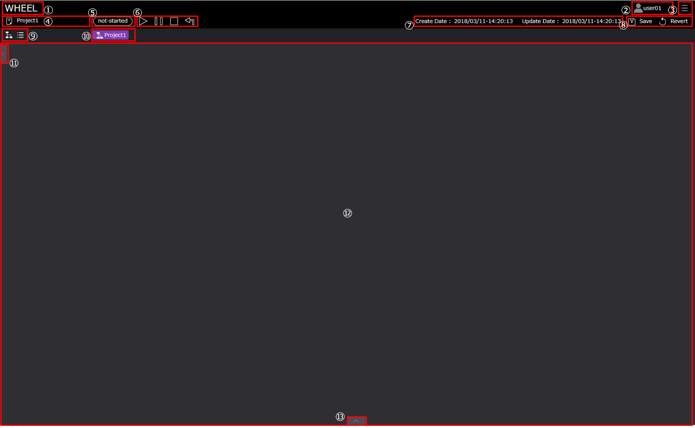
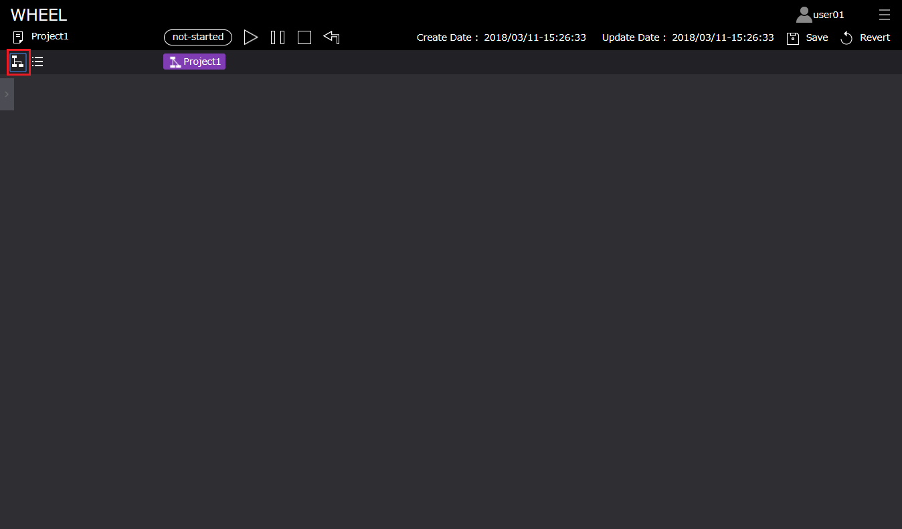
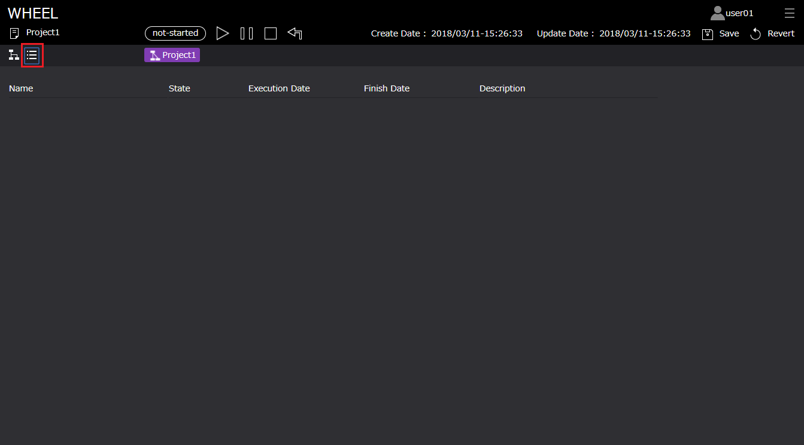
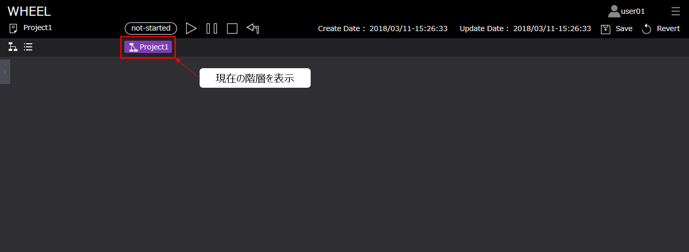
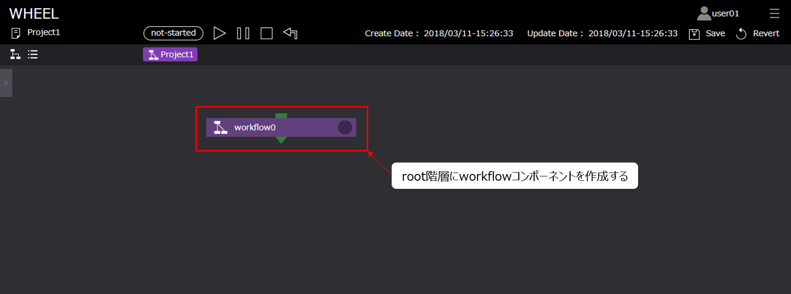
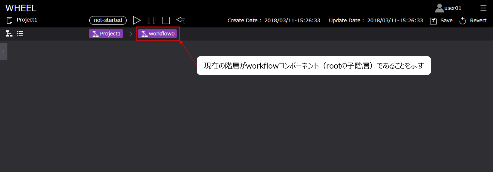
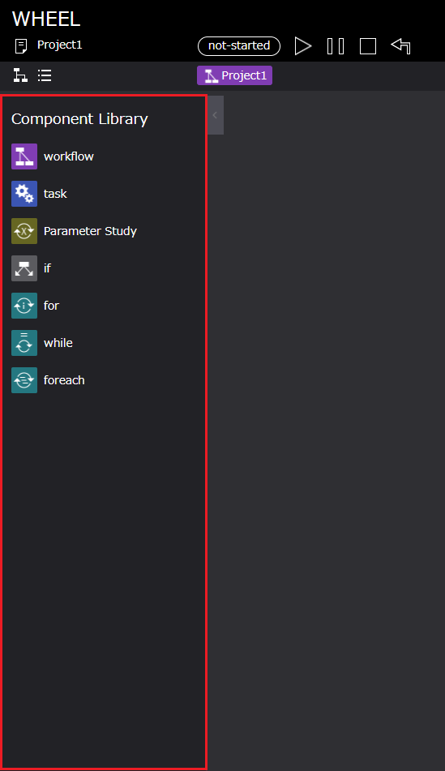
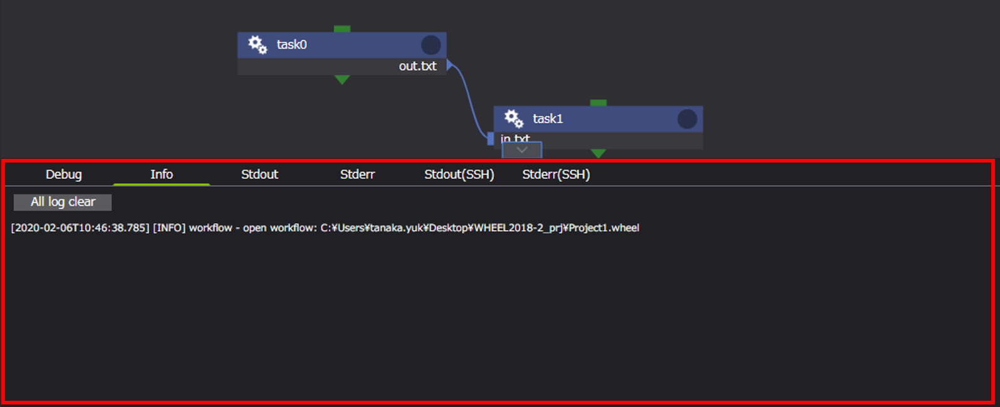

# ワークフロー編集画面（グラフビュー）の機能説明
本章では、WHEELのメイン画面であるワークフロー編集画面（グラフビュー）の機能について説明します。  
ワークフローの作成・実行等の例題については、後述の「ワークフローの作成」において説明します。

## 1. 画面仕様説明
ワークフロー編集画面（グラフビュー）は以下のように構成されています。  

  

1. タイトル　　　　　　　　　　　　　：ホーム画面遷移ボタン
1. ユーザー名　　　　　　　　　　　　：ログインユーザ名
1. 画面遷移ドロワー　　　　　　　　　：ホスト登録画面、ログアウト用
1. プロジェクト名　　　　　　　　　　：ワークフロー編集中のプロジェクト名
1. プロジェクトの状態表示エリア　　　：プロジェクトのstate（実行状態）表示
1. プロジェクトの操作ボタンエリア　　：プロジェクトの実行、一時停止、停止、クリーンボタン
1. プロジェクトの編集日時表示エリア　：プロジェクトの作成、更新日時
1. プロジェクトの保存ボタンエリア　　：プロジェクトの保存、リバートボタン
1. ワークフロー画面切替ボタン　　　　：グラフビュー、リストビューの切替ボタン
1. プロジェクトの階層表示・遷移ボタン：現在表示中のプロジェクトディレクトリの階層表示、また、階層間の遷移ボタン
1. コンポーネントライブラリ表示ボタン：ワークフロー作成用のライブラリ表示用ボタン
1. ワークフロー作成用エリア　　　　　：ワークフロー作成のためコンポーネント操作用エリア
1. ログ表示ボタン　　　　　　　　　　：ワークフローの作成、実行に関するログ表示用ボタン

次に各エリア、ボタンの詳細について説明します。  

### プロジェクトの状態表示エリア
プロジェクトの状態表示エリアは、プロジェクト全体の進行状態によって以下の状態を示します。  

1. not-started：プロジェクト実行前

 

2. running    ：プロジェクト実行中

 

3. finished   ：プロジェクト実行終了

 

4. failed     ：プロジェクトの失敗

 

### プロジェクトの操作ボタンエリア
プロジェクト実行、停止などを操作するボタンとその詳細は以下です。  

 

1. run ボタン：プロジェクトの実行開始
1. pause ボタン：プロジェクト実行の一時停止
1. stop ボタン：プロジェクトの実行停止と初期化
1. clean：プロジェクトの初期化  

また、WHEELでは、gitを用いたファイル管理を行っております。
そのため、上記[ clean ]ボタンは、以下の gitコマンド操作を行っております。

```
clean -> git clean -fd  
```

### プロジェクトの保存ボタンエリア
プロジェクト保存、リバートを操作するボタンとその詳細は以下です。  

 

1. save ボタン：projectのsave(commit)を指示する
1. revert ボタン：projectの状態を直前のcommitまで戻すことを指示する

[ save ], [ revert ] ボタンは、以下の gitコマンド操作を行っております。

```
save   -> git commit  
revert -> git reset HEAD --hard  
```

### ワークフロー画面切替ボタン
ワークフロー画面には、ワークフローの作成を行うグラフビュー画面とワークフローの進行状態を確認するリストビュー画面があります。  
下記のボタンによって画面の切替を行います。

##### グラフビュー画面  

 

##### リストビュー画面  

   

### プロジェクトの階層表示・遷移ボタン
***
ワークフローの作成時には、コンポーネント内にコンポーネントを作成するケースがあります。
その場合の現在のコンポーネントディレクトリの階層、およびコンポーネント名の確認、および階層間の移動用として
本ボタンは利用します。  

##### root階層の場合  

   

##### 子階層 (root階層の1階層下) の場合  

   

作成したworkflowコンポーネント内へ遷移する（rootの子階層に相当）

   

### コンポーネントライブラリ表示ボタン
ワークフローの作成に用いるコンポーネントライブラリを表示します。  
コンポーネントライブラリの詳細については次章にて説明します。  

##### コンポーネントライブラリ非表示  


##### コンポーネントライブラリ表示  

   

### ワークフロー作成用エリア
ワークフローの作成用領域です。  
ワークフローを作成する場合、この領域にコンポーネントを配置し、ワークフローを作成します。  

##### ワークフロー作成用エリア  


### ログ表示ボタン
ワークフローの作成時や実行時等に出力されるログを表示します。  

##### ログ非表示  


##### ログ表示  

  

ログ表示エリア内の各ボタンは以下のようになっております。  
ログは、サーバサイドの処理中に発生した出力内容を分類し表示しています。

1. Debug：デバッグメッセージ
1. Info：メッセージ、ワーニングメッセージ、エラーメッセージ
1. Stdout：ローカルホストで実行されたtaskの標準出力
1. Stderr：ローカルホストで実行されたtaskの標準エラー出力
1. Stdout(SSH)：リモートホストで実行されたtaskの標準出力
1. Stderr(SSH)：リモートホストで実行されたtaskの標準エラー出力
1. All log clear：ログを全て消去する  

##### ログ表示例 (Debug)

  

