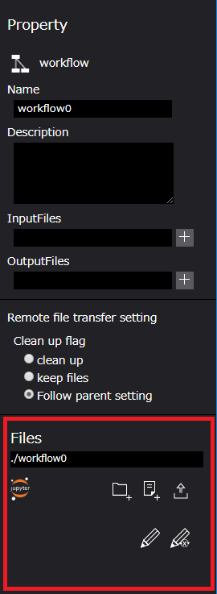
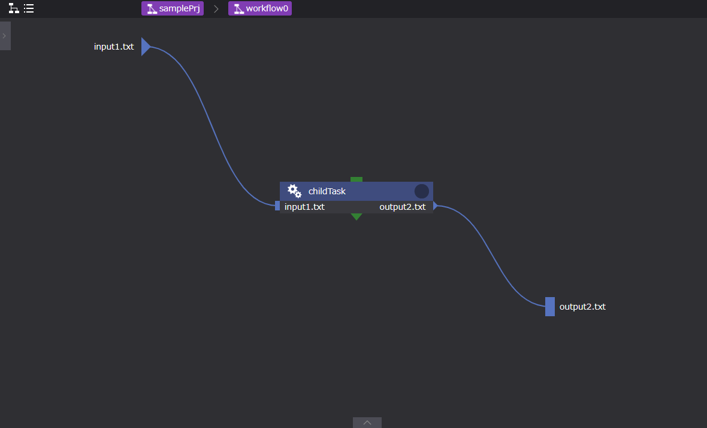

# コンポーネントプロパティの仕様詳細

## ■inputFileおよびoutputFile   
コンポーネントのinputFiles, outputFilesに設定可能な入力値について説明します。　　

inputFiles, outputFilesには以下の4種類の文字列を指定することができます。  
・空文字列(inputのみ)  
・path.sep('\\'でも'/'でも良い)を含む文字列  
・path.sep('\\'でも'/'でも良い)を含まない文字列  
・globパターン(outputのみ)  

### <u>◯inputが空文字列の場合</u>  
inputは後続ノードのrootディレクトリ(そのノードのpathプロパティが指定されたディレクトリ)が指定されてものとして扱われます。  

### <u>◯inputがpath.sepを含まない文字列の場合</u>  
outputが単一のファイルの場合、inputはファイル名として扱われ、別名でのシンボリックリンクが作成されます。  
outputがディレクトリの場合、inputはディレクトリ名として扱われ、その名前でディレクトリへのシンボリックリンクが作成されます。  
outputがglobパターンの場合、inputはディレクトリ名として扱われ、そのディレクトリの下にglobパターンで指定されたファイルへのシンボリックリンクが作成されます。  
いずれの場合でも、outputの指定文字列にpath.sepが含まれた場合は後続ノード側でも同じディレクトリが作成された上でシンボリックリンクが作成されます。  

### <u>◯inputがpath.sepを含む文字列の場合</u>  
最後のpath.sepまでを後続ノードのrootディレクトリからの相対ディレクトリ名として扱います。  
先頭と末尾のpath.sepは無視され、それぞれ取り除いた値が指定されたものとして扱います。  
例えば'/foo/bar/'という指定がされた場合は、'foo/bar'が指定されたものとして扱います。  
(もしあれば)末尾のものを除いて最後のpath.sep以降に続く文字列は"inputがpath.sepを含まない文字列の場合"に準じてoutputの指定に応じた取り扱いを行います。    

## ■コンポーネントディレクトリへのファイル操作
コンポーネントで使用するファイルは、コンポーネント選択時に表示されるプロパティ画面の[ Files ]領域より設定します。  

例：Workflowコンポーネントのプロパティ画面  

  

Files領域の構成は、以下です。  

  

1. rootワークフローからの相対パス表示領域
1. JupyterNotebookの起動ボタン
1. コンポーネントディレクトリへの新規ディレクトリの作成ボタン
1. コンポーネントディレクトリへの新規ファイルの作成ボタン
1. コンポーネントディレクトリへのファイルのアップロードボタン（ファイルブラウザの起動）
1. ファイル編集ボタン
1. PS用ファイル編集ボタン

以下で各ボタンの機能について説明します。

### <u>◯コンポーネントディレクトリへの新規ディレクトリの作成</U>
コンポーネントディレクトリへの新規ディレクトリの作成手順は以下になります。

1. 新規ディレクトリを作成したいコンポーネントをクリックする。
1. [ Files ]領域内の上記Files領域図ボタン「3」をクリックする。
1. 表示されるダイアログより、作成するディレクトリ名を入力し、[ OK ]ボタンをクリックする。

##### 新規ディレクトリの作成  

  

##### 作成結果 

  

### <u>◯コンポーネントディレクトリへの新規ファイルの作成</u>
新規ファイルの作成もディレクトリの作成と同様に以下の手順になります。

1. 新規ファイルを作成したいコンポーネントをクリックする。
1. [ Files ]領域内の上記Files領域図ボタン「4」をクリックする。
1. 表示されるダイアログより、作成するファイル名を入力し、[ OK ]ボタンをクリックする。

### <u>◯コンポーネントディレクトリへのファイルのアップロード</u>

コンポーネントディレクトリへのファイルのアップロード手順は以下になります。

1. 新規ディレクトリを作成したいコンポーネントをクリックする。
1. [ Files ]領域内の上記Files領域図ボタン「5」をクリックする。
1. 表示されるファイルブラウザ画面、アップロードしたいファイルを選択し、[ 開く ]ボタンをクリックする。

##### ファイルのアップロード 

  

##### アップロード結果 

  

## ■階層間（親子間）のファイル移動    
Workflow, ParameterStudy, 及びループ系（For, While, Foreach）のコンポーネントは、  
コンポーネント内にコンポーネント（子コンポーネント）を持つことができます。  
親コンポーネントから子コンポーネントへのファイル移動は、親子間ファイル移動機能を使用することで行うことができます。  
使用方法は以下です。  

### <u>◯親階層から子階層へ</u>
1. 渡し元コンポーネント（task0）の出力ファイルを設定する（図1参照）
1. 渡し先コンポーネント（workflow0）の入力ファイル名を設定する
1. 渡し元コンポーネント（task0）の出力ファイルを渡し元コンポーネント（workflow0）の入力ファイルへ接続する
1. コンポーネントの子階層へ遷移する（図2参照）
1. 子階層にてコンポーネントを作成する（childTask）
1. 子コンポーネント（childTask）の入力ファイルを設定する
1. 親コンポーネントからの入力ファイルを子コンポーネント（childTask）の入力ファイルへ接続する  

##### 図1 コンポーネントの出力・入力ファイル設定（親階層から子階層へ）
  

##### 図2 親から子へのファイル転送
  

### <u>◯子階層から親階層へ</u>
1. 渡し元コンポーネント（workflow0）の出力ファイルを設定する（図3参照）
1. 渡し先コンポーネント（task1）の入力ファイル名を設定する
1. 渡し元コンポーネント（workflow0）の出力ファイルを渡し先コンポーネント（task1）の入力ファイルへ接続する
1. コンポーネントの子階層へ遷移する（図4参照）
1. 子コンポーネント（childTask）の出力ファイルを設定する
1. 子コンポーネント（childTask）の出力ファイルを親コンポーネントの出力ファイルへ接続する

##### 図3 コンポーネントの出力・入力ファイル設定（子階層から親階層へ）
  

##### 図4 子から親へのファイル転送
  

ただし、子階層において親の入力ファイルを直接出力ファイルへ渡すこと（input1.txtをoutput2.txtへ接続する　図4参照）はできません。   