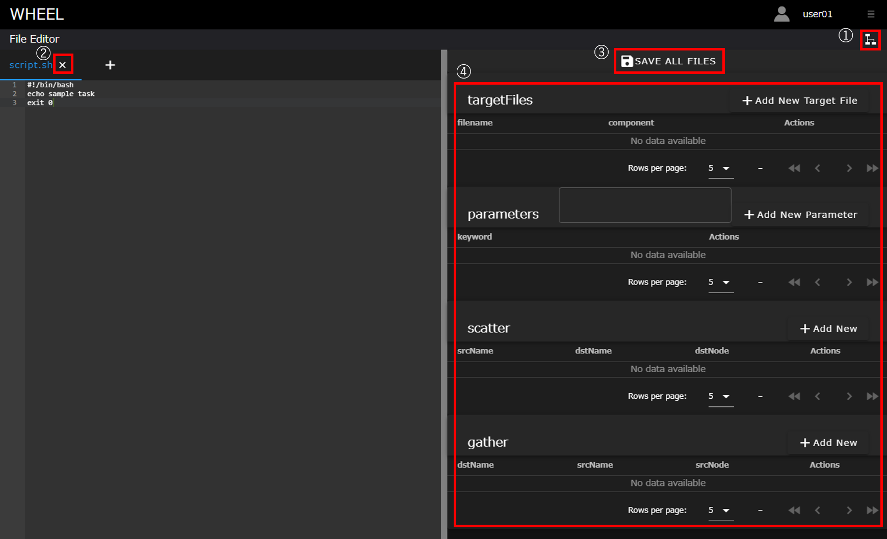
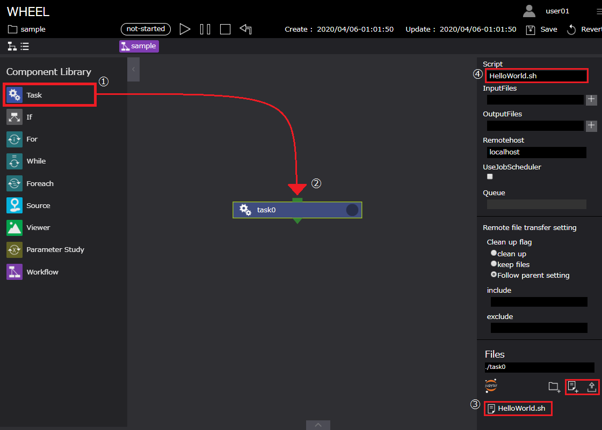
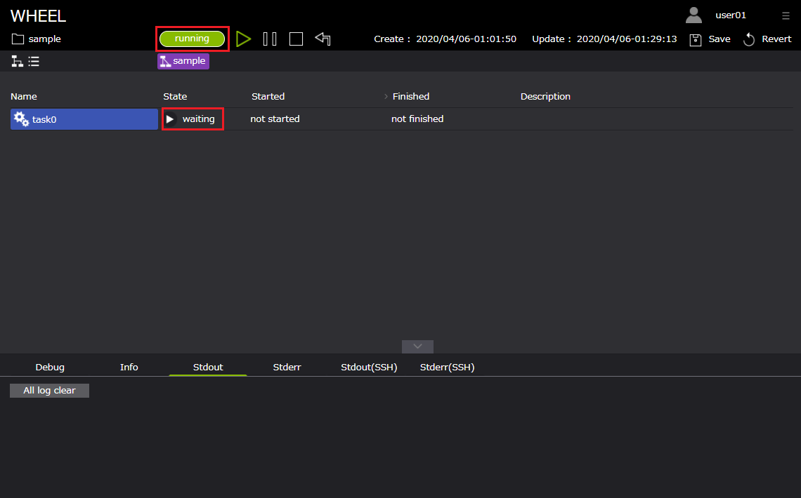
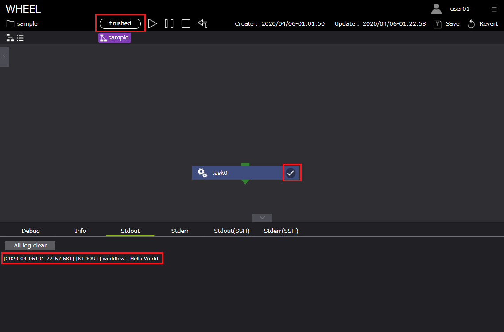

# Task

  

Taskコンポーネントは、WHEELの用意するコンポーネントの中で最も基本的かつ重要なコンポーネントです。  
[ script ]プロパティに設定されたスクリプトファイルを実行環境(host/useJobScheduler/queueプロパティ)の設定に応じて実行します。  

Taskコンポーネントのプロパティは以下です。

| プロパティ | 入力値 | プロパティ説明 |
|----|----|----|
| name | 文字列 | コンポーネント名 |
| description | 文字列 | コンポーネントの説明文 |
| script | ファイル | Task内の処理を記述したスクリプトのファイルを指定 *1<br>scriptにはFilesエリアに登録されているファイルが選択可能 | 
| inputFiles | ファイルまたはディレクトリ名 | 先行コンポーネントから受け取るファイル |
| outputFiles | ファイル, ディレクトリ名またはglobパターン | 後続コンポーネントへ渡すファイル |
| host | 文字列 | Taskを実行するhost、localhostまたは登録済のremotehostのlabelを指定する *2|
| useJobScheduler | チェックボックス | scriptをジョブスケジューラ経由で実行するか直接実行するかのフラグ *2|
| queue | 文字列 | ジョブの投入先キューを指定する(useJobSchedulerを使用しない場合は設定不可) *2|
| clean up flag | ラジオボタン | リモート環境に作成した一時ファイルの取り扱い指定フラグ |
|  | clean up | 削除する |
|  | keep files | 削除しない |
|  | follow parent setting | 親コンポーネントと同じ挙動をする |
| include | ファイル | リモート環境から回収してくるファイル *3 |
| exclude | ファイル | リモート環境から回収しないファイル *3 |
| state clean | ボタン | コンポーネントの進行状態を初期状態に戻す *4 |

*1 scriptに指定されたスクリプトの終了コードが0の場合は真、  
　それ以外の場合は、偽と判定し(プロジェクトの判定はfailedとなります)後続のノードへ遷移します。  
*2 リモートホスト使用時のみ有効です。また、queueプロパティはuseJobScheduler有効時のみ設定可能です。  
*3 include, excludeともにglobパターンを指定することができます。  
　includeにマッチしなおかつexcludeにマッチしないファイルを回収してくることができます。  
　ただし、outputFilesに指定されたファイルは、include/excludeの指定に関わらず全て回収されます。  
*4 コンポーネントの進行状態が"finished"もしくは"failed"の時のみ表示されます。

## Taskコンポーネントのタイプ

Taskコンポーネントは、実行マシン、ジョブスケジューラの使用/不使用によって、4つのタイプに分類されます。

1. ローカルタスク  
WHEELが動作するマシン上で実行するTaskコンポーネント
1. ローカルジョブタスク  
WHEELが動作するマシン上でジョブスケジューラを使用し実行するコンポーネント *
1. リモートタスク  
リモートマシン上で実行するタスクコンポーネント
1. リモートジョブタスク  
リモートマシン上でジョブスケジューラを使用し実行するコンポーネント

*現在のWHEELバージョン(ver.1.2.3)では対応していません。

## Taskコンポーネントの使用方法

Taskコンポーネントの使用方法を説明します。  

### scriptプロパティの設定

scriptプロパティはタスクのタイプによらず設定する必要があります。  
セレクトボックスに表示されるファイルリストの中から使用するスクリプトファイルを選択します。  
ファイルリストは、プロパティ画面下部Filesエリアに作成、または、アップロードしたファイルから構成されます。

#### スクリプトファイルの設定

  

#### Filesエリア

  

#### ファイルの編集

コンポーネント内で使用するファイル/ディレクトリは、Filesエリアより生成することができます。  
また、ファイルはファイル編集用ボタンで起動される画面で編集可能です。

  

#### ファイル編集画面  

  

1. グラフビュー画面遷移ボタン  
ファイル編集画面を終了し、グラフビュー画面に遷移します
1. 閉じるボタン  
ファイルを閉じます。保存処理も同時に実行されます
1. 全ファイル保存ボタン  
タブで開いている全ファイルを保存します
1. パラメータセッティングファイル編集画面  
ParameterStudyコンポーネントで使用するパラメータセッティングファイルの編集に使用します

#### スクリプトファイルの注意事項

Taskコンポーネントの実行成功/失敗は、scriptファイルの終了コードで判断されます。  
そのため、Taskコンポーネントの誤作動を防ぐためにスクリプトファイルには明示的に終了コードを記載することを推奨します。

```
#!/bin/bash
echo execute task0
exit 0 ← 明示的に「exit」することを推奨します
```

### コンポーネント間のファイルの受け渡し

inputFiles/outputFilesについて説明します。  
inputFilesは、先行コンポーネントのoutputFilesより接続されたファイルをinputFilesに設定した名称でシンボリックリンクを作成します。*1  
inputFilesは、Taskコンポーネントの処理開始時に、outputFilesはTaskコンポーネントの処理終了時にファイルの存在有無を確認するため、  
inputFiles/outputFilesに設定されたファイルが存在しない場合、エラーとなります。

*1 inputFiles/outputFilesに設定できる文字列の詳細は、[コンポーネント設計書](./10_component_design.md)を参考ください。

  

task0の処理終了時にtask0にoutput.txtが存在する場合、task1にiuput.txtとしてシンボリックリンクを作成します。

### リモートホストの設定

リモートタスク/リモートジョブタスクを使用する場合、使用するリモートホストをRemotehostプロパティに設定します。  
Remotehostプロパティのセレクトボックスには、リモートホスト登録画面にて登録したホストのラベルが一覧として表示ます。  
(参考：[リモートホスト登録画面](../2_remotehost_screen/remotehost.md))

#### Remotehostプロパティ

  

Remotehostプロパティには、リモートホスト画面で登録したホスト名が表示される。（下図参考）

#### リモートホスト画面

  

### ジョブスケジューラ/キューの設定

リモートジョブタスクを使用する場合、useJobSchedulerプロパティを有効にします。  
また、useJobSchedulerプロパティを有効にした場合にのみQueueプロパティにてキューの設定が可能です。  
Queueプロパティのセレクトボックスには、Remotehostプロパティで選択したホストに設定したQueueの値が一覧として表示されます。
(参考：[リモートホスト登録画面](../2_remotehost_screen/remotehost.md))

#### Queueプロパティ

  

Remotehostプロパティで設定した「hostA」のQueueがリストとして表示される（下図参考）

#### リモートホスト(hostA)の設定値


# プロジェクトの実行方法

ここでは、例として、ひとつのTaskコンポーネントの実行方法を紹介します。  
Taskコンポーネントは、[ script ]プロパティに設定されたHelloWorld.shを実行し、  
ログエリア[ Stdout ]にメッセージ「Hello World!」を出力します。  
手順は以下です。  

1. グラフビュー画面左部 Component Libraryより、Taskコンポーネントをグラフビュー画面に配置する
1. Taskコンポーネントをクリックし、プロパティ画面を表示する
1. プロパティ画面下部[ Files ]より、メッセージ表示（Stdout）するスクリプトをTaskコンポーネントディレクトリへアップロードする
1. プロパティ[ script ]にアップロードしたファイルのファイル名「HelloWorld.sh」を指定する



> sampleTask(taskコンポーネント)

| プロパティ名 | 設定値 |
| ---- | ---- |
| Name | sampleTask |
| Script | HelloWorld.sh |
| InputFiles | - |
| OutputFiles | - |
| Remotehost | localhost |
| Files | HelloWorld.sh |  

ここで設定したスクリプト「HelloWorld.sh」の中身は以下です。

#### ・HelloWorld.sh

```
#!/bin/bash
echo Hello World!
```

scriptプロパティに任意のスクリプトを設定することで任意の処理をWHEEL上で実行することができます。

## プロジェクトを保存する

ファイルの設定が完了後、プロジェクトを保存します。  
保存前後でワークフロー画面上部[ Create date ]が更新されることを確認します。

  
  

## プロジェクトの実行と実行状況の確認

プロジェクトを実行します。  
プロジェクトの実行は、ワークフロー画面上部[ Run ]ボタンより開始します。

#### 1. 実行

実行ボタン押下後、実行の状況の確認はグラフビュー画面、リストビュー画面のいずれかから確認することができます。

  

#### 2. グラフビュー画面

グラフビュー画面では、ワークフロー画面上部よりプロジェクト全体の進行状況とコンポーネント右上のアイコンにより実行状況を確認できます。  

  

#### 3. リストビュー画面

リストビュー画面では、各コンポーネントの進行状況がグラフビュー画面より詳細に表示されます。

  

#### 4. 実行完了

実行が完了したとき、状態は[ finished ]へと変化し、  
また、ログエリア[ Stdout ]に「Hello World!」と表示されます。  

  

以上が基本的なコンポーネント設定、プロジェクトの実行手順となります。  
WHEELでは、Taskコンポーネントに加えて以降紹介するコンポーネントを組み合わせることにより、  
複雑なワークフローを視覚的・直感的に理解しやすく構成することができます。
