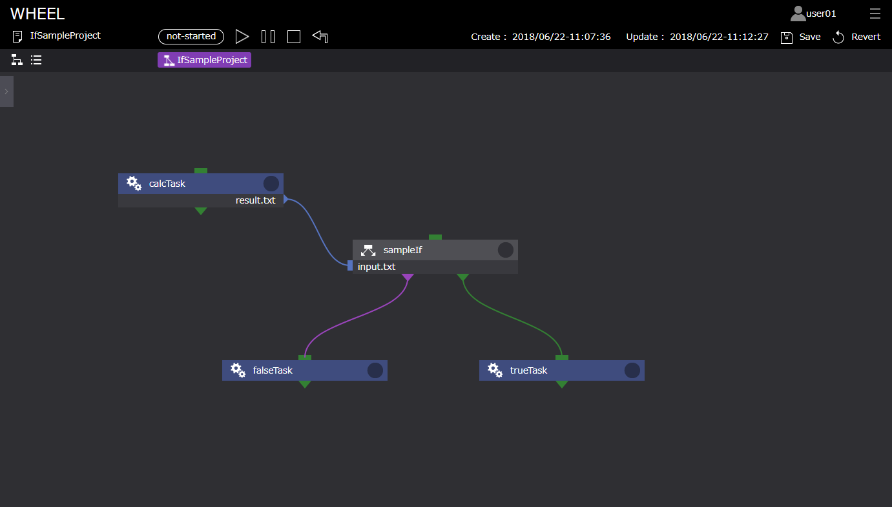

# If

  

Ifコンポーネントは、[ condition ]プロパティに設定したスクリプトにより真偽判別し、後のワークフローの挙動を変化させるために用います。  
真の場合はnext（緑）に指定されたコンポーネントを  
偽の場合はelse（紫）に指定されたコンポーネントを、後続タスクとして登録して終了します。  

Ifコンポーネントのプロパティは以下です。

| プロパティ | 入力値 | プロパティ説明 |
|----|----|----|
| name | 文字列 |  コンポーネントのディレクトリ名 |
| description | 文字列 | コンポーネントの説明文 | 
| inputFiles | ファイルまたはディレクトリ名 | 先行コンポーネントから受け取るファイル | 
| outputFiles | ファイル, ディレクトリ名またはglobパターン | 後続コンポーネントへ渡すファイル | 
| condition | ファイル名,またはJavaScriptの式 | 条件判定を行うスクリプトのファイル名、またはJavaScriptの式 *1 | 
| state clean | ボタン | コンポーネントの進行状態を初期状態に戻す *2 | 

*1 conditionに指定されたスクリプトの終了コードが0の場合は真、それ以外の場合は、偽と判定して後続のノードへ遷移します。  
　(後述のWhileコンポーネントではループ継続となります。)  
　ただし、conditionに指定された文字列と一致するファイルが存在しなかった場合は、Javascriptの式とみなしてそのコードを実行します。  
　この場合、実行結果がtruthyな値の場合を真、falseyな値の場合を偽とします。  
　また、Javascriptの式には、予約済環境変数`$WHEEL_CURRENT_INDEX`（ループ系コンポーネントのループカウンタインデックス）が使用できます。  
*2 コンポーネントの進行状態が"finished"もしくは"failed"の時のみ表示されます。

# If コンポーネントの使用例
サンプルでは、calcTaskコンポーネントにより三角形の面積を計算し、その計算結果を元にsampleIfコンポーネントにて真偽判定を行います。  
面積が20より大きい場合、trueTaskコンポーネントを、小さい場合、falseTaskコンポーネントを実行します。  
（true/falseTaskは、"true"/"false"を標準出力するTaskです。）  

このワークフローは下記の処理を行います。

1. calcTaskコンポーネントにより、面積算出ソルバーを実行する
2. 実行結果をifコンポーネントに渡す
3. sampleIfコンポーネントで設定したスクリプトにより結果ファイルの真偽を判定する
4. 真偽判定を踏まえ、trueTask, falseTaskのいずれかを実行する

## ■ ワークフロー構成図

   

## ■  ワークフローを構成するコンポーネント
| コンポーネントタイプ | コンポーネント名 | 入力ファイル | 出力ファイル | 設定ファイル |
|----|----|----|----|----|
| Task | calcTask |  | 計算結果データファイル | ソルバー実行スクリプト | 
|  | trueTask | 計算結果データファイル |  | 計算結果データを利用した計算をするスクリプト | 
|  | falseTask | - |  | 計算結果データを利用した計算をするスクリプト | 
| If | sampleIf | - | 計算結果データファイル | 真偽判別スクリプト |  

## ■ 各コンポーネントのプロパティ

> calkTask（Taskコンポーネント）

| プロパティ名 | 設定値 |
| ---- | ---- |
| Name | calcTask |
| Script | calc.sh |
| InputFiles | - |
| OutputFiles | result.txt *1 |
| Remotehost | localhost |
| Files | calc.sh, wheel_tutorial_solver.cc, inputdata.txt |  

*1 計算結果データ

#### ・ calc.sh  
```
#!/bin/bash 
g++ wheel_tutorial_solver.cc -o wheel_tutorial_solver  
./wheel_tutorial_solver  
```

> trueTask（Taskコンポーネント）

| プロパティ名 | 設定値 |
| ---- | ---- |
| Name | trueTask |
| Script | true.sh |
| InputFiles | - |
| OutputFiles | - |
| Remotehost | localhost |
| Files | true.sh |  

#### ・true.sh  
```
#!/bin/sh  
echo true  
```

> falseTask（Taskコンポーネント）

| プロパティ名 | 設定値 |
| ---- | ---- |
| Name | falseTask |
| Script | false.sh |
| InputFiles | - |
| OutputFiles | - |
| Remotehost | localhost |
| Files | false.sh |  

#### ・ false.sh  
```
#!/bin/sh  
echo false  
```

> sampleIf（ifコンポーネント）

| プロパティ名 | 設定値 |
| ---- | ---- |
| Name | sampleIf |
| InputFiles | input.txt |
| OutputFiles | - |
| Condition | condition.sh *1|
| Files | condition.sh |  
*1 conditionには直接JavaScript式を書くことも出来る。今回はfileを選択する。

#### ・ condition.sh  
```
#!/bin/sh
result=$(cut -f 2 -d "=" input.txt)
echo $result
if [ $result -gt 20 ] ; then
  exit 0
else
  exit 1
fi 
```

## ■ ワークフロー実行結果

   
