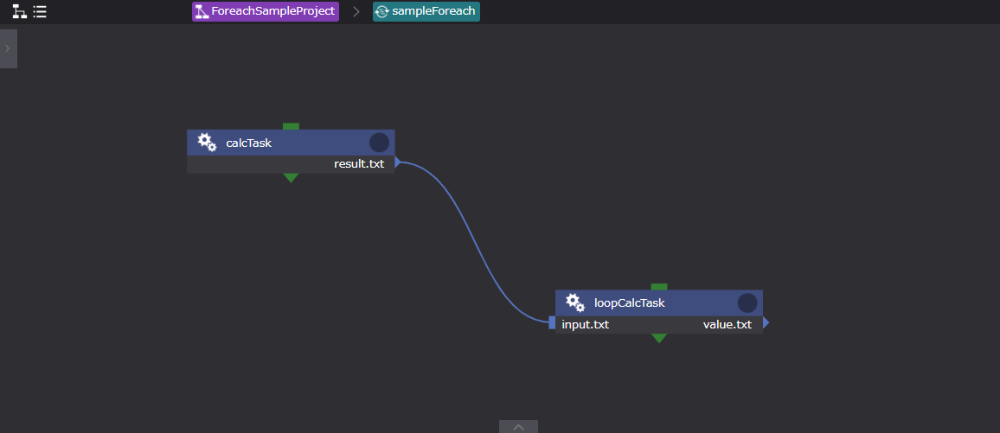
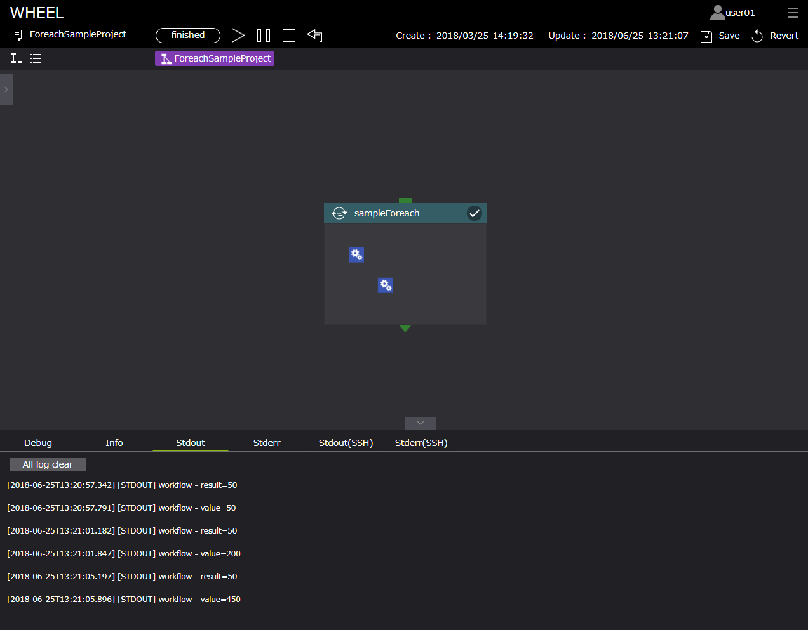

# Foreach

  

Forコンポーネントは、[ indexList ]プロパティによる繰り返し計算の実行に使用します。  
Foreachコンポーネントのプロパティは以下です。

| プロパティ | 入力値 | プロパティ説明 |
|----|----|----|
| name | 文字列 |  コンポーネント名 |
| description | 文字列 | コンポーネントの説明文 |
| inputFiles | ファイルまたはディレクトリ名 | 先行コンポーネントから受け取るファイル |
| outputFiles | ファイル, ディレクトリ名またはglobパターン | 後続コンポーネントへ渡すファイル |
| indexList | 文字列 | ループカウンタインデックスに指定される値のリスト *1|
| state clean | ボタン | コンポーネントの進行状態を初期状態に戻す *2 |

*1 使用できる文字列は、半角英数字[0-9 a-Z]、ハイフン[ - ]、アンダースコア[ _ ]のみです。  
*2 コンポーネントの進行状態が"finished"もしくは"failed"の時のみ表示されます。

## ループ系コンポーネント（Foreach/For/While）

Foreachコンポーネントは、For/Whileコンポーネントと同様に**ループ系コンポーネント**としてカテゴライズされ、  
ループカウンタインデックスを環境変数`$WHEEL_CURRENT_INDEX`に持ちます。  
ループ処理では、プロジェクト実行開始時に自身と同じ階層にループカウンタインデックスの値に応じたsuffixをつけてコンポーネント内に存在する全てのコンポーネントのコピーを作成します。  
生成処理が完了したら、ループカウンタインデックスを進めて終了判定を行い、ループが終了してなければ再度コピーを作成します。  
このときコピーされるコンポーネントは、**1つ前のループ処理後のコンポーネント** です。  
以下に例を示します。

### Foreachコンポーネント名が「Foreach」、indexListが「a, b, c」の場合

#### 実行前のプロジェクトのディレクトリ構造

```
Foreach
```

#### 実行開始ループカウンタa ($WHEEL_CURRENT_INDEX：a)

```
Foreach
Foreach_a ←ループカウンタaのため、Foreach_aコンポーネントが生成します
```

#### 実行開始ループカウンタb ($WHEEL_CURRENT_INDEX：b)

```
Foreach
Foreach_a
Foreach_b ←二つ目のindexList:bに基づき、Foreach_bを生成します  
　　　　　　このとき、Foreach_bコンポーネントは、カウンタaのForeach_aコンポーネントをコピーしたものです
```

以降、ループが終了するまでコンポーネントのコピー/実行を繰り返します。  
ループが終了条件を満たした時点で、これらのコンポーネントは終了となります。  

# Foreachコンポーネントの使用例  

Foreachコンポーネントのサンプルを示します。  
サンプルでは、Foreachコンポーネント内でのTaskコンポーネントの処理（面積計算）にループインデックス(`$WHEEL_CURRENT_INDEX`)使用します。  

このワークフローは下記の処理を行います。

1. calcTaskコンポーネントにより、面積算出ソルバーを実行する
1. 実行結果をtask1コンポーネントに渡す
1. 「1の結果（面積の値）×ループインデックス＋3の結果」 を実行する *1
1. 3の計算結果をファイルとして出力する
1. 上記処理をループインデックスの上限値まで繰り返す（ループインデックス1, 3, 5）

*　ループ回数2回目以降の計算にて使用する

## Foreachワークフロー 構成図

  

> sampleForeach（foreachコンポーネント）

| プロパティ名 | 設定値 |
| ---- | ---- |
| Name | sampleForeach |
| InputFiles | - |
| OutputFiles | - |
| index list | 1 |
|  | 3 |
|  | 5 |
| Files | - |

## Foreachワークフロー子階層　構成図



> calkTask（Taskコンポーネント）

| プロパティ名 | 設定値 |
| ---- | ---- |
| Name | calcTask |
| Script | calc.sh |
| InputFiles | - |
| OutputFiles | result.txt |
| Remotehost | localhost |
| Files | calc.sh , wheel_tutorial_solver.cc, inputdata.txt |  

#### ・calc.sh

```
#!/bin/bash
g++ wheel_tutorial_solver.cc -o wheel_tutorial_solver  
./wheel_tutorial_solver
exit 0
```

#### ・inputData.txt

```
0, 0, 0
0, 10, 0
10, 0, 0
```

> loopCalkTask（Taskコンポーネント）

| プロパティ名 | 設定値 |
| ---- | ---- |
| Name | loopCalcTask |
| Script | resultRead.sh |
| InputFiles | input.txt |
| OutputFiles | - |
| Remotehost | localhost |
| Files | resultRead.sh, value.txt *2 |

*2 result.shの計算結果ファイル、loopCalcTask内でインプットデータとして利用  

#### ・resultRead.sh

```
#!/bin/bash
result=$(cut -f 2 -d "=" input.txt)
if [ ! $WHEEL_CURRENT_INDEX = 0 ] ; then
    value=$(cut -f 2 -d "=" value.txt)
else
    value=0
fi
x=$(($result * $WHEEL_CURRENT_INDEX + $value))
echo $WHEEL_CURRENT_INDEX
echo value=$x
echo value=$x > value.txt
exit 0
```

## ワークフロー実行結果

