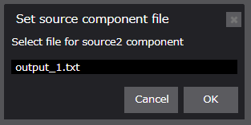
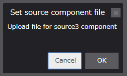
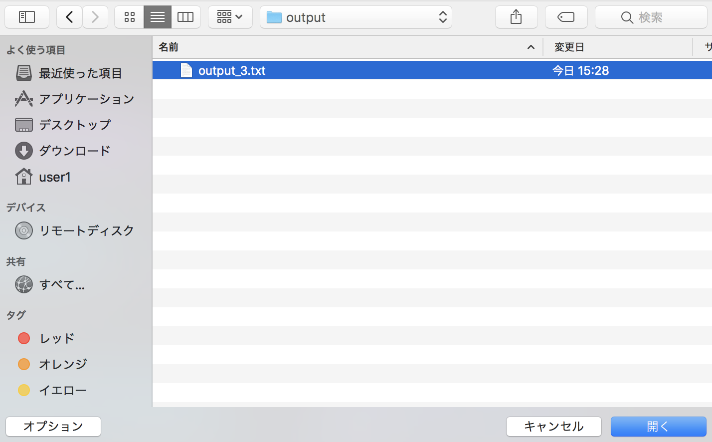
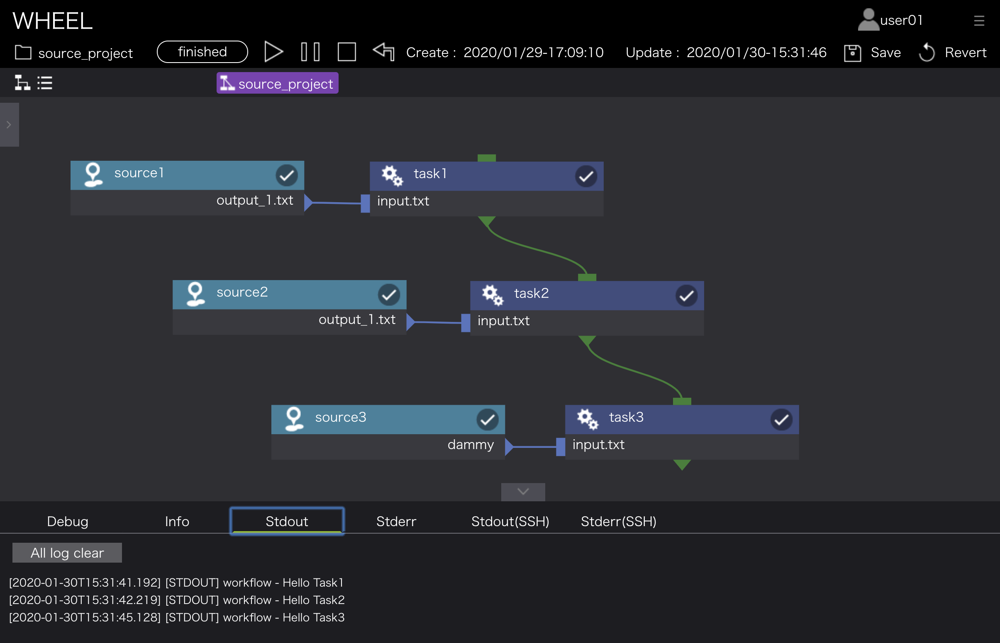

# Source


Sourceコンポーネントは、実際のプロジェクト実行に先立って
[ outputFile ]プロパティに指定されたファイルの実体を用意する処理を行います。

Sourceコンポーネントのプロパティは以下です。  

| プロパティ | 入力値 | プロパティ説明 |
|----|----|----|
| name | 文字列 | コンポーネント名 |
| description | 文字列 | コンポーネントの説明文 |
| outputFiles | ファイル, ディレクトリ名またはglobパターン | 後続コンポーネントへ渡すファイル |
| uploadOnDemand | チェックボックス | プロジェクト実行開始時にクライアントからアップロードさせるかどうかのフラグ |

# Sourceコンポーネントの使用例

Sourceコンポーネントのサンプルワークフローを示します。  
Sourceコンポーネントで後続コンポーネントにファイルを渡す方法は3パターンあります。  

1. [ outputFile ]プロパティに指定したファイルを渡す（FilesエリアにoutputFileで指定したファイルしか存在しない場合）
1. プロジェクト実行時に表示されるダイアログで指定したファイルを渡す（Filesエリアに複数ファイルが存在する場合）
1. プロジェクト実行時に表示されるファイルブラウザで指定したファイルを渡す（[ uploadOnDemand ]プロパティが有効の場合）

それぞれの設定方法を以下のサンプルワークフローを用いて説明します。  
このサンプルワークフローでは、sourceコンポーネントに設定したテキストファイルを後続のtaskコンポーネントに渡して、テキストファイルの内容を標準出力させます。

## sourceワークフロー構成図

  

## 各コンポーネントのプロパティ

> task1（Taskコンポーネント）

| プロパティ名 | 設定値 |
| ---- | ---- |
| Name | task1 |
| Script | echo.sh |
| InputFiles | input.txt |
| OutputFiles | - |
| Remotehost | localhost |
| Files | echo.sh |  

#### ・echo.sh

```
#!/bin/bash
cat input.txt
exit 0
```

※ task2, task3についても同様の設定

> source1 (Sourceコンポーネント)

| プロパティ名 | 設定値 |
| ---- | ---- |
| Name | source1 |
| OutputFiles | output_1.txt |
| uploadOnDemand | チェックしない |
| Files | output_1.txt |

#### ・output_1.txt

```
Hello Task1
```

> source2 (Sourceコンポーネント)

| プロパティ名 | 設定値 |
| ---- | ---- |
| Name | source2 |
| OutputFiles | output_1.txt |
| uploadOnDemand | チェックしない |
| Files | output_1.txt, output_2.txt |

#### ・output_1.txt

```
Hello Task1
```

#### ・output_2.txt

```
Hello Task2
```

> source3 (Sourceコンポーネント)

| プロパティ名 | 設定値 |
| ---- | ---- |
| Name | source3 |
| OutputFiles | dammy |
| uploadOnDemand | チェックする |
| Files | dammy |

#### ・dammy
outputファイルはダイアログからアップロードするため、任意のダミーファイルをoutputファイルに設定します  
今回は"dammy"という名前の空ファイルを設定しました

#### ・output_3.txt

```
Hello Task3
```

output_3.txtは、ワークフローを実行した際にアップロードするファイルです  
Webブラウザを起動しているマシンに存在する必要があります

## sourceワークフロー実行

サンプルワークフローを実行すると、Filesエリアに複数ファイルを持っている"source2"コンポーネントを実行するにあたり  
下記のダイアログが表示されます。セレクトボックスで"output_2.txt"を選択して「OK」をクリックします  

  

次に、uploadOnDemandにチェックを入れている"source3"コンポーネントを実行するにあたり  
下記のダイアログが表示されます。「OK」をクリックします

  

次にアップロードするファイルを選択するダイアログが表示されます。  
任意のディレクトリに格納していた"output_3.txt"を選択します。

  

souceコンポーネントのoutputファイルの設定が完了すると、ワークフローがrunningになります  
ワークフローの結果が下記になります

  
