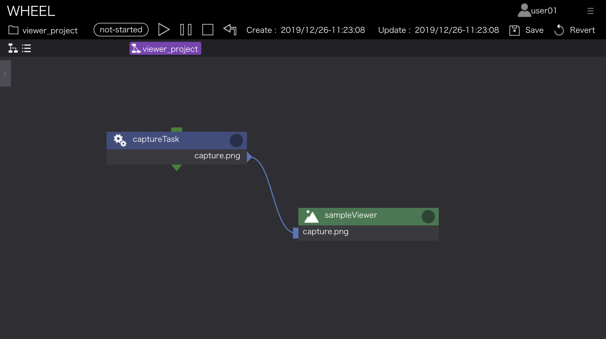

# Viewer

  

Viewerコンポーネントは、[ inputFiles ]プロパティに指定したファイルを収集するために使用します。  
inputFilesプロパティに指定されたファイルを先行コンポーネントから受け取った後、  
ブラウザにて表示な可能なファイル（画像ファイル）が存在する場合は、別タブを起動し表示します。

Viewerコンポーネントのプロパティは以下です。  

| プロパティ | 入力値 | プロパティ説明 |
|----|----|----|
| name | 文字列 | コンポーネント名 |
| description | 文字列 | コンポーネントの説明文 |
| inputFiles | ファイルまたはディレクトリ名 | 先行コンポーネントから受け取るファイル *1 |

*1 ファイル形式は画像ファイル（拡張子png, jpg, gif, bmp）をサポートしています。  

# Viewerコンポーネントの使用例

Viewerコンポーネントのサンプルを示します。  
このサンプルでは、 captureTaskで撮影したスクリーンショット画像をsampleViewerに渡し、
別タブ（WHEEL viewer）で結果を確認します。

このワークフローは下記の処理を行います。

1. captureTaskコンポーネントにより、スクリーンショットを撮影する
1. スクリーンショットの画像ファイルをsampleViewerコンポーネントに渡す
1. 「WHEEL viewer」を新規タブで開く
1. 1.で撮影したスクリーンショット画像を表示する
  
## Viewerワークフロー構成図

  

## 各コンポーネントのプロパティ

> captureTask（Taskコンポーネント）

| プロパティ名 | 設定値 |
| ---- | ---- |
| Name | captureTask |
| Script | capture.sh |
| InputFiles | - |
| OutputFiles | capture.png |
| Remotehost | localhost |
| Files | capture.sh, capture.png*1 |

*1 capture.pngはcaputure.sh実行後に生成されるファイルです

#### ・ capture.sh

```
#!/bin/bash
CURRENT_DIR=$(pwd)
echo CURRENT_DIR = $CURRENT_DIR
screencapture -m $CURRENT_DIR/capture.png
exit 0
```

> sampleViewer(VIewerコンポーネント)

| プロパティ名 | 設定値 |
| ---- | ---- |
| Name | sampleViewer |
| InputFiles | capture.png |
| Files | capture.png*2 |

*2 capture.pngはcaptureTaskから渡されるファイルです

## Viewer ワークフロー実行結果

