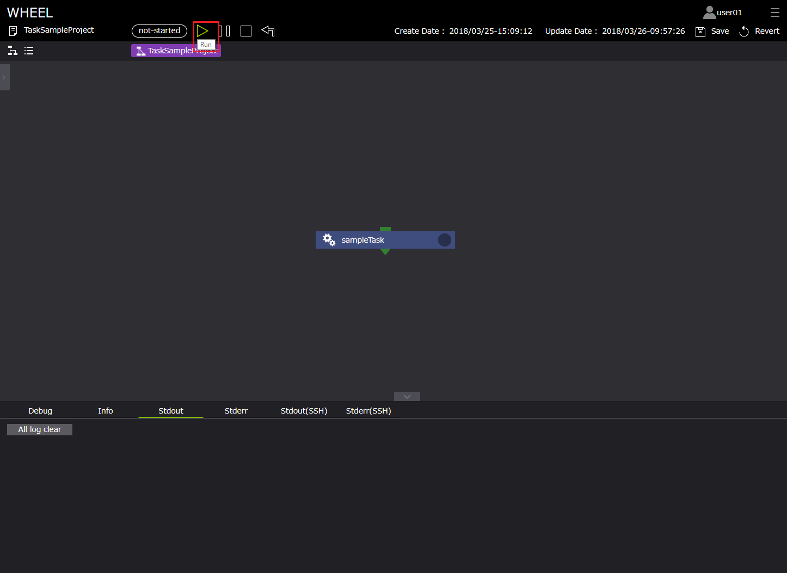
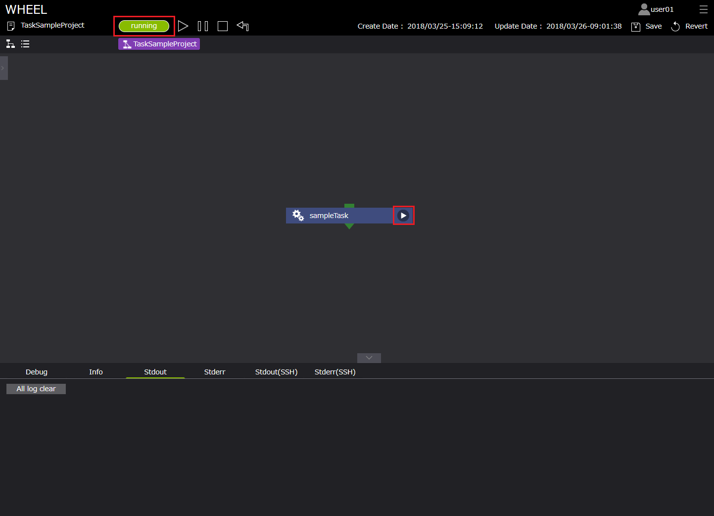
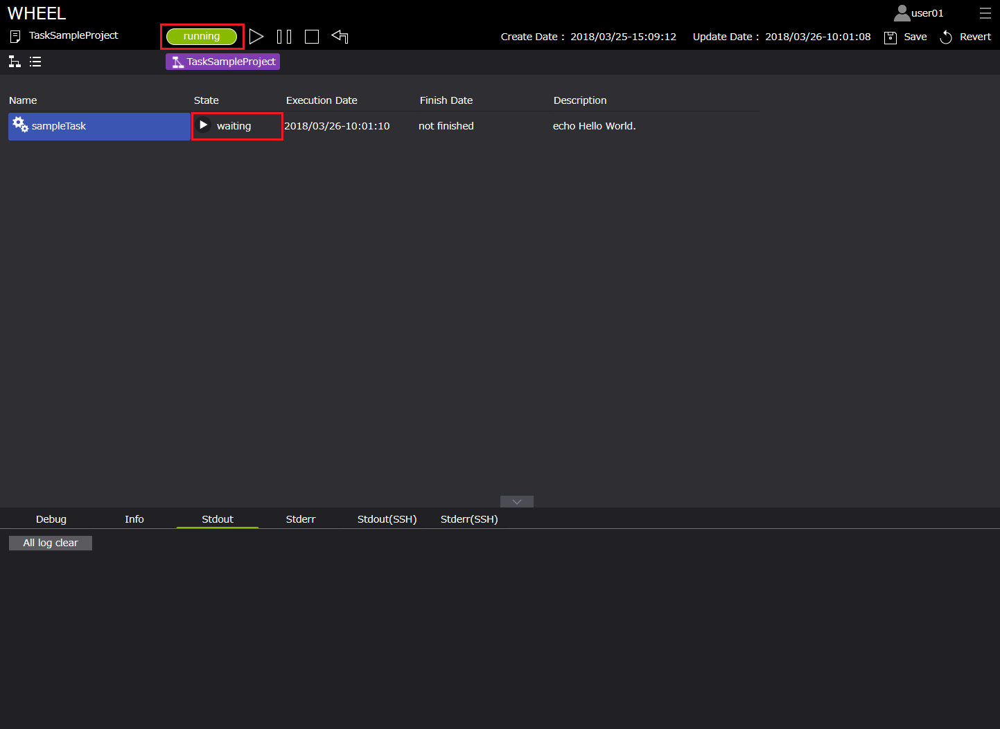

# ワークフローの実行方法

## ■ワークフローの作成
はじめに、ワークフローの作成手順（実行に必要なファイルの設定方法）について説明します。  
ここでは、例として、ログエリア[ Stdout ]にメッセージ「Hello World!」を出力するTaskコンポーネントの設定を紹介します。  
手順は以下です。 

1. グラフビュー画面左部 Component Libraryより、Taskコンポーネントをグラフビュー画面に配置する
1. Taskコンポーネントをクリックし、プロパティ画面を表示する
1. プロパティ画面下部[ Files ]より、メッセージ表示（Stdout）するスクリプトをTaskコンポーネントディレクトリへアップロードする *1
1. プロパティ[ script ]にアップロードしたファイルのファイル名(HelloWorld.sh)を指定する 

*1 Taskコンポーネントディレクトリへのスクリプトの設定方法は、ファイルをアップロードする方法と  
　[ Files ]の新規ファイル作成機能によりファイルを作成する方法があります。

 

> sampleTask(taskコンポーネント)

| プロパティ名 | 設定値 |
| ---- | ---- |
| Name | sampleTask |
| Script | HelloWorld.sh |
| InputFiles | - |
| OutputFiles | - |
| Remotehost | localhost |
| Files | HelloWorld.sh |  

ここで設定したスクリプト「HelloWorld.sh」の中身は以下です。

#### ・HelloWorld.sh

```
#!/bin/bash
echo Hello World!
```

## ■プロジェクトを保存する
ファイルの設定が完了後、プロジェクトを保存します。  
保存前後でワークフロー画面上部[ Create date ]が更新されることを確認します。

  
  

## ■ワークフローの実行と実行状況の確認
ワークフローを実行します。  
ワークフローは、デフォルト値[ localhost ]で実行します。

ワークフローの実行は、ワークフロー画面上部[ Run ]ボタンより開始します。

#### 1. 実行

実行ボタン押下後、実行の状況の確認はグラフビュー画面、リストビュー画面のいずれかから確認することができます。

  

#### 2. グラフビュー画面

グラフビュー画面では、ワークフロー画面上部よりプロジェクト全体の進行状況とコンポーネント右上のアイコンにより実行状況を確認できます。  

  

#### 3. リストビュー画面

リストビュー画面では、各コンポーネントの進行状況がグラフビュー画面より詳細に表示されます。

  

#### 4. 実行完了

実行が完了したとき、状態は[ finished ]へと変化し、  
また、ログエリア[ Stdout ]に「Hello World!」と表示されます。  

  


以上が基本的なコンポーネント設定、ワークフローの実行手順となります。  
WHEELでは、複雑なワークフローもこれらコンポーネントを組み合わせることにより、視覚的・直感的に理解しやすいワークフローを構成することができます。