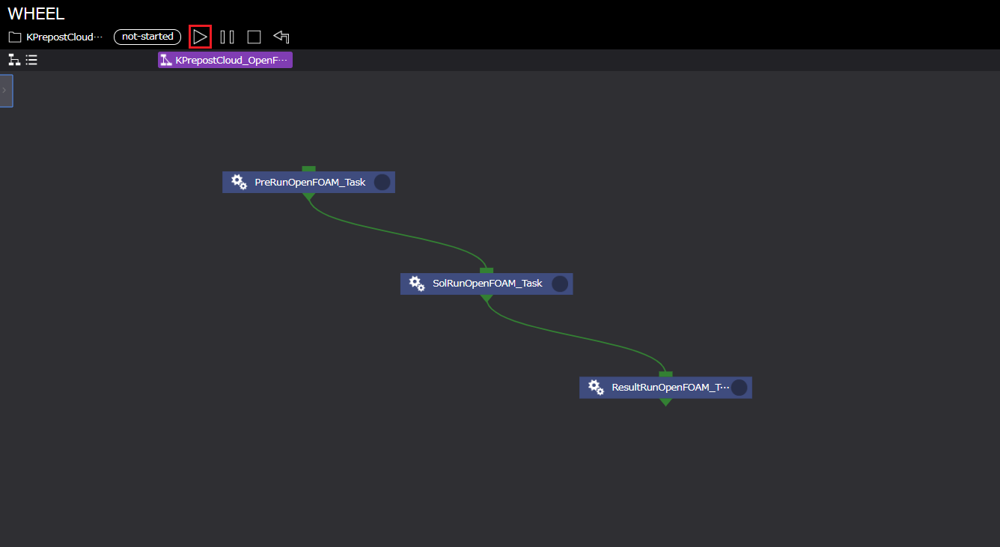

# 京プリポストクラウドを用いたOpenFOAM解析ワークフローの実行
本章では、前章で紹介した「OpenFOAMを利用したcavityケースの解析ワークフロー」の京プリポストクラウド上での実行方法について説明します。  
以降、下記の順にて内容を紹介します。  

また、本章で使用するモデルデータは前章でダウンロード可能です。
Taskコンポーネントで使用するスクリプトは、下記よりダウンロード可能です。  
<a href="./sample/OpenFOAM_KPrepostCloud_sample.zip">OpenFOAMサンプルデータ(京プリポストクラウド)</a>

1. 京プリポストクラウドインスタンスへのOpenFOAM環境設定
1. ワークフローの作成  
　1. Task コンポーネント - 1  
　2. Task コンポーネント - 2  
　3. Task コンポーネント - 3  
1. 解析の実行

## 1. 京プリポストクラウドインスタンスへのOpenFOAM環境設定

### 京プリポストクラウドインスタンス
京プリポストクラウドサービスに関しては、理化学研究所のHPをご確認下さい。

https://www.r-ccs.riken.jp/ungi/prpstcloud/

本事例では、下記の構成をもつインスタンスを使用しています。  
```
イメージ名：Ubuntu16.04_LTS  
サイズ　　：A4.medium  
```

### OpenFOAM環境設定
京プリポストクラウドでOpenFOAMを実行するためには、ユーザ自身でアプリケーションをインストールする必要があります。  
本節では、OpenFOAM(v6)のインストール方法について説明します。

#### リポジトリの追加
作成したインスタンスへログイン後、以下のコマンドをターミナルで実行します。
```
sudo sh -c "wget -O - http://dl.openfoam.org/gpg.key | apt-key add -"
```

OKが表示されることを確認します。
```
--20XX-XX-XX hh:mm:ss--  http://dl.openfoam.org/gpg.key
Resolving dl.openfoam.org (dl.openfoam.org)... 52.208.208.42
Connecting to dl.openfoam.org (dl.openfoam.org)|52.208.208.42|:80... connected.
HTTP request sent, awaiting response... 200 OK
Length: 1710 (1.7K) [application/pgp-keys]
Saving to: ‘STDOUT’

-                             100%[=================================================>]   1.67K  --.-KB/s    in 0s

20XX-XX-XX hh:mm:ss (61.8 MB/s) - written to stdout [1710/1710]

OK
```

続いて以下のコマンドを実行します。  
メッセージは表示されません。
```
sudo add-apt-repository http://dl.openfoam.org/ubuntu
```

#### アップデート
以下のコマンドを実行します。
```
sudo apt-get update
```

以下のメッセージを確認します。
```
～中略～
Reading package lists... Done
```

#### インストールの実行
以下のコマンドを実行します。
```
sudo apt-get -y install openfoam6
```

実行完了後、以下のメッセージが表示されます。  
従って、次節でbashrcの編集を行います。
```
～中略～
** To use OpenFOAM please add
**
**    . /opt/openfoam6/etc/bashrc
**
** To your ~/.bashrc
～中略～
```

#### bashrcの編集
OpenFOAM v6を使用するためにはパスを通す必要があります。
ここでは、viを用いてbashrcを編集します。

以下のコマンドを実行します。
```
vi ~/.bashrc
```
ページの最下部に移動し、iキーを押し、入力モードに変更します。  
以下を記入します。
```
source /opt/openfoam6/etc/bashrc
```
ESCキーを押し、入力モードから離脱後、下記コマンドにより保存します。
```
:wq
```

#### インストールの確認
インスタンスを再起動(ソフトリブート)後、下記のコマンドを実行します。
```
simpleFoam -help
```

以下が表示されることを確認してください。
```
Usage: simpleFoam [OPTIONS]
options:
  -case <dir>       specify alternate case directory, default is the cwd
  -fileHandler <handler>
                    override the fileHandler
  -hostRoots <(((host1 dir1) .. (hostN dirN))>
                    slave root directories (per host) for distributed running
  -listFunctionObjects
                    List functionObjects
  -listFvOptions    List fvOptions
  -listRegisteredSwitches
                    List switches registered for run-time modification
  -listScalarBCs    List scalar field boundary conditions (fvPatchField<scalar>)
  -listSwitches     List switches declared in libraries but not set in
                    etc/controlDict
  -listTurbulenceModels
                    List turbulenceModels
  -listUnsetSwitches
                    List switches declared in libraries but not set in
                    etc/controlDict
  -listVectorBCs    List vector field boundary conditions (fvPatchField<vector>)
  -noFunctionObjects
                    do not execute functionObjects
  -parallel         run in parallel
  -postProcess      Execute functionObjects only
  -roots <(dir1 .. dirN)>
                    slave root directories for distributed running
  -srcDoc           display source code in browser
  -doc              display application documentation in browser
  -help             print the usage

Using: OpenFOAM-6 (see www.OpenFOAM.org)
Build: 6-fa1285188035
```

以上で京プリポストクラウドインスタンスへのOpenFOAM環境設定は完了です。

## 2. ワークフローの作成
ワークフローの構成は前章と同様に以下の構成となっております。
各コンポーネントの詳細に関しては、前章をご確認ください。

- Task コンポーネント - 1：ITOへのジョブ投入及びOpenFOAM前処理
- Task コンポーネント - 2：ITOへのジョブ投入及びOpenFOAM実行用
- Task コンポーネント - 3：ITOへのジョブ投入及びファイル回収用

京プリポストクラウドでは、ジョブスケジューラは利用できないため各Taskコンポーネントに設定する
スクリプトファイルは以下のようになります。  
### Taskコンポーネント-1 PreRunOpenFOAM_Task

> PreRunOpenFOAM.sh  
```
#!/bin/bash
source /opt/openfoam6/etc/bashrc
tar xvzf cavity.tar.gz
mkdir ../WORK
mv cavity ../WORK
cd ../WORK/cavity
blockMesh
```

### Taskコンポーネント-2 SolRunOpenFOAM_Task

> SolRunOpenFOAM.sh  
```
#!/bin/bash
source /opt/openfoam6/etc/bashrc
cd ../WORK/cavity
icoFoam > ./log.icoFoam 2>&1
```

### Taskコンポーネント-3 ResultRunOpenFOAM_Task

> ResultRunOpenFOAM.sh  
```
#!/bin/bash
cd ../WORK/cavity
touch result.foam
cd ../  
tar cvzf cavity.tar.gz cavity
mv cavity.tar.gz ../ResultRunOpenFOAM_Task/
```

## 3. 解析の実行

### リモートホスト登録情報に関して

解析の実行にあたり、リモートホスト画面にてユーザが作成した京プリポストクラウドのインスタンス情報を登録する必要があります。
参考として、本事例で設定したホスト情報の中で注意すべき項目を示します。

- Host Name：10.9.X.X
- User ID：ubuntu
- Host Work Dir：/home/ubuntu

### ワークフローの実行
上記スクリプトを各コンポーネントに設定後、プロジェクト実行ボタンを押下することで計算が開始されます。  
プロジェクト実行時には京プリポストクラウドとVPN接続されている必要があります。  
京プリポストクラウドとのVPN接続に関しては、理化学研究所のHPをご確認下さい。

  

結果の確認方法は前章をご確認下さい。

京プリポストクラウドを用いたOpenFOAM解析ワークフローの実行例は以上になります。